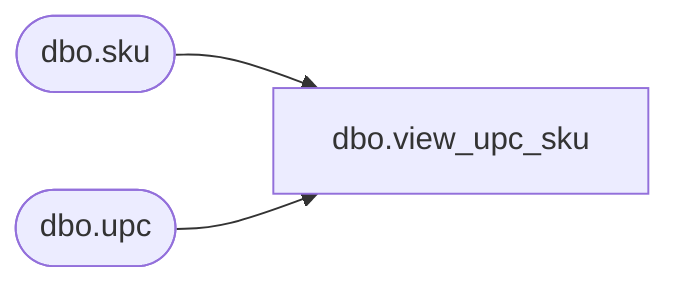

# dbo.view_upc_sku

**Database:** me_01  
**Server:** bedrockdb02  

## Architecture Diagram



## Table Dependencies

| Referenced Table |
|---|
| dbo.sku |
| dbo.upc |

## View Code

```sql
create view dbo.view_upc_sku 


AS

SELECT
	sku.sku_id,
	MIN (upc.upc_number) upc_number
FROM
	sku
LEFT OUTER JOIN upc ON sku.sku_id = upc.sku_id
GROUP BY
	sku.sku_id
```

