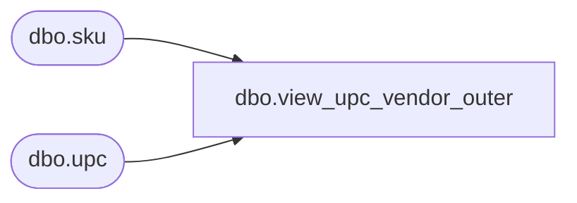

# dbo.view_upc_vendor_outer

**Database:** me_01  
**Server:** bedrockdb02  

## Architecture Diagram



## Table Dependencies

| Referenced Table |
|---|
| dbo.sku |
| dbo.upc |

## View Code

```sql
create view dbo.view_upc_vendor_outer 

AS
select s.sku_id,u.upc_number from upc u RIGHT JOIN sku s
on 
u.sku_id = s.sku_id  AND  u.upc_type = 1
```

