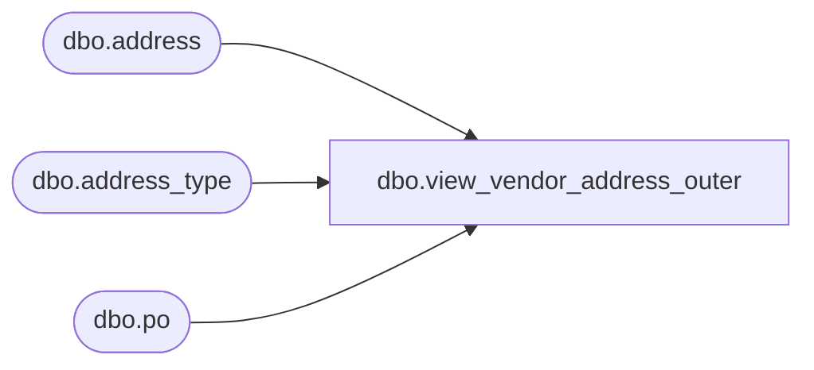

# dbo.view_vendor_address_outer

**Database:** me_01  
**Server:** bedrockdb02  

## Architecture Diagram



## Table Dependencies

| Referenced Table |
|---|
| dbo.address |
| dbo.address_type |
| dbo.po |

## View Code

```sql
create view dbo.view_vendor_address_outer 

AS
SELECT g.po_id,g.vendor_id,f.country_id, f.address_name,f.address_line1,f.address_line2,f.address_city,f.address_state,
f.address_zip_code,f.address_email,g.address_type_id
FROM
  (  SELECT DISTINCT a.po_id,   
                     e.parent_id,
                     e.country_id,         
                     e.address_name,   
                     e.address_line1,
                     e.address_line2,
                     e.address_city,
                     e.address_state,
                     e.address_zip_code,
                     e.address_email,
                     e.address_type_id                              
     FROM address e RIGHT JOIN po a 
       on  a.po_id =e.document_id 
       and a.vendor_id = e.parent_id
     LEFT JOIN  address_type b
       on e.address_type_id = b.address_type_id 
       and e.parent_type =3  
        ) f 
RIGHT JOIN
  (  SELECT DISTINCT  
                a.po_id, 
                a.vendor_id,
                null address_name,
                e.address_type_id 
     FROM  address_type e ,po a ,address d where d.parent_type =3
 and e.address_type_id =d.address_type_id) g
on  f.po_id = g.po_id
and g.vendor_id = f.parent_id
AND   (f.address_type_id = g.address_type_id
OR     f.address_type_id is NULL)
```

