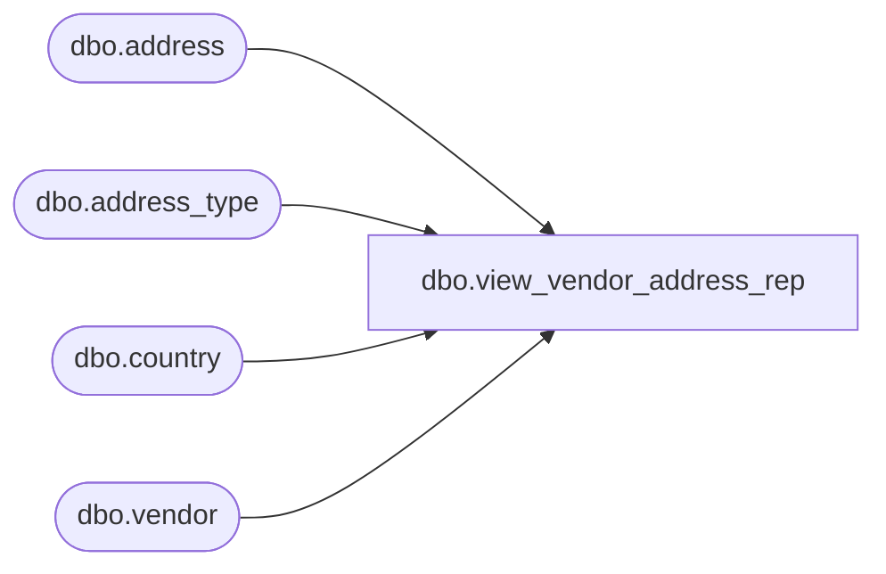

# dbo.view_vendor_address_rep

**Database:** me_01  
**Server:** bedrockdb02  

## Architecture Diagram



## Table Dependencies

| Referenced Table |
|---|
| dbo.address |
| dbo.address_type |
| dbo.country |
| dbo.vendor |

## View Code

```sql
create view dbo.view_vendor_address_rep AS
SELECT DISTINCT
 v.vendor_id,
 a.parent_id,
 a.address_id,
 a.address_type_id,
 a.address_name,
 a.address_line1,
 a.address_line2,
 a.address_city,
 a.address_state,
 a.address_zip_code,
 a.country_id,
 a.address_email,
 t.address_type_description,
 c.country_code, c.country_description
FROM  dbo.vendor v
LEFT OUTER JOIN dbo.address a ON (v.vendor_id = a.parent_id AND a.parent_type = 3)
LEFT OUTER JOIN dbo.address_type t ON (a.address_type_id = t.address_type_id)
LEFT OUTER JOIN dbo.country c ON (a.country_id = c.country_id)
where  t.address_type_id = 1
```

