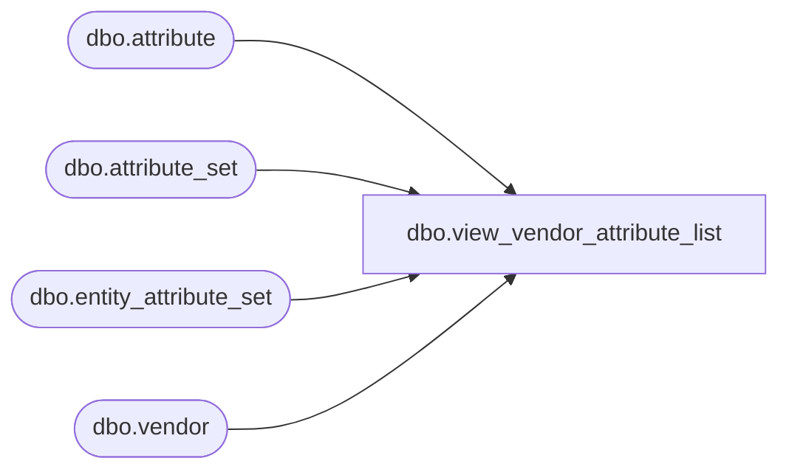

# dbo.view_vendor_attribute_list

**Database:** me_01  
**Server:** bedrockdb02  

## Architecture Diagram



## Table Dependencies

| Referenced Table |
|---|
| dbo.attribute |
| dbo.attribute_set |
| dbo.entity_attribute_set |
| dbo.vendor |

## View Code

```sql
create view dbo.view_vendor_attribute_list  AS
SELECT DISTINCT 
  v.vendor_id,  
  eas.attribute_set_id,
  ats.attribute_set_code, 
  ats.attribute_set_label,
  eas.attribute_id,
  a.attribute_code,
  a.attribute_label 
FROM vendor v
LEFT OUTER JOIN  entity_attribute_set eas
ON (v.vendor_id =eas.parent_id and eas.parent_type =3)
LEFT OUTER JOIN  attribute a
on (eas.attribute_id = a.attribute_id)
LEFT OUTER JOIN  attribute_set ats
ON (eas.attribute_set_id = ats.attribute_set_id)
```

