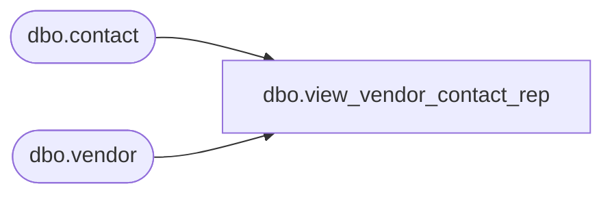

# dbo.view_vendor_contact_rep

**Database:** me_01  
**Server:** bedrockdb02  

## Architecture Diagram



## Table Dependencies

| Referenced Table |
|---|
| dbo.contact |
| dbo.vendor |

## View Code

```sql
create view dbo.view_vendor_contact_rep 

AS
SELECT DISTINCT
	v.vendor_id,
	c.contact_description1,
	c.contact_description2,
	c.contact_number
FROM 	vendor v
LEFT OUTER JOIN contact c ON (v.vendor_id = c.parent_id AND c.parent_type = 3)
```

