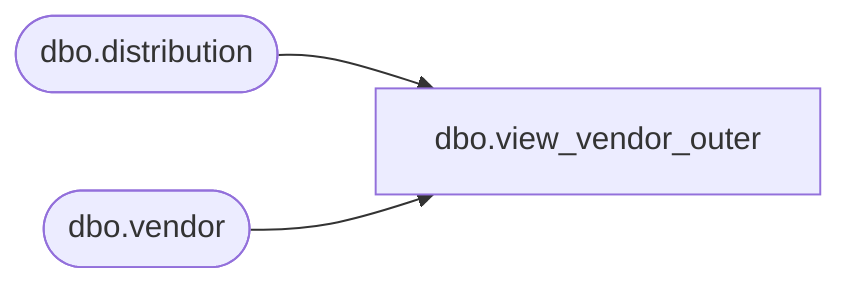

# dbo.view_vendor_outer

**Database:** me_01  
**Server:** bedrockdb02  

## Architecture Diagram



## Table Dependencies

| Referenced Table |
|---|
| dbo.distribution |
| dbo.vendor |

## View Code

```sql
create view dbo.view_vendor_outer AS
select distinct d.distribution_id, v.vendor_id, v.vendor_code ,v.vendor_name
 FROM vendor v RIGHT JOIN distribution d
on  d.vendor_id =v.vendor_id
```

