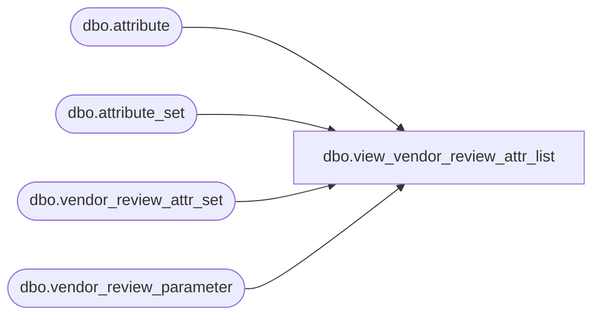

# dbo.view_vendor_review_attr_list

**Database:** me_01  
**Server:** bedrockdb02  

## Architecture Diagram



## Table Dependencies

| Referenced Table |
|---|
| dbo.attribute |
| dbo.attribute_set |
| dbo.vendor_review_attr_set |
| dbo.vendor_review_parameter |

## View Code

```sql
create view dbo.view_vendor_review_attr_list  AS
SELECT DISTINCT vr.vendor_review_parameter_id,  
                     vra.attribute_set_id,
                     ats.attribute_set_code, 
                     ats.attribute_set_label, 
                     a.attribute_id,
                     a.attribute_code,
                     a.attribute_label  
 FROM vendor_review_parameter vr 
 LEFT OUTER JOIN vendor_review_attr_set vra
  ON (vr.vendor_review_parameter_id =vra.vendor_review_parameter_id)
 LEFT OUTER JOIN  attribute_set ats
  ON (ats.attribute_set_id = vra.attribute_set_id )
 LEFT OUTER JOIN attribute a
  ON (ats.attribute_id = a.attribute_id)
```

