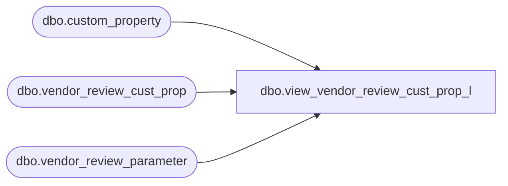

# dbo.view_vendor_review_cust_prop_l

**Database:** me_01  
**Server:** bedrockdb02  

## Architecture Diagram



## Table Dependencies

| Referenced Table |
|---|
| dbo.custom_property |
| dbo.vendor_review_cust_prop |
| dbo.vendor_review_parameter |

## View Code

```sql
create view dbo.view_vendor_review_cust_prop_l  AS
SELECT DISTINCT vr.vendor_review_parameter_id,  
                vc.custom_property_id,
                vc.custom_property_value,
                c.cust_prop_code,
                c.cust_prop_label                    
 FROM vendor_review_parameter vr
 LEFT OUTER JOIN vendor_review_cust_prop vc
  ON (vr.vendor_review_parameter_id = vc.vendor_review_parameter_id)
 LEFT OUTER JOIN  custom_property c
  ON (vc.custom_property_id = c.custom_property_id )
```

