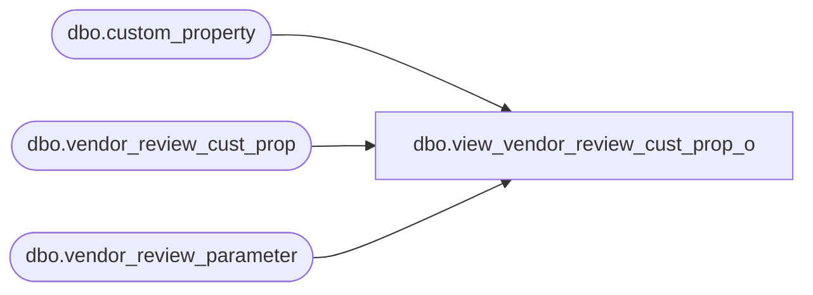

# dbo.view_vendor_review_cust_prop_o

**Database:** me_01  
**Server:** bedrockdb02  

## Architecture Diagram



## Table Dependencies

| Referenced Table |
|---|
| dbo.custom_property |
| dbo.vendor_review_cust_prop |
| dbo.vendor_review_parameter |

## View Code

```sql
create view dbo.view_vendor_review_cust_prop_o  AS
SELECT  g.vendor_review_parameter_id,{fn IFNULL(g.custom_property_id ,-1)} custom_property_id,
p.custom_property_value,p.cust_prop_code,p.cust_prop_label
from
       (SELECT DISTINCT  vr.vendor_review_parameter_id,
           vc.custom_property_id,
           vc.custom_property_value,c.cust_prop_code,c.cust_prop_label
           from  vendor_review_cust_prop vc
        RIGHT JOIN  vendor_review_parameter vr
        ON
        vr.vendor_review_parameter_id = vc.vendor_review_parameter_id
       LEFT JOIN custom_property c
       ON
       vc.custom_property_id = c.custom_property_id
      ) p
 RIGHT JOIN  
      (  SELECT DISTINCT a.vendor_review_parameter_id,
                         NULL custom_property_value,
                         e.custom_property_id
         FROM custom_property e ,vendor_review_parameter a
         WHERE e.entity_type=229 ) g
    ON
p.vendor_review_parameter_id = g.vendor_review_parameter_id
and(p.custom_property_id = g.custom_property_id 
       OR    p.custom_property_id is NULL)
```

