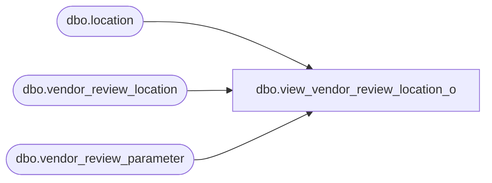

# dbo.view_vendor_review_location_o

**Database:** me_01  
**Server:** bedrockdb02  

## Architecture Diagram



## Table Dependencies

| Referenced Table |
|---|
| dbo.location |
| dbo.vendor_review_location |
| dbo.vendor_review_parameter |

## View Code

```sql
create view dbo.view_vendor_review_location_o  AS
select distinct vr.vendor_review_parameter_id,vl.vendor_review_location_id,
 vl.location_id,vl.suspend_reorder_from_vendor, convert(smalldatetime,convert(char(12),vl.reorder_suspension_from,109)) reorder_suspension_from,
 convert(smalldatetime,convert(char(12),vl.reorder_suspension_to,109)) reorder_suspension_to,
vl.effective_inventory_time_frame,l.location_code,l.location_name,l.location_short_name
from vendor_review_location vl
RIGHT join vendor_review_parameter vr
on vr.vendor_review_parameter_id = vl.vendor_review_parameter_id
LEFT join location l
on vl.location_id = l.location_id
```

