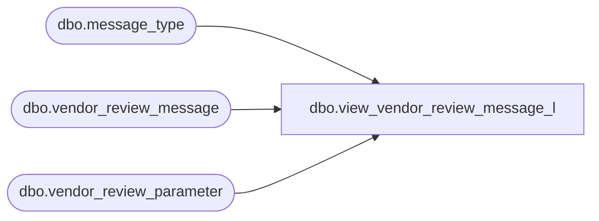

# dbo.view_vendor_review_message_l

**Database:** me_01  
**Server:** bedrockdb02  

## Architecture Diagram



## Table Dependencies

| Referenced Table |
|---|
| dbo.message_type |
| dbo.vendor_review_message |
| dbo.vendor_review_parameter |

## View Code

```sql
create view dbo.view_vendor_review_message_l  AS
SELECT DISTINCT vr.vendor_review_parameter_id,  
                vm.message_type_id,
                vm.message_text,
                m.message_type_description                   
 FROM vendor_review_parameter vr
 LEFT OUTER JOIN vendor_review_message vm
  ON (vr.vendor_review_parameter_id =vm.vendor_review_parameter_id)
 LEFT OUTER JOIN  message_type m
  ON (vm.message_type_id = m.message_type_id )
```

