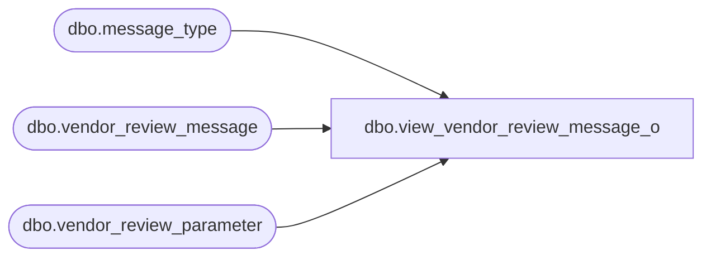

# dbo.view_vendor_review_message_o

**Database:** me_01  
**Server:** bedrockdb02  

## Architecture Diagram



## Table Dependencies

| Referenced Table |
|---|
| dbo.message_type |
| dbo.vendor_review_message |
| dbo.vendor_review_parameter |

## View Code

```sql
create view dbo.view_vendor_review_message_o AS
SELECT  g.vendor_review_parameter_id,{fn IFNULL(g.message_type_id ,-1)} 
message_type_id,
p.message_text,p.message_type_description
from
       (SELECT DISTINCT  vr.vendor_review_parameter_id,
           vm.message_type_id,
vm.message_text,m.message_type_description
           from  vendor_review_message vm
        RIGHT JOIN  vendor_review_parameter vr
        ON
        vr.vendor_review_parameter_id = vm.vendor_review_parameter_id
       LEFT JOIN message_type m
       ON
       vm.message_type_id = m.message_type_id
      ) p
 RIGHT JOIN  
      (  SELECT DISTINCT a.vendor_review_parameter_id,
                         NULL message_text,
                         e.message_type_id
         FROM message_type e ,vendor_review_parameter a
         WHERE e.transaction_type=6 ) g
    ON
p.vendor_review_parameter_id = g.vendor_review_parameter_id
and(p.message_type_id = g.message_type_id 
       OR    p.message_type_id is NULL)
```

