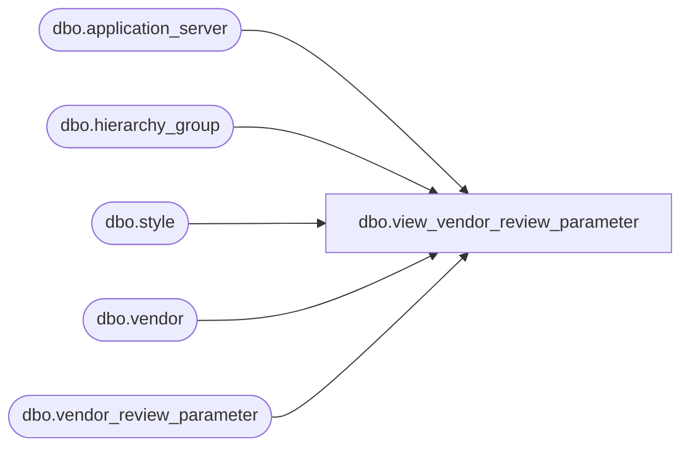

# dbo.view_vendor_review_parameter

**Database:** me_01  
**Server:** bedrockdb02  

## Architecture Diagram



## Table Dependencies

| Referenced Table |
|---|
| dbo.application_server |
| dbo.hierarchy_group |
| dbo.style |
| dbo.vendor |
| dbo.vendor_review_parameter |

## View Code

```sql
create view dbo.view_vendor_review_parameter 


AS
(SELECT DISTINCT
  vr.vendor_review_parameter_id, 
  NULL merchandise_hierarchy_group_id,
  NULL hierarchy_group_code,
  NULL hierarchy_group_short_label,
  NULL hierarchy_group_label,
  vr.style_id,
  s.style_code,
  s.short_desc,
  s.long_desc,
  vr.vendor_id,
  v.vendor_code,
  v.vendor_name,
  vr.cycle_frequency,
  vr.last_execution,
  vr.generate_po,
  vr.retain_for_distribution,
  vr.group_distribution_by,
  vr.distribution_description,
  vr.review_on_sunday,
  vr.review_on_monday,
  vr.review_on_tuesday,
  vr.review_on_wednesday,
  vr.review_on_thursday,
  vr.review_on_friday,
  vr.review_on_saturday,
  vr.cycle_period,
  vr.next_execution,
  vr.position_id,
  ap.server_name
 FROM vendor_review_parameter vr
 INNER JOIN vendor v
 ON  vr.vendor_id =v.vendor_id 
 INNER JOIN style s
 ON vr.style_id = s.style_id
 INNER JOIN application_server ap
 ON vr.application_server_id =ap.application_server_id
)
UNION ALL
(SELECT DISTINCT
  vr.vendor_review_parameter_id,
  vr.merchandise_hierarchy_group_id,
  h.hierarchy_group_code,
  h.hierarchy_group_short_label,
  h.hierarchy_group_label,
  NULL style_id, 
  NULL style_code,
  NULL short_desc,
  NULL long_desc,
  vr.vendor_id,
  v.vendor_code,
  v.vendor_name,
  vr.cycle_frequency,
  vr.last_execution,
  vr.generate_po,
  vr.retain_for_distribution,
  vr.group_distribution_by,
  vr.distribution_description,
  vr.review_on_sunday,
  vr.review_on_monday,
  vr.review_on_tuesday,
  vr.review_on_wednesday,
  vr.review_on_thursday,
  vr.review_on_friday,
  vr.review_on_saturday,
  vr.cycle_period,
  vr.next_execution,
  vr.position_id,
  ap.server_name
 FROM vendor_review_parameter vr
 INNER JOIN vendor v
 ON vr.vendor_id =v.vendor_id 
 INNER JOIN hierarchy_group h
 ON vr.merchandise_hierarchy_group_id = h.hierarchy_group_id
 INNER JOIN application_server ap
 ON vr.application_server_id =ap.application_server_id
 )
```

