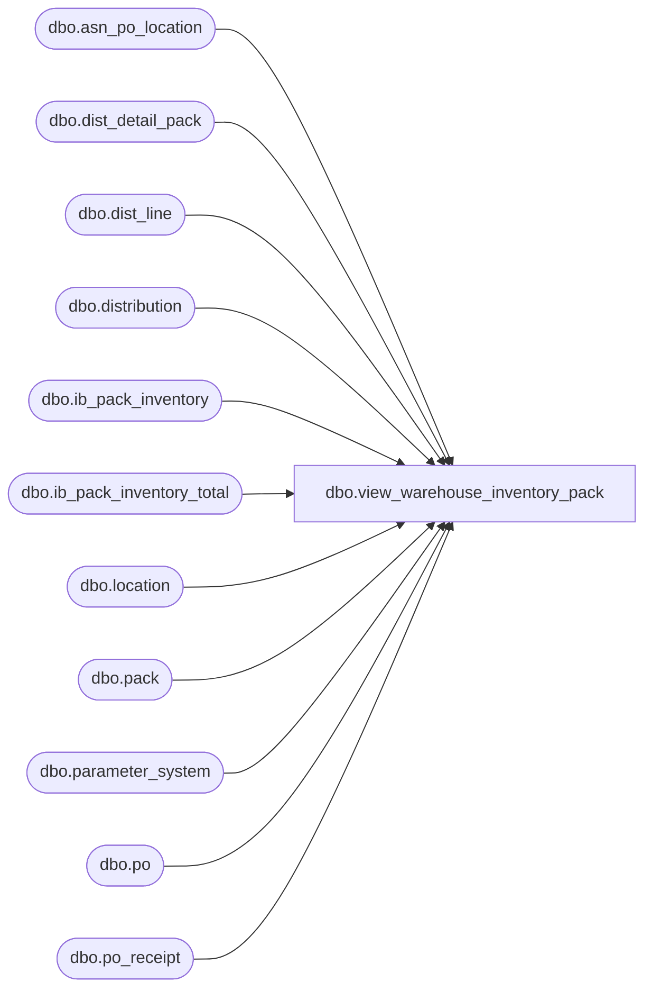

# dbo.view_warehouse_inventory_pack

**Database:** me_01  
**Server:** bedrockdb02  

## Architecture Diagram



## Table Dependencies

| Referenced Table |
|---|
| dbo.asn_po_location |
| dbo.dist_detail_pack |
| dbo.dist_line |
| dbo.distribution |
| dbo.ib_pack_inventory |
| dbo.ib_pack_inventory_total |
| dbo.location |
| dbo.pack |
| dbo.parameter_system |
| dbo.po |
| dbo.po_receipt |

## View Code

```sql
CREATE VIEW [dbo].[view_warehouse_inventory_pack]

AS

SELECT
	l.location_code,
	p.pack_code,
	l.location_id,
	p.pack_id,
	ISNULL(tot.available_on_hand, 0) AS available_on_hand
FROM
	(
		SELECT data_by_pack.location_id, data_by_pack.pack_id, SUM(data_by_pack.on_hand_units) AS available_on_hand
		FROM

		(
			-- IB Pack inventory total is the 'base'
			SELECT location_id, pack_id, total_on_hand_units AS on_hand_units
			FROM dbo.ib_pack_inventory_total

			UNION ALL

			-- Subtract 'shipped qty'
			SELECT i.location_id, i.pack_id, -i.transaction_units AS ib_shipped_qty
			FROM dbo.ib_pack_inventory i
			-- Distribution status: Released, Frozen; Pack distribution shipped transaction_type_code = 1300
				INNER JOIN dbo.distribution d ON d.distribution_id = i.distribution_id
					AND d.distribution_status IN (6, 7) AND i.transaction_type_code = 1300

			UNION ALL

			-- Subtract 'unavailable'
			SELECT i.location_id, i.pack_id, -i.transaction_units AS ib_unavail_qty
			FROM dbo.ib_pack_inventory i
			-- PO Receipt shipped status = 26; Pack Receipt transaction_type_code = 1200
				INNER JOIN dbo.po_receipt por ON por.document_no = i.document_number
					AND por.document_status = 26 AND i.transaction_type_code = 1200

			UNION ALL

			-- Subtract 'allocated'
			SELECT d.location_id, al.pack_id, -al.allocated_qty
			FROM
			(
				-- Detail type 0
				SELECT distribution_id, location_id AS detail_location_id, 0 dtl_type, pack_id, quantity AS allocated_qty
				FROM dbo.dist_detail_pack
				WHERE pack_id > 0

				UNION ALL

				-- Detail type 1
				SELECT distribution_id, -1, 1, pack_id, available_quantity AS allocated_qty
				FROM dbo.dist_line
				WHERE pack_id IS NOT NULL
			) al
				INNER JOIN
				(
					-- Distributions from Warehouse (system or user) and external source
					SELECT DISTINCT d.distribution_id, d.location_id, d.reserve_location_id
					FROM dbo.distribution d
					WHERE d.distribution_status in (5, 6, 7)	-- Open, Released, Frozen
					AND d.document_source in (6, 9, 10, 11)	-- WarehousePickUser, WarehousePickSystem, ExternalSource, Store

					UNION

					-- Distributions from received POs (Bulk, Dropship for WH/DC + cross dock if 4wall not installed)
					SELECT DISTINCT d.distribution_id, d.location_id, d.reserve_location_id
					FROM dbo.distribution d, dbo.po_receipt pr, dbo.po
					WHERE d.distribution_status in (5, 6, 7)	-- Open, Released, Frozen
					-- BulkPO, VendorOrderUser, VendorOrderSystem, Dropship for WH/DC and possibly CrossdockPO
					AND (d.document_source in (1, 7, 8, 14) OR d.document_source = (CASE WHEN (SELECT installed_4wall_flag FROM parameter_system) = 0 THEN 2 ELSE 1 END))
					AND d.po_id IS NOT NULL
					AND d.po_id = pr.po_id
					AND d.po_id = po.po_id
					-- Bulk, Dropship, and possibly PackByStoreCrossdock
					AND (po.predistribution_type in (1, 2 ) OR po.predistribution_type = (CASE WHEN (SELECT installed_4wall_flag FROM parameter_system) = 0 THEN 3 ELSE 1 END))
					AND pr.document_status = 4	-- Received

					UNION

					-- Distributions from received PO Receipts
					SELECT DISTINCT d.distribution_id, d.location_id, d.reserve_location_id
					FROM dbo.dist_line dl, dbo.distribution d, dbo.po_receipt pr
					WHERE d.distribution_status in (5, 6, 7)	-- Open, Released, Frozen
					AND d.document_source = 5	-- POReceipt
					AND d.distribution_id = dl.distribution_id
					AND dl.po_receipt_id = pr.po_receipt_id
					AND pr.document_status = 4	-- Received

					UNION

					-- Distributions from received ASNs
					SELECT DISTINCT d.distribution_id, d.location_id, d.reserve_location_id
					FROM dbo.dist_line dl, dbo.distribution d, dbo.asn_po_location asnpl, dbo.po_receipt pr
					WHERE d.distribution_id = dl.distribution_id
					AND d.distribution_status in (5, 6, 7)	-- Open, Released, Frozen
					AND d.document_source = 4	-- AdvanceShippingNotice
					AND dl.advance_shipping_notice_id = asnpl.advance_shipping_notice_id
					AND d.po_id = asnpl.po_id
					AND asnpl.po_id = pr.po_id
					AND pr.po_id = d.po_id AND pr.document_status = 4	-- Received
				) d
				ON d.distribution_id = al.distribution_id
				AND ((d.location_id = d.reserve_location_id AND al.dtl_type = 0) OR (d.location_id != d.reserve_location_id AND al.dtl_type = 1))
				AND d.location_id != al.detail_location_id
		) data_by_pack
		GROUP BY data_by_pack.location_id, data_by_pack.pack_id
	) tot
		INNER JOIN dbo.location l ON l.location_id = tot.location_id AND l.location_type IN (3, 4) -- Only W/H and D/C location types
		INNER JOIN dbo.pack p ON p.pack_id = tot.pack_id
```

