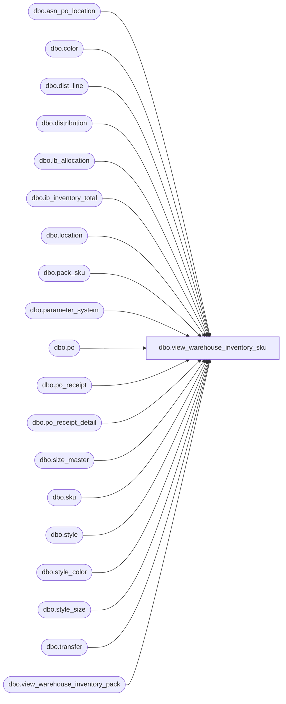

# dbo.view_warehouse_inventory_sku

**Database:** me_01  
**Server:** bedrockdb02  

## Architecture Diagram



## Table Dependencies

| Referenced Table |
|---|
| dbo.asn_po_location |
| dbo.color |
| dbo.dist_line |
| dbo.distribution |
| dbo.ib_allocation |
| dbo.ib_inventory_total |
| dbo.location |
| dbo.pack_sku |
| dbo.parameter_system |
| dbo.po |
| dbo.po_receipt |
| dbo.po_receipt_detail |
| dbo.size_master |
| dbo.sku |
| dbo.style |
| dbo.style_color |
| dbo.style_size |
| dbo.transfer |
| dbo.view_warehouse_inventory_pack |

## View Code

```sql
CREATE VIEW [dbo].[view_warehouse_inventory_sku]

AS
SELECT
  l.location_code,
  s.style_code,
  c.color_code,
  sm.size_code,
  l.location_id,
  sku.sku_id,
    ISNULL(tot.available_on_hand, 0) AS available_on_hand
FROM
  (
    SELECT data_by_sku.location_id, data_by_sku.sku_id, SUM(data_by_sku.on_hand_units) AS available_on_hand
    FROM

    (
      -- IB inventory total available is the 'base'
      SELECT location_id, sku_id, total_on_hand_units AS on_hand_units
      FROM dbo.ib_inventory_total
      WHERE inventory_status_id = 1

      UNION ALL

      -- Subtract pack available on-hand
      SELECT vwp.location_id, ps.sku_id, -vwp.available_on_hand * ps.sku_quantity AS pack_available_on_hand
      FROM dbo.view_warehouse_inventory_pack vwp
        INNER JOIN dbo.pack_sku ps ON ps.pack_id = vwp.pack_id

      UNION ALL

      -- Subtract allocated (Distributions)
      SELECT d.location_id, ia.sku_id, -ia.allocated_units
      FROM dbo.ib_allocation ia
        INNER JOIN
        (
          -- Distributions from Warehouse (system or user) and external source
          SELECT DISTINCT d.distribution_id, d.distribution_number, d.location_id
          FROM dbo.distribution d
          WHERE d.distribution_status in (5, 6, 7)	-- Open, Released, Frozen
          AND d.document_source in (6, 9, 10, 11)	-- WarehousePickUser, WarehousePickSystem, ExternalSource, Store

          UNION

          -- Distributions from received POs (Bulk, Dropship for WH/DC + cross dock if 4wall not installed)
          SELECT DISTINCT d.distribution_id, d.distribution_number, d.location_id
          FROM dbo.distribution d, dbo.po_receipt pr, dbo.po, po_receipt_detail prd (nolock), dist_line dl (nolock)
          WHERE d.distribution_status in (5, 6, 7)	-- Open, Released, Frozen
          -- BulkPO, Dropship for WH/DC, VendorOrderUser, VendorOrderSystem, and possibly CrossdockPO
          AND (d.document_source in (1, 7, 8, 14) OR d.document_source = (CASE WHEN (SELECT installed_4wall_flag FROM parameter_system) = 0 THEN 2 ELSE 1 END))
          AND d.po_id IS NOT NULL
          AND d.po_id = pr.po_id
          AND d.po_id = po.po_id
          -- Bulk, Dropship, and possibly PackByStoreCrossdock
          AND (po.predistribution_type in (1, 2) OR po.predistribution_type = (CASE WHEN (SELECT installed_4wall_flag FROM parameter_system) = 0 THEN 3 ELSE 1 END))
          AND pr.document_status = 4	-- Received
          AND pr.po_receipt_id = prd.po_receipt_id
          AND d.distribution_id = dl.distribution_id
          AND ((prd.style_color_id = dl.style_color_id AND prd.pack_id IS NULL) OR (prd.pack_id = dl.pack_id AND prd.style_color_id IS NULL))
          UNION

          -- Distributions from received PO Receipts
          SELECT DISTINCT d.distribution_id, d.distribution_number, d.location_id
          FROM dbo.dist_line dl, dbo.distribution d, dbo.po_receipt pr
          WHERE d.distribution_status in (5, 6, 7)	-- Open, Released, Frozen
          AND d.document_source = 5	-- POReceipt
          AND d.distribution_id = dl.distribution_id
          AND dl.po_receipt_id = pr.po_receipt_id
          AND pr.document_status = 4	-- Received

          UNION

          -- Distributions from received ASNs
          SELECT DISTINCT d.distribution_id, d.distribution_number, d.location_id
          FROM dbo.dist_line dl, dbo.distribution d, dbo.asn_po_location asnpl, dbo.po_receipt pr
          WHERE d.distribution_id = dl.distribution_id
          AND d.distribution_status in (5, 6, 7)	-- Open, Released, Frozen
          AND d.document_source = 4	-- AdvanceShippingNotice
          AND dl.advance_shipping_notice_id = asnpl.advance_shipping_notice_id
          AND d.po_id = asnpl.po_id
          AND asnpl.po_id = pr.po_id
          AND pr.po_id = d.po_id AND pr.document_status = 4	-- Received
        ) d
        ON d.distribution_number = ia.allocation_number

      UNION ALL

      -- Subtract allocated (Transfers)
      SELECT t.from_location_id, ia.sku_id, -ia.allocated_units
      FROM dbo.ib_allocation ia
        INNER JOIN transfer t ON N'T' + t.document_no = ia.allocation_number
        AND ia.transaction_type_code = 800	-- Allocation Create
        AND t.document_status = 2	 --  Ready To Send Transfers

    ) data_by_sku
    GROUP BY data_by_sku.location_id, data_by_sku.sku_id
  ) tot
  INNER JOIN dbo.location l ON l.location_id = tot.location_id AND l.location_type IN (3, 4) -- Only W/H and D/C location types
  INNER JOIN sku ON sku.sku_id = tot.sku_id
  INNER JOIN style s ON s.style_id = sku.style_id
  INNER JOIN style_color sc ON sc.style_color_id = sku.style_color_id
  INNER JOIN color c ON c.color_id = sc.color_id
  INNER JOIN style_size ss ON ss.style_size_id = sku.style_size_id
  INNER JOIN size_master sm ON sm.size_master_id = ss.size_master_id


dbo,view_wholesale_inventory_pack,create view dbo.view_wholesale_inventory_pack 
--	Object GUID: 589C8F85-AF15-495B-B985-39937243C7D3
 AS
SELECT
	 wip.vendor_code
	,wip.pack_code
	,v.vendor_id
	,p.pack_id
	,wip.available_on_hand AS original_available_on_hand
	,(CASE
		WHEN caAOH.available_on_hand < 0 THEN 0
		ELSE caAOH.available_on_hand
		END) AS available_on_hand
FROM
.me_01.dbo.wholesale_inventory_pack wip
	INNER JOIN dbo.vendor v ON v.vendor_code = wip.vendor_code
	INNER JOIN dbo.pack p ON wip.pack_code = p.pack_code
	LEFT JOIN dbo.view_wholesale_inventory_pack_decrement vpkdec ON vpkdec.vendor_id = v.vendor_id
		AND vpkdec.pack_id = p.pack_id
	CROSS APPLY

		(
			SELECT
				wip.available_on_hand - ISNULL (vpkdec.decrement_quantity, 0) AS available_on_hand
		) caAOH
```

