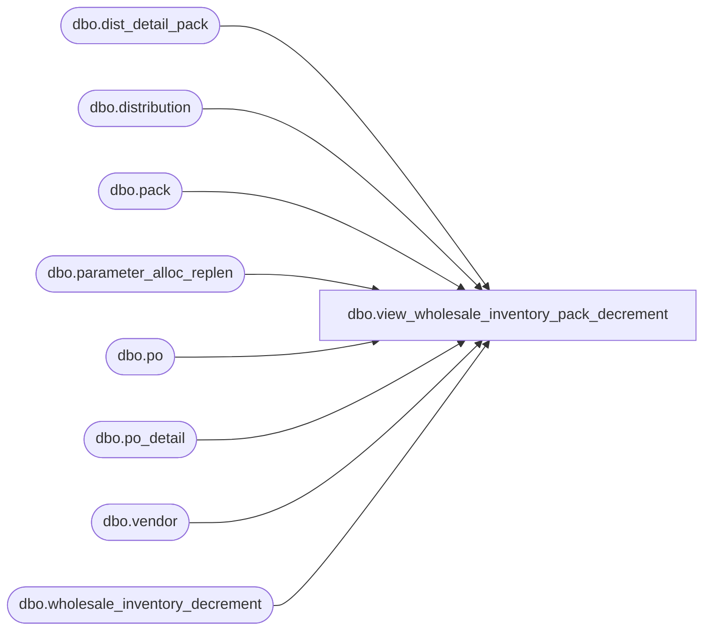

# dbo.view_wholesale_inventory_pack_decrement

**Database:** me_01  
**Server:** bedrockdb02  

## Architecture Diagram



## Table Dependencies

| Referenced Table |
|---|
| dbo.dist_detail_pack |
| dbo.distribution |
| dbo.pack |
| dbo.parameter_alloc_replen |
| dbo.po |
| dbo.po_detail |
| dbo.vendor |
| dbo.wholesale_inventory_decrement |

## View Code

```sql
CREATE VIEW dbo.view_wholesale_inventory_pack_decrement

AS

--	Object GUID: 8ECE23B9-6B11-47C1-9E2C-395C4A84BE4C

SELECT
	 V.vendor_code
	,PK.pack_code
	,V.vendor_id
	,PK.pack_id
	,sqDQS.decrement_quantity
FROM

	(
		SELECT
			 sqDQD.vendor_id
			,sqDQD.pack_id
			,SUM (sqDQD.decrement_quantity) AS decrement_quantity
		FROM

			(
				-- Distribution Document Type
				SELECT
					 D.vendor_id
					,DDP.pack_id
					,DDP.quantity AS decrement_quantity
				FROM
					dbo.wholesale_inventory_decrement WID
					INNER JOIN dbo.parameter_alloc_replen PAR ON PAR.wholesale_inventory_decrement_type = WID.document_type
					INNER JOIN dbo.distribution D ON D.distribution_id = WID.document_id
						AND D.document_source IN (12, 13) -- 12: Wholesale System Generated, 13: Wholesale User Initiated
						AND D.distribution_status = 2 -- 2: Preliminary
					INNER JOIN dbo.dist_detail_pack DDP ON DDP.distribution_id = D.distribution_id
						AND DDP.pack_id IS NOT NULL
				WHERE
					WID.document_type = 1 -- 1: Distribution

				UNION ALL

				-- PO Document Type
				SELECT
					 P.vendor_id
					,PD.pack_id
					,PD.ordered_units AS decrement_quantity
				FROM
					dbo.wholesale_inventory_decrement WID
					INNER JOIN dbo.parameter_alloc_replen PAR ON (CASE PAR.wholesale_inventory_decrement_type
																	WHEN 3 THEN 2
																	ELSE PAR.wholesale_inventory_decrement_type
																	END) = WID.document_type
					INNER JOIN dbo.po P ON P.po_id = WID.document_id
						AND P.predistribution_type = 2 -- 2: Dropship
						AND P.po_status IN (2, 3, 4) -- 2: Preliminary, 3: Submitted, 4: Open
						AND
						(
							PAR.wholesale_inventory_decrement_type = 2 -- 2: Wholesale PO Created
							OR
							(
								PAR.wholesale_inventory_decrement_type = 3 -- 3: Wholesale PO Becomes Open
								AND P.po_status = 4 -- 4: Open
							)
						)
					INNER JOIN dbo.po_detail PD ON PD.po_id = P.po_id
						AND PD.pack_id IS NOT NULL
				WHERE
					WID.document_type = 2 -- 2: PO
			) sqDQD

		GROUP BY
			 sqDQD.vendor_id
			,sqDQD.pack_id
	) sqDQS

	INNER JOIN dbo.vendor V ON V.vendor_id = sqDQS.vendor_id
	INNER JOIN dbo.pack PK ON PK.pack_id = sqDQS.pack_id

dbo,view_wholesale_inventory_sku,create view view_wholesale_inventory_sku
--	Object GUID: 7035901B-83D9-4C42-8147-E8C15483FED5
 AS
SELECT
	 wis.vendor_code
	,wis.style_code
	,wis.color_code
	,wis.size_code
	,v.vendor_id
	,sku.sku_id
	,wis.available_on_hand AS original_available_on_hand
	,(CASE
		WHEN caAOH.available_on_hand < 0 THEN 0
		ELSE caAOH.available_on_hand
		END) AS available_on_hand
FROM
.me_01.dbo.wholesale_inventory_sku wis
	INNER JOIN vendor v ON v.vendor_code = wis.vendor_code
	INNER JOIN style s ON s.style_code = wis.style_code
	INNER JOIN sku ON sku.style_id = s.style_id
	INNER JOIN style_color sc ON sc.style_color_id = sku.style_color_id
	INNER JOIN color c ON c.color_id = sc.color_id
		AND c.color_code = wis.color_code
	INNER JOIN style_size ss ON ss.style_size_id = sku.style_size_id
	INNER JOIN size_master sm ON sm.size_master_id = ss.size_master_id
		AND sm.size_code = wis.size_code
	LEFT JOIN view_wholesale_inventory_sku_decrement vskudec ON vskudec.vendor_id = v.vendor_id
		AND vskudec.sku_id = sku.sku_id	
	CROSS APPLY

		(
			SELECT
				wis.available_on_hand - ISNULL (vskudec.decrement_quantity, 0) AS available_on_hand
		) caAOH

dbo,view_wholesale_inventory_sku_decrement,CREATE VIEW dbo.view_wholesale_inventory_sku_decrement

AS

--	Object GUID: 04497D0D-ADC0-446C-9B3B-BB1928B95193

SELECT
	 V.vendor_code
	,ST.style_code
	,C.color_code
	,SM.size_code
	,V.vendor_id
	,sqDQS.sku_id
	,sqDQS.decrement_quantity
FROM

	(
		SELECT
			 sqDQD.vendor_id
			,sqDQD.sku_id
			,SUM (sqDQD.decrement_quantity) AS decrement_quantity
		FROM

			(
				-- Distribution Document Type
				SELECT
					 D.vendor_id
					,ISNULL (DD.sku_id, DDP.sku_id) AS sku_id
					,ISNULL (DD.quantity, DDP.quantity) AS decrement_quantity
				FROM
					dbo.wholesale_inventory_decrement WID
					INNER JOIN dbo.parameter_alloc_replen PAR ON PAR.wholesale_inventory_decrement_type = WID.document_type
					INNER JOIN dbo.distribution D ON D.distribution_id = WID.document_id
						AND D.document_source IN (12, 13) -- 12: Wholesale System Generated, 13: Wholesale User Initiated
						AND D.distribution_status = 2 -- 2: Preliminary
					LEFT JOIN dbo.dist_detail DD ON DD.distribution_id = D.distribution_id
						AND NOT EXISTS

							(
								SELECT
									*
								FROM
									dbo.dist_line DL
								WHERE
									DL.pack_id IS NOT NULL
									AND DL.distribution_id = DD.distribution_id
							)

					LEFT JOIN dbo.dist_detail_pack DDP ON DDP.distribution_id = D.distribution_id
						AND DDP.sku_id IS NOT NULL
				WHERE
					WID.document_type = 1 -- 1: Distribution
					AND
					(
						DD.distribution_id IS NOT NULL
						OR DDP.distribution_id IS NOT NULL
					)

				UNION ALL

				-- PO Document Type
				SELECT
					 P.vendor_id
					,PD.sku_id
					,PD.ordered_units AS decrement_quantity
				FROM
					dbo.wholesale_inventory_decrement WID
					INNER JOIN dbo.parameter_alloc_replen PAR ON (CASE PAR.wholesale_inventory_decrement_type
																	WHEN 3 THEN 2
																	ELSE PAR.wholesale_inventory_decrement_type
																	END) = WID.document_type
					INNER JOIN dbo.po P ON P.po_id = WID.document_id
						AND P.predistribution_type = 2 -- 2: Dropship
						AND P.po_status IN (2, 3, 4) -- 2: Preliminary, 3: Submitted, 4: Open
						AND
						(
							PAR.wholesale_inventory_decrement_type = 2 -- 2: Wholesale PO Created
							OR
							(
								PAR.wholesale_inventory_decrement_type = 3 -- 3: Wholesale PO Becomes Open
								AND P.po_status = 4 -- 4: Open
							)
						)
					INNER JOIN dbo.po_detail PD ON PD.po_id = P.po_id
						AND PD.sku_id IS NOT NULL
				WHERE
					WID.document_type = 2 -- 2: PO
			) sqDQD

		GROUP BY
			 sqDQD.vendor_id
			,sqDQD.sku_id
	) sqDQS

	INNER JOIN dbo.vendor V ON V.vendor_id = sqDQS.vendor_id
	INNER JOIN dbo.sku S ON S.sku_id = sqDQS.sku_id
	INNER JOIN dbo.style ST ON ST.style_id = S.style_id
	INNER JOIN dbo.style_color SC ON SC.style_color_id = S.style_color_id
	INNER JOIN dbo.color C ON C.color_id = SC.color_id
	INNER JOIN dbo.style_size SS ON SS.style_size_id = S.style_size_id
	INNER JOIN dbo.size_master SM ON SM.size_master_id = SS.size_master_id
```

