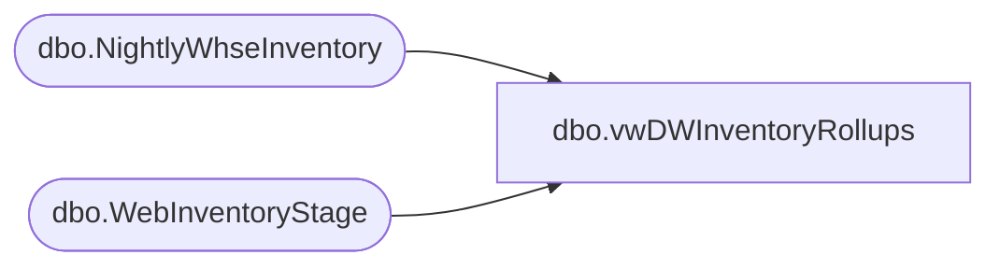

# dbo.vwDWInventoryRollups

**Database:** me_01  
**Server:** bedrockdb02  

## Architecture Diagram



## Table Dependencies

| Referenced Table |
|---|
| dbo.NightlyWhseInventory |
| dbo.WebInventoryStage |

## View Code

```sql
CREATE view [dbo].[vwDWInventoryRollups] 

as

---View runs on tables loaded from SSIS, view is called from SSIS, otherwise view is not useful.

With
StoreAndWebInventory as 
	(
		select 
			StyleCode,
			sum(
					case when LocationCode not in ('0013','2013','0980','0960','2970')
							and LocationCode not like '2___'
							then Qty
						else 0
					end
				) as StoreInventoryUS,
			sum(
					case when LocationCode not in ('0013','2013','0980','0960','2970')
							and LocationCode like '2___'
							then Qty
						else 0
					end
				) as StoreInventoryUK,
			sum(
					case when LocationCode in ('0013')
							then Qty
						else 0
					end
				) as WebInventoryUS,
			sum(
					case when LocationCode in ('2013')
							then Qty
						else 0
					end
				) as WebInventoryUK
		from esell.dbo.WebInventoryStage with (nolock)
		group by StyleCode 
	),
WhseInventory as
	(
		select 
			style_code as StyleCode,
			sum(
					case 
						when location_code in ('0960', '0980') 
							then qty 
							else 0
						end
				) as WarehouseInventoryUS,
			sum(
					case 
						when location_code in ('2970') 
							then qty 
							else 0
						end
				) as WarehouseInventoryUK
		from NightlyWhseInventory with (nolock)
		where datediff(dd, load_date, getdate()) = 0
		group by 
			style_code,
			cast(load_date as date)
	)
select 
	saw.StyleCode,
	saw.StoreInventoryUS,
	saw.StoreInventoryUK,
	saw.WebInventoryUS,
	saw.WebInventoryUK,
	wi.WarehouseInventoryUS,
	wi.WarehouseInventoryUK,
	cast(getdate() as date) as InventoryDate 
from StoreAndWebInventory saw 
left join WhseInventory wi on saw.StyleCode = wi.StyleCode

dbo,vwErpFactoryAddress,create view vwErpFactoryAddress 

---------------------------------------------------------------------------------------------
--Dan Tweedie - 20180405 - Created View to aid Purchasing team in lookup of factory address
---------------------------------------------------------------------------------------------

as 

with Factories as
	(
		select FactoryCode
		from DBSPOExportArchive --only factories which have been on po's exported to db schenker
		group by FactoryCode
	)
select 
	vendor_code as VendorCode,
	attribute_set_code as FactoryCode,
	address_name as Factory,
	port as Port,
	address as FactoryAddress,
	city as FactoryCity,
	province as FactoryProvince,
	country as FactoryCountry
from factory_address fa
join Factories f on fa.attribute_set_code = f.FactoryCode
```

