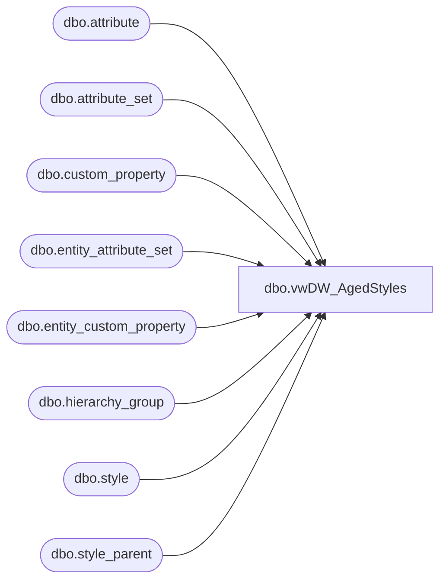

# dbo.vwDW_AgedStyles

**Database:** me_01  
**Server:** bedrockdb02  

## Architecture Diagram



## Table Dependencies

| Referenced Table |
|---|
| dbo.attribute |
| dbo.attribute_set |
| dbo.custom_property |
| dbo.entity_attribute_set |
| dbo.entity_custom_property |
| dbo.hierarchy_group |
| dbo.style |
| dbo.style_parent |

## View Code

```sql
CREATE view [dbo].[vwDW_AgedStyles]


as

--==================================================================================================
--	Author			Date			Details
--	Dan Tweedie		11/30/2016		Returns all styles, and Y/N flag for Aged.
--									Aged = OUTDATE is >= 3 months before getdate() AND style does not have MSTAT attribute with (DON, QC NO, WO, WROFF, GONE).
--											If OUTDATE not formatted as date, it is Aged.
--==================================================================================================


with 
Styles as
	(
		select
			s.style_id,
			s.style_code,
			s.short_desc
		FROM
			 ma_01.dbo.style s with (nolock)
		join ma_01.dbo.style_parent sp with (nolock) on s.style_id = sp.style_id and sp.hierarchy_level_id = 10000002 
		join ma_01.dbo.hierarchy_group hg with (nolock) on hg.hierarchy_group_id = sp.parent_hierarchy_group_id and hg.hierarchy_group_code = N'W'
	),
OutDate as
	(
		select 
			s.style_id,
			max(cast(
				case 
					when ecp.custom_property_value is NULL 
						then ecp.custom_property_value
					when isdate(replace(replace(replace(replace(ecp.custom_property_value, '\', '-'), '/', '-'), '.', '-'), ' ', '')) = 1
						then cast( replace(replace(replace(replace(ecp.custom_property_value, '\', '-'), '/', '-'), '.', '-'), ' ', '') as date)
					else cast(ecp.custom_property_value as date) 
				end 
			as date))		
			 as OutDate
		from Styles s 
		join entity_custom_property ecp on s.style_id = ecp.parent_id and ecp.parent_type = 1
		join custom_property cp (nolock) on cp.custom_property_id = ecp.custom_property_id 
		where cp.cust_prop_code IN ('ODATE') 
		and isdate(ecp.custom_property_value) = 1
		group by s.style_id
	) ,
MSTAT as
	(
		select distinct
			s.style_id
		from Styles s (nolock)
		join entity_attribute_set eas (nolock) on s.style_id = eas.parent_id
		join attribute_set att (nolock) on eas.attribute_set_id = att.attribute_set_id
		join attribute a (nolock) on att.attribute_id = a.attribute_id and a.parent_type = 1
		where a.attribute_code in ('MSTAT')
		and att.attribute_set_code in ('DON', 'QC NO', 'WO', 'WROFF', 'GONE')
	)
select 
	s.style_id,
	s.style_code,
	s.short_desc,
	case 
		when 
			(
				dateadd(mm, +3, od.OutDate) <= getdate()
				and ms.style_id is null
			)
		or od.style_id is null 
		then 'Y'
		else 'N'
	end as Aged,
	case 
		when 
			(
				dateadd(mm, +3, od.OutDate) <= getdate()-364
				and ms.style_id is null
			)
		or od.style_id is null 
		then 'Y'
		else 'N'
	end as AgedLY,
	OutDate
from 
	Styles s
left join OutDate od on s.style_id = od.style_id
left join MSTAT ms on s.style_id = ms.style_id


dbo,vwDW_LicenseRates,CREATE VIEW dbo.vwDW_LicenseRates
AS
WITH Licensed AS (SELECT DISTINCT s.style_code
                                          FROM            dbo.style AS s WITH (nolock) INNER JOIN
                                                                    dbo.style_group AS sg WITH (nolock) ON s.style_id = sg.style_id INNER JOIN
                                                                    dbo.entity_attribute_set AS eas WITH (nolock) ON eas.parent_id = s.style_id INNER JOIN
                                                                    dbo.attribute_set AS ats WITH (nolock) ON eas.attribute_set_id = ats.attribute_set_id INNER JOIN
                                                                    dbo.attribute AS a WITH (nolock) ON ats.attribute_id = a.attribute_id AND a.parent_type = 1
                                          WHERE        (a.attribute_code IN ('LICEN', 'LICEN2')) AND (ats.attribute_set_code IN ('YES', 'Y'))), Licensor AS
    (SELECT DISTINCT s.style_code, ats.attribute_set_code AS Licensor
      FROM            dbo.style AS s WITH (nolock) INNER JOIN
                                Licensed AS l ON s.style_code = l.style_code INNER JOIN
                                dbo.style_group AS sg WITH (nolock) ON s.style_id = sg.style_id INNER JOIN
                                dbo.entity_attribute_set AS eas WITH (nolock) ON eas.parent_id = s.style_id INNER JOIN
                                dbo.attribute_set AS ats WITH (nolock) ON eas.attribute_set_id = ats.attribute_set_id INNER JOIN
                                dbo.attribute AS a WITH (nolock) ON ats.attribute_id = a.attribute_id AND a.parent_type = 1
      WHERE        (a.attribute_code IN ('LICNSR')))
    SELECT DISTINCT TOP (100) PERCENT s.style_code, l.Licensor, ats.attribute_set_code AS LicenseFee
     FROM            dbo.style AS s WITH (nolock) INNER JOIN
                              Licensor AS l ON s.style_code = l.style_code INNER JOIN
                              dbo.style_group AS sg WITH (nolock) ON s.style_id = sg.style_id INNER JOIN
                              dbo.entity_attribute_set AS eas WITH (nolock) ON eas.parent_id = s.style_id INNER JOIN
                              dbo.attribute_set AS ats WITH (nolock) ON eas.attribute_set_id = ats.attribute_set_id INNER JOIN
                              dbo.attribute AS a WITH (nolock) ON ats.attribute_id = a.attribute_id AND a.parent_type = 1
     WHERE        (a.attribute_code IN ('ACROYR'))
     ORDER BY l.Licensor, s.style_code
```

