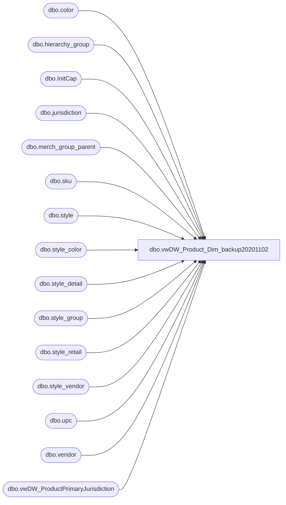

# dbo.vwDW_Product_Dim_backup20201102

**Database:** me_01  
**Server:** bedrockdb02  

## Architecture Diagram



## Table Dependencies

| Referenced Table |
|---|
| dbo.color |
| dbo.hierarchy_group |
| dbo.InitCap |
| dbo.jurisdiction |
| dbo.merch_group_parent |
| dbo.sku |
| dbo.style |
| dbo.style_color |
| dbo.style_detail |
| dbo.style_group |
| dbo.style_retail |
| dbo.style_vendor |
| dbo.upc |
| dbo.vendor |
| dbo.vwDW_ProductPrimaryJurisdiction |

## View Code

```sql
CREATE VIEW [dbo].[vwDW_Product_Dim_backup20201102]
AS

SELECT
	CAST(upc.upc_number AS BIGINT) AS sku,  
	upc.activation_date AS activation_date, 
	CAST(dbo.InitCap(s.style_code) AS VARCHAR(20)) AS style_code,  
	CAST(dbo.InitCap(s.short_desc) AS VARCHAR(20)) AS style_desc, 
	CAST(c.color_code AS VARCHAR(20)) AS color_code, 
	CAST(dbo.InitCap(c.color_short_description) AS VARCHAR(20)) AS color_desc,
	CAST(dbo.InitCap(s.short_desc + ' ' + c.color_short_description) AS VARCHAR(40)) AS product_desc, 
	CAST(dbo.InitCap(hgsub.hierarchy_group_short_label) AS VARCHAR(20)) AS subclass, 
	CAST(dbo.InitCap(hgcla.hierarchy_group_short_label) AS VARCHAR(20)) AS class, 
	CAST(dbo.InitCap(hgdep.hierarchy_group_short_label) AS VARCHAR(20)) AS department, 
	CAST(dbo.InitCap(hgdep.hierarchy_group_code) AS VARCHAR(20)) AS department_code, 
	CAST(dbo.InitCap(hgdiv.hierarchy_group_short_label) AS VARCHAR(20)) AS division, 
	CAST(dbo.InitCap(hgchain.hierarchy_group_short_label) AS VARCHAR(20)) AS chain,  
	CAST(dbo.InitCap(hgconcept.hierarchy_group_short_label) AS VARCHAR(20)) AS concept, 
	--priceline_code (derived column in SSIS package)
	CAST(hgsub.hierarchy_group_code AS VARCHAR(20)) AS subclass_code, 
	CAST(v.vendor_code AS VARCHAR(20)) AS primary_vendor_code, 
	CAST(v.vendor_name AS VARCHAR(50)) AS primary_vendor_name, 
	CAST(v.alternate_vendor_code AS VARCHAR(20)) AS alt_primary_vendor_code, 
	CASE 
		WHEN (isnumeric(s.style_code) != 1) --OR vppj.attribute_set_code = 'US'
			THEN sr_home.current_selling_retail
		WHEN (cast(s.style_code AS BIGINT) BETWEEN 100000 AND 199999) --OR vppj.attribute_set_code = 'CA'
			THEN sr_cdn.current_selling_retail
		WHEN (cast(s.style_code AS BIGINT) BETWEEN 400000 AND 499999) --OR vppj.attribute_set_code = 'UK'
			THEN CAST ((sr_uk.current_selling_retail/((j_uk.jurisdiction_equivalency_rate * .01)+1)) AS DECIMAL(10,2))
		ELSE sr_home.current_selling_retail
	END AS current_retail,
	--CASE 
	--	WHEN hgdiv.hierarchy_group_code = 'R-B-C' THEN sr_cdn.current_selling_retail
	--	WHEN  hgdiv.hierarchy_group_code = 'R-B-U' THEN CAST ((sr_uk.current_selling_retail/((j_uk.jurisdiction_equivalency_rate * .01)+1)) AS DECIMAL(10,2))
	--	ELSE sr_home.current_selling_retail
	--END AS current_retail,
	sr_home.original_selling_retail AS original_retail,
	sr_uk.current_selling_retail AS price_with_vat,
	s.reorder_flag AS reorder_flag,
	sr_euro.current_selling_retail AS euro_value,
	--CAST(merch.attribute_set_code AS VARCHAR(6)) AS merch_status, -- lookup in SSIS package
	--CAST(wss.attribute_set_code AS VARCHAR(6)) AS wss_reportable,-- lookup in SSIS package
	s.style_id,
	c.color_id, 
	sr_home.current_selling_retail as current_selling_retail_home,
	CAST(CASE 
		WHEN (isnumeric(s.style_code) != 1) --OR vppj.attribute_set_code = 'US' 
			then 'US'
		WHEN (cast(s.style_code AS BIGINT) BETWEEN 100000 AND 199999) --OR vppj.attribute_set_code = 'CA' 
			THEN  'CA'
		WHEN (cast(s.style_code AS BIGINT) BETWEEN 400000 AND 499999) --OR vppj.attribute_set_code = 'UK' 
			THEN  'UK'
		WHEN (cast(s.style_code AS BIGINT) BETWEEN 800000 AND 899999) --OR vppj.attribute_set_code = 'CN' 
			THEN  'CN'
		ELSE 'US' 
	END AS VARCHAR(20)) jurisdiction_code,
	CASE 
		WHEN (isnumeric(s.style_code) != 1) --OR vppj.attribute_set_code = 'US' 
			then 1
		WHEN (cast(s.style_code AS BIGINT) BETWEEN 100000 AND 199999) --OR vppj.attribute_set_code = 'CA' 
			THEN  3
		WHEN (cast(s.style_code AS BIGINT) BETWEEN 400000 AND 499999) --OR vppj.attribute_set_code = 'UK' 
			THEN 2
		WHEN (cast(s.style_code AS BIGINT) BETWEEN 800000 AND 899999) --CHINA
			THEN 8
		ELSE 1
	END AS jurisdiction_id, 
	sr_cdn.current_selling_retail AS cdn_value
FROM style_color sc  WITH (NOLOCK)
	INNER JOIN style s WITH (NOLOCK) ON sc.style_id=s.style_id  
	INNER JOIN color c WITH (NOLOCK) ON sc.color_id=c.color_id
	LEFT JOIN sku  WITH (NOLOCK) ON sku.style_color_id=sc.style_color_id
	LEFT JOIN upc WITH (NOLOCK) ON sku.sku_id=upc.sku_id  and upc.upc_number < '000001000000'    
	INNER JOIN style_group sg WITH (NOLOCK) ON sc.style_id=sg.style_id 

	INNER JOIN style_retail sr_home WITH (NOLOCK) ON sc.style_id=sr_home.style_id  
	INNER JOIN style_retail sr_cdn WITH (NOLOCK) ON sc.style_id=sr_cdn.style_id 
	INNER JOIN style_retail sr_uk WITH (NOLOCK) ON sc.style_id=sr_uk.style_id 
	INNER JOIN style_retail sr_euro WITH (NOLOCK) ON sc.style_id=sr_euro.style_id 

	INNER JOIN merch_group_parent mgp WITH (NOLOCK) ON sg.hierarchy_group_id=mgp.hierarchy_group_id 
	INNER JOIN hierarchy_group hgsub WITH (NOLOCK) ON mgp.parent_hierarchy_group_id=hgsub.hierarchy_group_id 
	INNER JOIN hierarchy_group hgcla WITH (NOLOCK) ON hgsub.parent_group_id=hgcla.hierarchy_group_id 
	INNER JOIN hierarchy_group hgdep WITH (NOLOCK) ON hgcla.parent_group_id=hgdep.hierarchy_group_id 
	INNER JOIN hierarchy_group hgdiv WITH (NOLOCK) ON hgdep.parent_group_id=hgdiv.hierarchy_group_id 
	INNER JOIN hierarchy_group hgchain WITH (NOLOCK) ON hgdiv.parent_group_id=hgchain.hierarchy_group_id 
	INNER JOIN hierarchy_group hgconcept WITH (NOLOCK) ON hgchain.parent_group_id=hgconcept.hierarchy_group_id 
	INNER JOIN style_detail ON style_detail.style_id = s.style_id
	INNER JOIN style_vendor sv WITH (NOLOCK) ON s.style_id = sv.style_id and sv.primary_vendor_flag = 1
	INNER JOIN vendor v WITH (NOLOCK) ON sv.vendor_id = v.vendor_id
	INNER JOIN jurisdiction j_uk WITH (NOLOCK) ON sr_uk.jurisdiction_id = j_uk.jurisdiction_id
	LEFT OUTER JOIN vwDW_ProductPrimaryJurisdiction vppj
		ON s.style_code = vppj.style_code
where 1=1 
	AND hgsub.hierarchy_id=1     
	AND hgcla.hierarchy_id=1     
	AND hgdep.hierarchy_id=1     
	AND hgdiv.hierarchy_id=1     
	AND hgchain.hierarchy_id=1     
	AND hgconcept.hierarchy_id=1      
	AND hgsub.hierarchy_level_id=10000007 --8    
	AND hgcla.hierarchy_level_id=10000006 --7
	AND hgdep.hierarchy_level_id=10000005 --6     
	AND hgdiv.hierarchy_level_id=10000004 --5     
	AND hgchain.hierarchy_level_id=10000003 --4      
	AND hgconcept.hierarchy_level_id=10000002 --3
	AND sr_home.jurisdiction_id = 1 --HOME
	AND sr_cdn.jurisdiction_id = 3 --CANADA
	AND sr_uk.jurisdiction_id = 2 --UK
	AND sr_euro.jurisdiction_id = 5 --EURO
	and len(upc_number) = 12
	and substring(upc_number, 7, 6) = s.style_code
	and s.style_code not in ('000450','001857','004422') -- known dups
	and substring(hgdep.hierarchy_group_code, 1, 5) !=  'R-B-Z'  -- do not include zhu-zhu here

UNION

SELECT DISTINCT
	CAST(upc.upc_number AS BIGINT) AS sku,  
	upc.activation_date AS activation_date, 
	CAST(dbo.InitCap(s.style_code) AS VARCHAR(20)) AS style_code,  
	CAST(dbo.InitCap(s.short_desc) AS VARCHAR(20)) AS style_desc, 
	CAST(c.color_code AS VARCHAR(20)) AS color_code, 
	CAST(dbo.InitCap(c.color_short_description) AS VARCHAR(20)) AS color_desc,
	CAST(dbo.InitCap(s.short_desc + ' ' + c.color_short_description) AS VARCHAR(40)) AS product_desc, 
	CAST(dbo.InitCap(hgsub.hierarchy_group_short_label) AS VARCHAR(20)) AS subclass, 
	CAST(dbo.InitCap(hgcla.hierarchy_group_short_label) AS VARCHAR(20)) AS class, 
	CAST(dbo.InitCap(hgdep.hierarchy_group_short_label) AS VARCHAR(20)) AS department, 
	CAST(dbo.InitCap(hgdep.hierarchy_group_code) AS VARCHAR(20)) AS department_code, 
	CAST(dbo.InitCap(hgdiv.hierarchy_group_short_label) AS VARCHAR(20)) AS division, 
	CAST(dbo.InitCap(hgchain.hierarchy_group_short_label) AS VARCHAR(20)) AS chain, 
	CAST(dbo.InitCap(hgconcept.hierarchy_group_short_label) AS VARCHAR(20)) AS concept,
	--priceline_code (derived column in SSIS package)
	CAST(hgsub.hierarchy_group_code AS VARCHAR(20)) AS subclass_code, 
	CAST(v.vendor_code AS VARCHAR(20)) AS primary_vendor_code, 
	CAST(v.vendor_name AS VARCHAR(50)) AS primary_vendor_name, 
	CAST(v.alternate_vendor_code AS VARCHAR(20)) AS alt_primary_vendor_code, 
	CASE 
		WHEN hgdiv.hierarchy_group_code = 'R-B-C' then sr_cdn.current_selling_retail
		WHEN hgdiv.hierarchy_group_code = 'R-B-U' then cast ((sr_uk.current_selling_retail/((j_uk.jurisdiction_equivalency_rate * .01)+1)) AS DECIMAL(10,2))
		ELSE sr_home.current_selling_retail
	END AS current_retail,
	sr_home.original_selling_retail AS original_retail,
	sr_uk.current_selling_retail AS price_with_vat,
	s.reorder_flag AS reorder_flag,
	sr_euro.current_selling_retail AS euro_value,
	--CAST(merch.attribute_set_code AS VARCHAR(6)) AS merch_status, -- lookup in SSIS package
	--CAST(wss.attribute_set_code AS VARCHAR(6)) AS wss_reportable, -- lookup in SSIS package
	s.style_id,
	c.color_id, 
	sr_home.current_selling_retail AS current_selling_retail_home,
	CAST(CASE 
		WHEN jurisdiction_code = 'HOME' THEN 'US'
		ELSE jurisdiction_code
	END AS VARCHAR(20)) AS jurisdiction_code,
	sr.jurisdiction_id, 
	sr_cdn.current_selling_retail AS cdn_value
FROM style_color sc  WITH (NOLOCK) 
	INNER JOIN style s WITH (NOLOCK) ON sc.style_id=s.style_id 
	INNER JOIN color c WITH (NOLOCK) ON sc.color_id=c.color_id 
	LEFT JOIN sku  WITH (NOLOCK) ON sku.style_color_id=sc.style_color_id 
	LEFT JOIN upc WITH (NOLOCK) ON sku.sku_id=upc.sku_id  and upc.upc_number < '000001000000'   
	INNER JOIN style_group sg WITH (NOLOCK) ON sc.style_id=sg.style_id 

	INNER JOIN style_retail sr WITH (NOLOCK) ON sc.style_id=sr.style_id 

	INNER JOIN style_retail sr_home WITH (NOLOCK) ON sc.style_id=sr_home.style_id 
	INNER JOIN style_retail sr_cdn WITH (NOLOCK) ON sc.style_id=sr_cdn.style_id 
	INNER JOIN style_retail sr_uk WITH (NOLOCK) ON sc.style_id=sr_uk.style_id 
	INNER JOIN style_retail sr_euro WITH (NOLOCK) ON sc.style_id=sr_euro.style_id 

	INNER JOIN merch_group_parent mgp WITH (NOLOCK) ON sg.hierarchy_group_id=mgp.hierarchy_group_id 
	INNER JOIN hierarchy_group hgsub WITH (NOLOCK) ON mgp.parent_hierarchy_group_id=hgsub.hierarchy_group_id 
	INNER JOIN hierarchy_group hgcla WITH (NOLOCK) ON hgsub.parent_group_id=hgcla.hierarchy_group_id 
	INNER JOIN hierarchy_group hgdep WITH (NOLOCK) ON hgcla.parent_group_id=hgdep.hierarchy_group_id 
	INNER JOIN hierarchy_group hgdiv WITH (NOLOCK) ON hgdep.parent_group_id=hgdiv.hierarchy_group_id 
	INNER JOIN hierarchy_group hgchain WITH (NOLOCK) ON hgdiv.parent_group_id=hgchain.hierarchy_group_id 
	INNER JOIN hierarchy_group hgconcept WITH (NOLOCK) ON hgchain.parent_group_id=hgconcept.hierarchy_group_id 
	INNER JOIN style_detail ON style_detail.style_id = s.style_id
	INNER JOIN style_vendor sv WITH (NOLOCK) ON s.style_id = sv.style_id and sv.primary_vendor_flag = 1
	INNER JOIN vendor v WITH (NOLOCK) ON sv.vendor_id = v.vendor_id
	INNER JOIN jurisdiction j_uk WITH (NOLOCK) ON sr.jurisdiction_id = j_uk.jurisdiction_id
where 1=1  
	AND hgsub.hierarchy_id=1     
	AND hgcla.hierarchy_id=1     
	AND hgdep.hierarchy_id=1     
	AND hgdiv.hierarchy_id=1     
	AND hgchain.hierarchy_id=1     
	AND hgconcept.hierarchy_id=1      
	AND hgsub.hierarchy_level_id=10000007 --8    
	AND hgcla.hierarchy_level_id=10000006 --7
	AND hgdep.hierarchy_level_id=10000005 --6     
	AND hgdiv.hierarchy_level_id=10000004 --5     
	AND hgchain.hierarchy_level_id=10000003 --4      
	AND hgconcept.hierarchy_level_id=10000002 --3
	AND sr_home.jurisdiction_id = 1 --HOME
	AND sr_cdn.jurisdiction_id = 3 --CANADA
	AND sr_uk.jurisdiction_id = 2 --UK
	AND sr_euro.jurisdiction_id = 5 --EURO
	and len(upc_number) = 12
	and substring(upc_number, 7, 6) = style_code
	and style_code not in ('000450','001857','004422') -- known dups
	and substring(hgdep.hierarchy_group_code, 1, 5) =  'R-B-Z'  -- zhu-zhu


dbo,vwDW_Product_Dim_ORIG_DeleteAfter20150729,CREATE VIEW [dbo].[vwDW_Product_Dim]
AS 

SELECT 
	CAST(upc.upc_number AS BIGINT) AS sku,  
	upc.activation_date AS activation_date, 
	CAST(dbo.InitCap(s.style_code) AS VARCHAR(20)) AS style_code,  
	CAST(dbo.InitCap(s.short_desc) AS VARCHAR(20)) AS style_desc, 
	CAST(c.color_code AS VARCHAR(20)) AS color_code, 
	CAST(dbo.InitCap(c.color_short_description) AS VARCHAR(20)) AS color_desc,
	CAST(dbo.InitCap(s.short_desc + ' ' + c.color_short_description) AS VARCHAR(40)) AS product_desc, 
	CAST(dbo.InitCap(hgsub.hierarchy_group_short_label) AS VARCHAR(20)) AS subclass, 
	CAST(dbo.InitCap(hgcla.hierarchy_group_short_label) AS VARCHAR(20)) AS class, 
	CAST(dbo.InitCap(hgdep.hierarchy_group_short_label) AS VARCHAR(20)) AS department, 
	CAST(dbo.InitCap(hgdep.hierarchy_group_code) AS VARCHAR(20)) AS department_code, 
	CAST(dbo.InitCap(hgdiv.hierarchy_group_short_label) AS VARCHAR(20)) AS division, 
	CAST(dbo.InitCap(hgchain.hierarchy_group_short_label) AS VARCHAR(20)) AS chain,  
	CAST(dbo.InitCap(hgconcept.hierarchy_group_short_label) AS VARCHAR(20)) AS concept, 
	--priceline_code (derived column in SSIS package)
	CAST(hgsub.hierarchy_group_code AS VARCHAR(20)) AS subclass_code, 
	--hgcla.hierarchy_group_code AS class_code, 
	CAST(v.vendor_code AS VARCHAR(20)) AS primary_vendor_code, 
	CAST(v.vendor_name AS VARCHAR(50)) AS primary_vendor_name, 
	CAST(v.alternate_vendor_code AS VARCHAR(20)) AS alt_primary_vendor_code, 
	CASE 
		WHEN hgdiv.hierarchy_group_code = 'R-B-C' THEN sr_cdn.current_selling_retail
		WHEN  hgdiv.hierarchy_group_code = 'R-B-U' THEN CAST ((sr_uk.current_selling_retail/((j_uk.jurisdiction_equivalency_rate * .01)+1)) AS DECIMAL(10,2))
		ELSE sr_home.current_selling_retail
	END AS current_retail,
	sr_home.original_selling_retail AS original_retail,
	sr_uk.current_selling_retail AS price_with_vat,
	s.reorder_flag AS reorder_flag,
	sr_euro.current_selling_retail AS euro_value,
	--CAST(merch.attribute_set_code AS VARCHAR(6)) AS merch_status, -- lookup in SSIS package
	--CAST(wss.attribute_set_code AS VARCHAR(6)) AS wss_reportable,-- lookup in SSIS package
	s.style_id,
	c.color_id, 
	sr_home.current_selling_retail as current_selling_retail_home,
	CAST(CASE 
		WHEN isnumeric(style_code) != 1 then 'US'
		WHEN cast(s.style_code AS BIGINT) BETWEEN 100000 AND 199999 THEN  'CA'
		WHEN cast(s.style_code AS BIGINT) BETWEEN 400000 AND 499999 THEN  'UK'
		ELSE 'US' 
	END AS VARCHAR(20)) jurisdiction_code,
	CASE 
		WHEN isnumeric(style_code) != 1 then 1
		WHEN cast(s.style_code AS BIGINT) BETWEEN 100000 AND 199999 THEN  3
		WHEN cast(s.style_code AS BIGINT) BETWEEN 400000 AND 499999 THEN 2
		ELSE 1
	END AS jurisdiction_id, 
	sr_cdn.current_selling_retail AS cdn_value
FROM style_color sc  WITH (NOLOCK) 
INNER JOIN style s WITH (NOLOCK) 
	ON sc.style_id=s.style_id 
    AND style_code NOT IN ('000450','001857','004422') -- known dups
INNER JOIN color c WITH (NOLOCK) 
	ON sc.color_id=c.color_id 
LEFT JOIN sku  WITH (NOLOCK) 
	ON sku.style_color_id=sc.style_color_id 
    AND sku.style_id = s.style_id
LEFT JOIN upc WITH (NOLOCK) 
	ON sku.sku_id=upc.sku_id 
	AND upc.upc_number < '000001000000' 
	AND LEN(upc.upc_number) = 12
    AND SUBSTRING(upc.upc_number, 7, 6) = style_code  
INNER JOIN style_group sg WITH (NOLOCK) 
	ON sc.style_id=sg.style_id 
    AND sg.style_id = s.style_id
INNER JOIN style_retail sr_home WITH (NOLOCK) 
	ON sc.style_id=sr_home.style_id 
    AND sr_home.jurisdiction_id = 1 --HOME
INNER JOIN style_retail sr_cdn WITH (NOLOCK) 
	ON sc.style_id=sr_cdn.style_id 
    AND sr_cdn.jurisdiction_id = 3 --CANADA
INNER JOIN style_retail sr_uk WITH (NOLOCK) 
	ON sc.style_id=sr_uk.style_id 
    AND sr_uk.jurisdiction_id = 2 --UK
INNER JOIN style_retail sr_euro WITH (NOLOCK) 
	ON sc.style_id=sr_euro.style_id 
    AND sr_euro.jurisdiction_id = 5 --EURO
INNER JOIN merch_group_parent mgp WITH (NOLOCK) 
	ON sg.hierarchy_group_id=mgp.hierarchy_group_id 
INNER JOIN hierarchy_group hgsub WITH (NOLOCK) 
	ON mgp.parent_hierarchy_group_id=hgsub.hierarchy_group_id 
    AND hgsub.hierarchy_id=1     
    AND hgsub.hierarchy_level_id=10000007 --8
INNER JOIN hierarchy_group hgcla WITH (NOLOCK) 
	ON hgsub.parent_group_id=hgcla.hierarchy_group_id 
         AND hgcla.hierarchy_id=1
    AND hgcla.hierarchy_level_id=10000006 --7
INNER JOIN hierarchy_group hgdep WITH (NOLOCK) 
	ON hgcla.parent_group_id=hgdep.hierarchy_group_id 
    AND hgdep.hierarchy_id=1
    AND hgdep.hierarchy_level_id=10000005 --6
    AND SUBSTRING(hgdep.hierarchy_group_code, 1, 5) !=  'R-B-Z'  -- do not include zhu-zhu here
INNER JOIN hierarchy_group hgdiv WITH (NOLOCK) 
	ON hgdep.parent_group_id=hgdiv.hierarchy_group_id 
    AND hgdiv.hierarchy_id=1     
    AND hgdiv.hierarchy_level_id=10000004 --5     
INNER JOIN hierarchy_group hgchain WITH (NOLOCK) 
	ON hgdiv.parent_group_id=hgchain.hierarchy_group_id 
    AND hgchain.hierarchy_id=1
    AND hgchain.hierarchy_level_id=10000003 --4
INNER JOIN hierarchy_group hgconcept WITH (NOLOCK) 
	ON hgchain.parent_group_id=hgconcept.hierarchy_group_id 
    AND hgconcept.hierarchy_id=1
    AND hgconcept.hierarchy_level_id=10000002 --3
INNER JOIN style_detail 
	ON style_detail.style_id = s.style_id
INNER JOIN style_vendor sv WITH (NOLOCK) 
	ON s.style_id = sv.style_id 
AND sv.primary_vendor_flag = 1
INNER JOIN vendor v WITH (NOLOCK) 
	ON sv.vendor_id = v.vendor_id
INNER JOIN jurisdiction j_uk WITH (NOLOCK) 
	ON sr_uk.jurisdiction_id = j_uk.jurisdiction_id
--INNER JOIN view_style_attribute_outer wss with (nolock)
--ON s.style_id = wss.style_id
--    AND wss.attribute_id = 108
--    AND wss.attribute_set_code is not null
--INNER JOIN view_style_attribute_outer merch with (nolock)
--ON s.style_id = merch.style_id
--    AND merch.attribute_id = 74
--    AND merch.attribute_set_code is not null
    
UNION 

SELECT DISTINCT
	CAST(upc.upc_number AS BIGINT) AS sku,  
	upc.activation_date AS activation_date, 
	CAST(dbo.InitCap(s.style_code) AS VARCHAR(20)) AS style_code,  
	CAST(dbo.InitCap(s.short_desc) AS VARCHAR(20)) AS style_desc, 
	CAST(c.color_code AS VARCHAR(20)) AS color_code, 
	CAST(dbo.InitCap(c.color_short_description) AS VARCHAR(20)) AS color_desc,
	CAST(dbo.InitCap(s.short_desc + ' ' + c.color_short_description) AS VARCHAR(40)) AS product_desc, 
	CAST(dbo.InitCap(hgsub.hierarchy_group_short_label) AS VARCHAR(20)) AS subclass, 
	CAST(dbo.InitCap(hgcla.hierarchy_group_short_label) AS VARCHAR(20)) AS class, 
	CAST(dbo.InitCap(hgdep.hierarchy_group_short_label) AS VARCHAR(20)) AS department, 
	CAST(dbo.InitCap(hgdep.hierarchy_group_code) AS VARCHAR(20)) AS department_code, 
	CAST(dbo.InitCap(hgdiv.hierarchy_group_short_label) AS VARCHAR(20)) AS division, 
	CAST(dbo.InitCap(hgchain.hierarchy_group_short_label) AS VARCHAR(20)) AS chain, 
	CAST(dbo.InitCap(hgconcept.hierarchy_group_short_label) AS VARCHAR(20)) AS concept,
	--priceline_code (derived column in SSIS package)
	CAST(hgsub.hierarchy_group_code AS VARCHAR(20)) AS subclass_code, 
	--hgcla.hierarchy_group_code AS class_code,  
	CAST(v.vendor_code AS VARCHAR(20)) AS primary_vendor_code, 
	CAST(v.vendor_name AS VARCHAR(50)) AS primary_vendor_name, 
	CAST(v.alternate_vendor_code AS VARCHAR(20)) AS alt_primary_vendor_code, 
	CASE 
		WHEN hgdiv.hierarchy_group_code = 'R-B-C' then sr_cdn.current_selling_retail
		WHEN hgdiv.hierarchy_group_code = 'R-B-U' then cast ((sr_uk.current_selling_retail/((j_uk.jurisdiction_equivalency_rate * .01)+1)) AS DECIMAL(10,2))
		ELSE sr_home.current_selling_retail
	END AS current_retail,
	sr_home.original_selling_retail AS original_retail,
	sr_uk.current_selling_retail AS price_with_vat,
	s.reorder_flag AS reorder_flag,
	sr_euro.current_selling_retail AS euro_value,
	--CAST(merch.attribute_set_code AS VARCHAR(6)) AS merch_status, -- lookup in SSIS package
	--CAST(wss.attribute_set_code AS VARCHAR(6)) AS wss_reportable, -- lookup in SSIS package
	s.style_id,
	c.color_id, 
	sr_home.current_selling_retail AS current_selling_retail_home,
	CAST(CASE 
		WHEN jurisdiction_code = 'HOME' THEN 'US'
		ELSE jurisdiction_code
	END AS VARCHAR(20)) AS jurisdiction_code,
	sr.jurisdiction_id, 
	sr_cdn.current_selling_retail AS cdn_value
FROM style_color sc  WITH (NOLOCK) 
INNER JOIN style s WITH (NOLOCK) 
	ON sc.style_id=s.style_id 
    AND style_code NOT IN ('000450','001857','004422') -- known dups
INNER JOIN color c WITH (NOLOCK) 
	ON sc.color_id=c.color_id 
LEFT JOIN sku  WITH (NOLOCK) 
	ON sku.style_color_id=sc.style_color_id 
LEFT JOIN upc WITH (NOLOCK) 
	ON sku.sku_id=upc.sku_id  and upc.upc_number < '000001000000'  
    AND LEN(upc.upc_number) = 12
    AND SUBSTRING(upc.upc_number, 7, 6) = style_code 
INNER JOIN style_group sg WITH (NOLOCK) 
	ON sc.style_id=sg.style_id 
INNER JOIN style_retail sr WITH (NOLOCK) 
	ON sc.style_id=sr.style_id 
INNER JOIN style_retail sr_home WITH (NOLOCK) 
	ON sc.style_id=sr_home.style_id 
    AND sr_home.jurisdiction_id = 1 --HOME
INNER JOIN style_retail sr_cdn WITH (NOLOCK) 
	ON sc.style_id=sr_cdn.style_id 
    AND sr_cdn.jurisdiction_id = 3 --CANADA
INNER JOIN style_retail sr_uk WITH (NOLOCK) 
	ON sc.style_id=sr_uk.style_id 
    AND sr_uk.jurisdiction_id = 2 --UK
INNER JOIN style_retail sr_euro WITH (NOLOCK) 
	ON sc.style_id=sr_euro.style_id 
    AND sr_euro.jurisdiction_id = 5 --EURO
INNER JOIN merch_group_parent mgp WITH (NOLOCK) 
	ON sg.hierarchy_group_id=mgp.hierarchy_group_id 
INNER JOIN hierarchy_group hgsub WITH (NOLOCK) 
	ON mgp.parent_hierarchy_group_id=hgsub.hierarchy_group_id 
    AND hgsub.hierarchy_id=1     
    AND hgsub.hierarchy_level_id=10000007 --8 
INNER JOIN hierarchy_group hgcla WITH (NOLOCK) 
	ON hgsub.parent_group_id=hgcla.hierarchy_group_id
    AND hgcla.hierarchy_id=1     
    AND hgcla.hierarchy_level_id=10000006 --7
INNER JOIN hierarchy_group hgdep WITH (NOLOCK) 
	ON hgcla.parent_group_id=hgdep.hierarchy_group_id 
    AND hgdep.hierarchy_id=1     
    AND hgdep.hierarchy_level_id=10000005 --6
    AND substring(hgdep.hierarchy_group_code, 1, 5) =  'R-B-Z'  -- zhu-zhu 
INNER JOIN hierarchy_group hgdiv WITH (NOLOCK) 
	ON hgdep.parent_group_id=hgdiv.hierarchy_group_id 
    AND hgdiv.hierarchy_id=1     
    AND hgdiv.hierarchy_level_id=10000004 --5
INNER JOIN hierarchy_group hgchain WITH (NOLOCK) 
	ON hgdiv.parent_group_id=hgchain.hierarchy_group_id 
    AND hgchain.hierarchy_id=1     
    AND hgchain.hierarchy_level_id=10000003 --4
INNER JOIN hierarchy_group hgconcept WITH (NOLOCK) 
	ON hgchain.parent_group_id=hgconcept.hierarchy_group_id 
    AND hgconcept.hierarchy_id=1      
    AND hgconcept.hierarchy_level_id=10000002 --3 
INNER JOIN style_detail 
    ON style_detail.style_id = s.style_id
INNER JOIN style_vendor sv WITH (NOLOCK) 
	ON s.style_id = sv.style_id and sv.primary_vendor_flag = 1
INNER JOIN vendor v WITH (NOLOCK) 
	ON sv.vendor_id = v.vendor_id
INNER JOIN jurisdiction j_uk WITH (NOLOCK) 
	ON sr.jurisdiction_id = j_uk.jurisdiction_id
--INNER JOIN view_style_attribute_outer wss with (nolock)
--ON s.style_id = wss.style_id
--    AND wss.attribute_id = 108
--    AND wss.attribute_set_code is not null
--INNER JOIN view_style_attribute_outer merch with (nolock)
--ON s.style_id = merch.style_id
--    AND merch.attribute_id = 74
--  AND merch.attribute_set_code is not null
```

