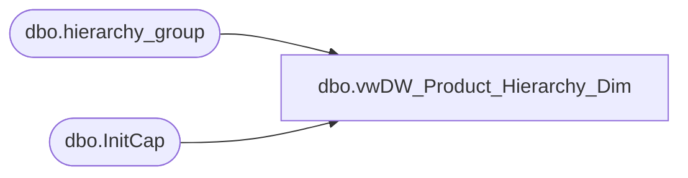

# dbo.vwDW_Product_Hierarchy_Dim

**Database:** me_01  
**Server:** bedrockdb02  

## Architecture Diagram



## Table Dependencies

| Referenced Table |
|---|
| dbo.hierarchy_group |
| dbo.InitCap |

## View Code

```sql
CREATE VIEW [dbo].[vwDW_Product_Hierarchy_Dim]
AS
SELECT cast(hgsub.hierarchy_group_code AS VARCHAR(20)) AS subclass_code
	 , cast(dbo.InitCap(hgsub.hierarchy_group_short_label) AS VARCHAR(20)) AS subclass
	 , cast(hgcla.hierarchy_group_code AS VARCHAR(20)) AS class_code
	 , cast(dbo.InitCap(hgcla.hierarchy_group_short_label) AS VARCHAR(20)) AS class
	 , cast(hgdep.hierarchy_group_code AS VARCHAR(20)) AS department_code
	 , cast(dbo.InitCap(hgdep.hierarchy_group_short_label) AS VARCHAR(20)) AS department
	 , cast(hgdiv.hierarchy_group_code AS VARCHAR(20)) AS division_code
	 , cast(dbo.InitCap(hgdiv.hierarchy_group_short_label) AS VARCHAR(20)) AS division
	 , cast(hgchain.hierarchy_group_code AS VARCHAR(20)) AS chain_code
	 , cast(dbo.InitCap(hgchain.hierarchy_group_short_label) AS VARCHAR(20)) AS chain
	 , cast(hgconcept.hierarchy_group_code AS VARCHAR(20)) AS concept_code
	 , cast(dbo.InitCap(hgconcept.hierarchy_group_short_label) AS VARCHAR(20)) AS concept

FROM
	hierarchy_group hgsub WITH (NOLOCK)
	INNER JOIN hierarchy_group hgcla WITH (NOLOCK)
		ON hgsub.parent_group_id = hgcla.hierarchy_group_id
	INNER JOIN hierarchy_group hgdep WITH (NOLOCK)
		ON hgcla.parent_group_id = hgdep.hierarchy_group_id
	INNER JOIN hierarchy_group hgdiv WITH (NOLOCK)
		ON hgdep.parent_group_id = hgdiv.hierarchy_group_id
	INNER JOIN hierarchy_group hgchain WITH (NOLOCK)
		ON hgdiv.parent_group_id = hgchain.hierarchy_group_id
	INNER JOIN hierarchy_group hgconcept WITH (NOLOCK)
		ON hgchain.parent_group_id = hgconcept.hierarchy_group_id
WHERE
	hgsub.hierarchy_level_id = 10000007 --8 
	AND hgcla.hierarchy_level_id = 10000006 --7
	AND hgdep.hierarchy_level_id = 10000005 --6
	AND hgdiv.hierarchy_level_id = 10000004 --5
	AND hgchain.hierarchy_level_id = 10000003 --4      
	AND hgconcept.hierarchy_level_id = 10000002 --3


dbo,vwDW_ProductPrimaryJurisdiction,CREATE VIEW dbo.vwDW_ProductPrimaryJurisdiction
AS
SELECT        style_code, 
                         CASE WHEN s_GRP.IsUS = 1 THEN 'US' WHEN s_GRP.IsCAN = 1 THEN 'CA' WHEN s_GRP.IsUK = 1 THEN 'UK' WHEN s_GRP.IsUSWEB = 1 THEN 'US' WHEN s_GRP.IsUKWEB
                          = 1 THEN 'UK' WHEN s_GRP.IsINTL = 1 THEN 'US' WHEN s_GRP.IsCORP = 1 THEN 'US' WHEN s_GRP.IsCN = 1 THEN 'CN' ELSE 'Unknown' END AS attribute_set_code
FROM            (SELECT        s.style_code, SUM(CASE WHEN att.attribute_set_code = 'US' THEN 1 ELSE 0 END) AS IsUS, 
                                                    SUM(CASE WHEN att.attribute_set_code = 'CA' THEN 1 ELSE 0 END) AS IsCAN, SUM(CASE WHEN att.attribute_set_code = 'UK' THEN 1 ELSE 0 END) 
                                                    AS IsUK, SUM(CASE WHEN att.attribute_set_code = 'CN' THEN 1 ELSE 0 END) AS IsCN, 
                                                    SUM(CASE WHEN att.attribute_set_code = 'USWEB' THEN 1 ELSE 0 END) AS IsUSWEB, 
                                                    SUM(CASE WHEN att.attribute_set_code = 'UKWEB' THEN 1 ELSE 0 END) AS IsUKWEB, 
                                                    SUM(CASE WHEN att.attribute_set_code = 'INTL' THEN 1 ELSE 0 END) AS IsINTL, SUM(CASE WHEN att.attribute_set_code = 'CORP' THEN 1 ELSE 0 END)
                                                     AS IsCORP
                          FROM            dbo.style AS s WITH (NOLOCK) INNER JOIN
                                                    dbo.entity_attribute_set AS eas WITH (NOLOCK) ON s.style_id = eas.parent_id INNER JOIN
                                                    dbo.attribute_set AS att WITH (NOLOCK) ON eas.attribute_set_id = att.attribute_set_id INNER JOIN
                                                    dbo.attribute AS a WITH (NOLOCK) ON att.attribute_id = a.attribute_id AND a.parent_type = 1
                          WHERE        (a.attribute_code = 'AVAILB') AND (att.attribute_set_code IN ('US', 'CA', 'UK', 'CN', 'USWEB', 'UKWEB', 'INTL', 'CORP'))
                          GROUP BY s.style_code) AS s_GRP
```

