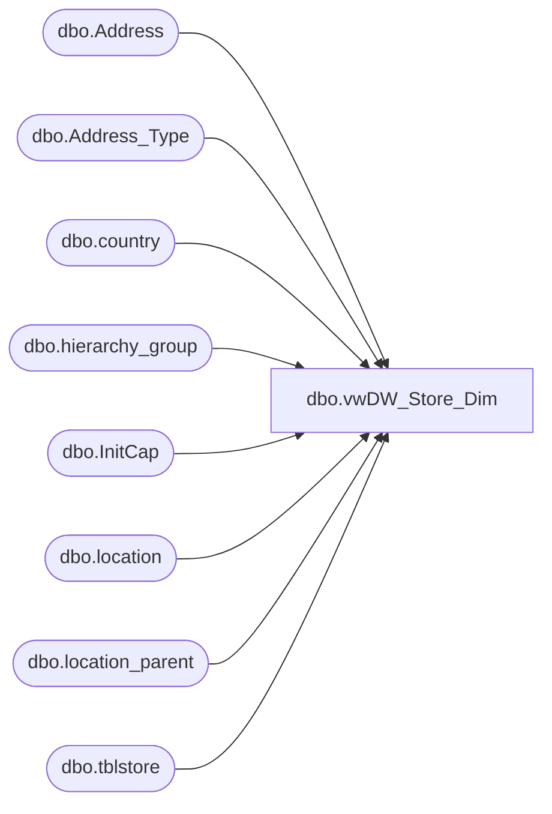

# dbo.vwDW_Store_Dim

**Database:** me_01  
**Server:** bedrockdb02  

## Architecture Diagram



## Table Dependencies

| Referenced Table |
|---|
| dbo.Address |
| dbo.Address_Type |
| dbo.country |
| dbo.hierarchy_group |
| dbo.InitCap |
| dbo.location |
| dbo.location_parent |
| dbo.tblstore |

## View Code

```sql
CREATE VIEW [dbo].[vwDW_Store_Dim]
AS
SELECT  [Address].[Store_ID]
	  ,[Address].[Store_Name]
	  ,[Address].[Abbreviation]
	  ,[Address].[Opening_Date]
	  ,[Address].[Closing_Date]
	  ,[Address].[Comp_Date]
	  ,[Address].[Address1]
	  ,[Address].[Address2]
	  ,[Address].[City]
	  ,[Address].[State_Province]
	  ,[Address].[Postal_Code]
	  ,[Address].[Country]
	  ,[Address].[Country_Name]
	  ,[tblStore].[Legal_Description]
	  ,[tblStore].[Volume_Group]
	  ,[tblStore].[Email]
	  ,[tblStore].[Phone]
	  ,[tblStore].[Fax]
	  ,[Region].[Bearea]
	  ,[Region].[Bearritory]
	  ,[Region].[Region]
	  ,[Region].[Division]
  FROM
  (
    SELECT   cast(l.[location_code] as int) [Store_ID]
		  ,cast(l.[location_name] as varchar(50)) [Store_Name]
 		  ,cast(l.[location_short_name] AS varchar(3))	[Abbreviation]
		  ,coalesce(l.[reopen_date],l.[open_date]) [Opening_Date]
		  ,CASE 
			WHEN l.[reopen_date] is not null 
			 THEN 
				null
			 ELSE 
				l.[closed_date] 
		  END [Closing_Date]
 		  ,l.[comparative_date]		[Comp_Date]
		  ,CASE 
			 WHEN l.[location_code] = 132 
				THEN 
				    a.[address_line2] 
				ELSE 
				    a.[address_line1] 
		  END [Address1]
		  ,CASE 
			 WHEN l.[location_code] = 132 
				THEN 
				    null 
				ELSE 
				    CASE 
					   WHEN len(a.[address_line2]) <=5 or a.[address_line2] IS NULL
						  THEN 
							 a.[address_line1]
						  ELSE
							 a.[address_line2]
				    END
		  END [Address2]
		  ,cast([dbo].[InitCap](a.[address_city]) as varchar(50))[City]
		  ,upper(a.[address_state])	[State_Province]
		  ,a.[address_zip_code]		[Postal_Code] 
		  ,cast(
			 CASE 
				WHEN c.[country_code] = 'PR' 
				    THEN 
					   'US'
				WHEN c.[country_code] = 'GB' 
				    THEN 
					   'UK'
				WHEN c.[country_code] = 'USA' 
				    THEN 
					   'US'
				WHEN c.[country_code] IN ('CAF','CAN') 
				    THEN 
					   'CA'
				ELSE 
				    c.[country_code]
			 END as varchar(3)) [Country] 
		  ,cast([dbo].[InitCap](c.[country_description]) as varchar(50))	[Country_Name]
      FROM [dbo].[location] l
      LEFT JOIN [dbo].[Address] a
	   ON l.[location_id]=a.[parent_id]
	  AND [parent_type] != 3
	INNER JOIN [dbo].[Address_Type] at
	   ON a.[Address_Type_ID] = at.[Address_Type_ID]
	  AND at.[Address_Type_Description] = 'MAIN'
      LEFT JOIN [dbo].[country] c
	   ON a.[country_id]=c.[country_id]) [Address]
  LEFT JOIN      
  (
    SELECT   cast([iStoreID] as int)	[Store_ID]
		  ,cast([sStoreName1] as varchar(50))  [Legal_Description]
		  ,cast(substring(cast([iGroup] as varchar),1, 1) as varchar(1))	   [Volume_Group]
		  ,cast([sEmail] as varchar(50))	   [Email]
		  ,[sPhone]	   [Phone]
		  ,[sFax]		   [Fax]
      FROM [KODIAK].[Bearhouse].[dbo].[tblstore]) tblStore 
    ON [Address].[Store_ID] = [tblStore].[Store_ID]
 LEFT JOIN 
  (
    SELECT DISTINCT 
			  CAST(a.[location_code] as int) [Store_ID]
			,b07.[hierarchy_group_short_label] as [Bearea] 
			,b06.[hierarchy_group_short_label] as [Bearritory]
			,b05.[hierarchy_group_short_label] as [Region]
			,b02.[hierarchy_group_short_label] as [Division]
	FROM [dbo].[location] a
	LEFT JOIN [dbo].[location_parent] c01 
		  ON a.[location_id] = c01.[location_id]
           AND c01.[hierarchy_level_id] = 20000002 
	LEFT JOIN [dbo].[location_parent] c02 
		  ON a.[location_id] = c02.[location_id]
           AND c02.[hierarchy_level_id] = 20000003 
	LEFT JOIN [dbo].[location_parent] c03 
		  ON a.[location_id] = c03.[location_id]
           AND c03.[hierarchy_level_id] = 20000004 
	LEFT JOIN [dbo].[location_parent] c04 
		  ON a.[location_id] = c04.[location_id]
           AND c04.[hierarchy_level_id] = 20000005 
	LEFT JOIN [dbo].[location_parent] c05 
		  ON a.[location_id] = c05.[location_id]
           AND c05.[hierarchy_level_id] = 20000006 
	LEFT JOIN [dbo].[location_parent] c06 
		  ON a.[location_id] = c06.[location_id]
           AND c06.[hierarchy_level_id] = 20000007 
	LEFT JOIN [dbo].[location_parent] c07 
		  ON a.[location_id] = c07.[location_id]
           AND c07.[hierarchy_level_id] = 20000008  
	LEFT JOIN [dbo].[hierarchy_group] b01
		  ON c01.[parent_hierarchy_group_id] = b01.[hierarchy_group_id]
	LEFT JOIN [dbo].[hierarchy_group] b02 
		  ON c02.[parent_hierarchy_group_id] = b02.[hierarchy_group_id]
	LEFT JOIN [dbo].[hierarchy_group] b03 
		  ON c03.[parent_hierarchy_group_id] = b03.[hierarchy_group_id]
	LEFT JOIN [dbo].[hierarchy_group] b04 
		  ON c04.[parent_hierarchy_group_id] = b04.[hierarchy_group_id]
	LEFT JOIN [dbo].[hierarchy_group] b05 
		  ON c05.[parent_hierarchy_group_id] = b05.[hierarchy_group_id]
	LEFT JOIN [dbo].[hierarchy_group] b06
		  ON c06.[parent_hierarchy_group_id] = b06.[hierarchy_group_id]
	LEFT JOIN [dbo].[hierarchy_group] b07 
		  ON c07.[parent_hierarchy_group_id] = b07.[hierarchy_group_id]) Region
    ON [Region].[Store_ID] = [Address].[Store_ID]
```

