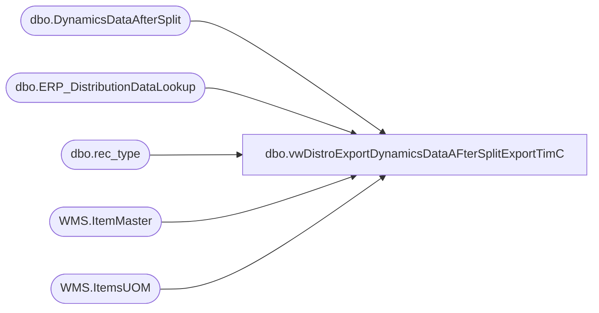

# dbo.vwDistroExportDynamicsDataAFterSplitExportTimC

**Database:** me_01  
**Server:** bedrockdb02  

## Architecture Diagram



## Table Dependencies

| Referenced Table |
|---|
| dbo.DynamicsDataAfterSplit |
| dbo.ERP_DistributionDataLookup |
| dbo.rec_type |
| WMS.ItemMaster |
| WMS.ItemsUOM |

## View Code

```sql
CREATE view [dbo].[vwDistroExportDynamicsDataAFterSplitExportTimC]

AS

--declare @seed bigint
--select @seed = round(max(document_number), 0) from store_shipment_export 

--;
with 
InventoryUnit as
(
	select 
		im.Entity,
		im.ItemNumber,
		right(im.ItemNumber,6) as StyleCode,
		im.InventoryUnitSymbol,
		cast(uom.Factor as int) as Factor 
	from [stl-ssis-p-01].IntegrationStaging.WMS.ItemMaster im 
	join [stl-ssis-p-01].IntegrationStaging.WMS.ItemsUOM uom 
		on im.Entity = uom.Entity 
		and im.PRODUCTNUMBER = uom.PRODUCTNUMBER
		and im.INVENTORYUNITSYMBOL = uom.FROMUNITSYMBOL
		and uom.TOUNITSYMBOL = 'wmea'
	where im.NecessaryProductionWorkingTimeSchedulingPropertyId in ('Merch','Supplies')
),
DistroData as
(
	select		
		ddas.id,
		ddas.DynId, -- Added on 8/10/2022 as we are now not using a split tool for supply TOs 
		cast(ddas.SourceID as varchar(4)) as SourceID,
		--cast(
		--		case 
		--			when rec_type = 3
		--				then ddas.destid + 'B'
		--			when rec_type = 7
		--				then ddas.destid + 'C'
		--			when rec_type = 8
		--				then ddas.destid + 'D'
		--			when rec_type = 9
		--				then ddas.destid + 'E'
		--			else ddas.destid
		--		end 
		--		as varchar(5)
		--	)
		--	as destid,-- Replaced on 8/10/2022 per report from Clipper they were receiving records B and that broke the integation 
		ddas.DestID as DestID, 
		ddas.rec_type,
		cast(left(rt.message, 20) as varchar(20)) as message,
		cast(ddas.style_code as varchar(6)) as style_code,
		ddas.quantity * isnull(uom.Factor,1) as quantity, --converts from staged unit to wm eaches
		convert(varchar, ddas.release_date,101) as release_date,
		cast(ddas.distribution_number as varchar(20)) as distribution_number,
		ddas.ref_field_1,
		ddl.ShortDescription as short_desc,  
		ddl.VendorStyle as vendor_style, 
		ddl.ColorCode as color_code, 
		ddl.DistributionMultiple as distribution_multiple,
		case 
			when SourceID in ('3970','8502','3980','8505','9942')
			then 
				case 
					when datepart(dw, ddas.release_date) < 4 
					then 
						case ddas.rec_type
							when 1 then 3 
							when 3 then 4 
							when 7 then 5 
							else 2
						end
					else 
						case ddas.rec_type
							when 1 then 3
							when 3 then 4
							when 7 then 5
							else 3 
						end
			end 
			else 1 
		end as handling_days
	from DynamicsDataAfterSplit ddas with (nolock)
	inner join rec_type rt with (nolock) on	ddas.rec_type = rt.rectype
	join ERP_DistributionDataLookup ddl with (nolock) 
		on ddas.distribution_number = ddl.OrderID
		and ddas.style_code = ddl.ItemNumber
		and ddas.sequencenbr = ddl.SequenceNumber
		and case 
				when ddas.sourceid in ('0980', '0960') then '1100'
				when ddas.sourceid in ('2970') then '2110'
				when ddas.sourceid in ('3970','8502','8505') then '3001'
				when ddas.sourceID in ('3980','9942') then '1200'
			end = ddl.Entity
	left join InventoryUnit uom on 
		case 
			when ddas.sourceid in ('0980', '0960') then '1100'
			when ddas.sourceid in ('2970') then '2110'
			when ddas.sourceid in ('3970','8502','8505') then '3001'
			when ddas.sourceID in ('3980','9942') then '1200'
		end = uom.Entity
		and ddas.style_code = uom.StyleCode 
	where		1=1      
	and
	(
		(cast(rt.rectype as int) >= 50 	
		or
		(cast(rt.rectype as int) < 50 and convert(varchar, getdate(), 108) >= '16:30:00')
		or 		
		(ddl.OrderType = 'Sales' and ddas.id is null )-- Allows Sales Orders that bypassed split tool to extract asap -- Added on 8/9/2022

		) 
	
		and ddas.released is null
		and quantity <> 0
	)
	--or ddas.distribution_number in ('TO0000027414','TO0000027415','TO0000027418')  -- Ad Hoc Exporting 
	or ddas.distribution_number in ('SO0000001832','SO0000002085')  -- Ad Hoc Exporting 
	--or ddas.id in ('19074885')  -- Ad Hoc Exporting 
	
)
select 
	id,
	DynId, 
	SourceID,
	cast(DestID as varchar (10)) as Destid,
	rec_type,
	message,
	style_code,
	quantity, 
	release_date,
	distribution_number, 
	ref_field_1,
	short_desc,  
	vendor_style, 
	color_code, 
	distribution_multiple,
	case 
		when SourceID in ('3970','8502')
		then 
			case 
				when 
					(datepart(dw, release_date) = 1 and handling_days >= 7)
				OR	(datepart(dw, release_date) = 2 and handling_days >= 6)
				OR	(datepart(dw, release_date) = 3 and handling_days >= 5)
				OR	(datepart(dw, release_date) = 4 and handling_days >= 4)
				OR	(datepart(dw, release_date) = 5 and handling_days >= 3)
				OR	(datepart(dw, release_date) = 6 and handling_days >= 2)
				OR	(datepart(dw, release_date) = 7 and handling_days >= 1)
					then cast( dateadd(dd, (handling_days +1), release_date) as date)
				else cast( dateadd(dd, handling_days, release_date) as date)
			end 
		else NULL
	end as expected_ship_date
	--,	@seed + DENSE_RANK() OVER (ORDER BY destid, rec_type) as document_number
from DistroData
group by 	id,
	DynId, 
	SourceID,
	cast(DestID as varchar (10)) ,
	rec_type,
	message,
	style_code,
	quantity, 
	release_date,
	distribution_number, 
	ref_field_1,
	short_desc,  
	vendor_style, 
	color_code, 
	distribution_multiple,
	case 
		when SourceID in ('3970','8502')
		then 
			case 
				when 
					(datepart(dw, release_date) = 1 and handling_days >= 7)
				OR	(datepart(dw, release_date) = 2 and handling_days >= 6)
				OR	(datepart(dw, release_date) = 3 and handling_days >= 5)
				OR	(datepart(dw, release_date) = 4 and handling_days >= 4)
				OR	(datepart(dw, release_date) = 5 and handling_days >= 3)
				OR	(datepart(dw, release_date) = 6 and handling_days >= 2)
				OR	(datepart(dw, release_date) = 7 and handling_days >= 1)
					then cast( dateadd(dd, (handling_days +1), release_date) as date)
				else cast( dateadd(dd, handling_days, release_date) as date)
			end 
		else NULL
	end
```

