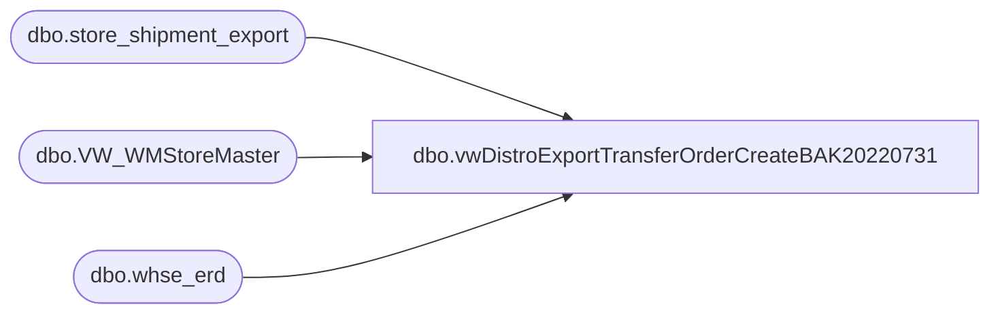

# dbo.vwDistroExportTransferOrderCreateBAK20220731

**Database:** me_01  
**Server:** bedrockdb02  

## Architecture Diagram



## Table Dependencies

| Referenced Table |
|---|
| dbo.store_shipment_export |
| dbo.VW_WMStoreMaster |
| dbo.whse_erd |

## View Code

```sql
CREATE view [dbo].[vwDistroExportTransferOrderCreateBAK20220731] 

as

with 
--CountryFlag as
--	(
--		select 	
--			l.location_code as LocationCode,
--			c.country_code as CountryCode
--		from location l with (nolock)
--		inner join address a  with (nolock) on l.location_id = a.parent_id
--			and l.location_status_id <> 5
--			and	a.parent_type = 2
--			and	address_type_id = 1
--		join keith_country c with (nolock) on a.country_id = c.country_id
--	),
PreStage as
	(
		select  
			ss.warehouse as FromWarehouse,
			ss.location_code as ToWarehouse,
			cast(ss.rec_type as int) as rec_type,
			'BestServe' as DeliveryTerms,
			ss.document_number as AptosShipmentNumber,
			ss.style_code as ItemNumber,
			ss.distribution_number as AptosDistroNumber,
			ss.distribution_line_number as AptosDistroLineNumber,
			cast(ss.release_date as date) as ShipDate,
			Null as ReceiptDate, --need to derive this based on rec type, similar to how we estimate ERD on store shipments from warehouses
			ss.quantity,
			'ea' as UnitOfMeasure,
			'AVAIL' as InventoryStatus,
			case 
				when ss.warehouse = '0980' 
					then 
						case 
							when ss.rec_type in ('1','6','8','9','56','61','1006') then isnull(we.truck_980,7)--truck
							when ss.rec_type in ('54','58','80','81','82','83','84','1004') then isnull(we.ground_980,7)--ground
							when ss.rec_type in ('51','52','73','85','86','1001','1002') then '1'--1 day
							when ss.rec_type in ('53','74','87','1003','57','1007','62') then '2'--2 day -- includes courier and intnl priority
							when ss.rec_type in ('60','88','1010') then '3'--3 day
							when ss.rec_type in ('55','89','1005') then datediff(dd, datepart(dw, ss.release_date),7) -- saturday
							when ss.rec_type in ('63') then isnull(we.intnl_econ_980,5)--Intl Economy -- 
							when ss.rec_type in ('64','65') then '30'--30
							when ss.rec_type = '3' then isnull(we.supplySecond_980,7)
							when ss.rec_type = '7' then isnull(we.supplyThird_980,7)
							else 7
						end 
				when ss.warehouse = '0960'
					then 
						case 
							when ss.rec_type in ('1','6','8','9','56','61','1006') then isnull(we.truck_960,7)--truck
							when ss.rec_type in ('54','58','80','81','82','83','84','1004') then isnull(we.ground_960,7)--ground
							when ss.rec_type in ('51','52','73','85','86','1001','1002') then '1'--1 day
							when ss.rec_type in ('53','74','87','1003','57','1007','62') then '2'--2 day -- includes courier and intnl priority
							when ss.rec_type in ('60','88','1010') then '3'--3 day
							when ss.rec_type in ('55','89','1005') then datediff(dd, datepart(dw, ss.release_date),7) -- saturday
							when ss.rec_type in ('63') then isnull(we.intnl_econ_960,5)--Intl Economy -- 
							when ss.rec_type in ('64','65') then '30'--30
							when ss.rec_type = '3' then isnull(we.supplySecond_960,7)
							when ss.rec_type = '7' then isnull(we.supplyThird_960,7)
							else 7
						end 
				else 7
			end as transit_days,
			sm1.cntry as DestinationCountryCode,
			sm2.cntry as SourceCountryCode
		from store_shipment_export ss with (nolock)
		left join whse_erd we (nolock) on ss.location_code = we.location_code
		join VW_WMStoreMaster sm1 on ss.location_code=sm1.Store_nbr 
		join VW_WMStoreMaster sm2 on ss.warehouse=sm2.Store_nbr 
		where ss.warehouse in ('0980','0960','2970','3970')
		and ss.exported is null
	)
select 
	FromWarehouse,
	ToWarehouse,
	rec_type,
	DeliveryTerms,
	AptosShipmentNumber,
	AptosDistroNumber,
	AptosDistroLineNumber,
	ItemNumber,
	ShipDate,
	case 
		when (datepart(dw, ShipDate) = 2 and transit_days > 4)
					or (datepart(dw, ShipDate) = 3 and transit_days > 3)
					or (datepart(dw, ShipDate) = 4 and transit_days > 2)
					or (datepart(dw, ShipDate) = 5 and transit_days > 1)
					or (datepart(dw, ShipDate) = 6)
		then cast(dateadd(day, (transit_days + 2), ShipDate) as date)
		when transit_days is NULL then cast(dateadd(day, (7), ShipDate) as date)
		else cast(dateadd(day, (transit_days), ShipDate) as date)
	end as ReceiptDate,
	quantity,
	UnitOfMeasure,
	InventoryStatus,
	SourceCountryCode,
	DestinationCountryCode,
	cast(
			case 
				when FromWarehouse in ('0960', '0980')
					then '1100'
				when FromWarehouse = '2970'
					then '2110'
				when FromWarehouse = '3970'
					then '3001'
			end as varchar(4)
		)
	as Company,
	cast(
		case 
			when SourceCountryCode<>DestinationCountryCode 
			and NOT (SourceCountryCode='UK' and DestinationCountryCode in ('UK', 'GB') )
				then 'SalesOrder'
			else 'TransferOrder'
		end as varchar(15)
		) as OrderType
from PreStage ps
```

