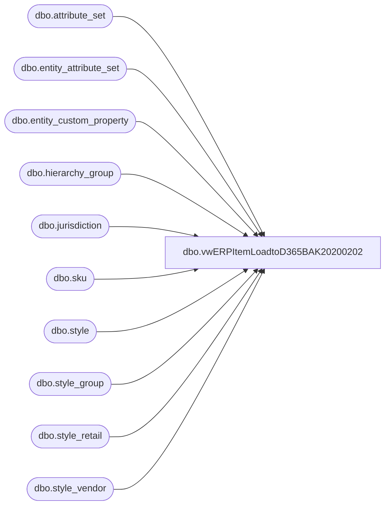

# dbo.vwERPItemLoadtoD365BAK20200202

**Database:** me_01  
**Server:** bedrockdb02  

## Architecture Diagram



## Table Dependencies

| Referenced Table |
|---|
| dbo.attribute_set |
| dbo.entity_attribute_set |
| dbo.entity_custom_property |
| dbo.hierarchy_group |
| dbo.jurisdiction |
| dbo.sku |
| dbo.style |
| dbo.style_group |
| dbo.style_retail |
| dbo.style_vendor |

## View Code

```sql
CREATE view [dbo].[vwERPItemLoadtoD365BAK20200202]

as 

---------------------------------------------------------------------------------------------------------------
-- Dan Tweedie - 2017-08-14 -- Created view from SQL provided by Keith Lee, used to capture SKU data for D365
--	DT --2018-06-14 - Updated view to get rid of handling for supplies since this is to be used only for Merchandise items
---------------------------------------------------------------------------------------------------------------


WITH JurisdictionCodes as
	(
		select
			jurisdiction_id,
			cast(
					case jurisdiction_code
						when 'HOME' then '1100'
						when 'CA' then '1700'
						when 'UK' then '2110'
						when 'DK' then '2300'
						when 'CN' then '3001'
					end 
					as nvarchar (10)
				) as Entity
		from jurisdiction with (nolock)
		where jurisdiction_code in ('HOME', 'CA', 'UK', 'DK', 'CN')
		UNION 
		select
			jurisdiction_id,
			cast('1200'	as nvarchar (10)) as Entity
		from jurisdiction with (nolock)
		where jurisdiction_code in ('HOME')

	)
select	
		'ea' as INVENTORYUNITSYMBOL,
		--case 
		--	when substring(hg.hierarchy_group_code,7,2) = '60'
		--	then 'pk'
		--	else 'ea'
		--end as INVENTORYUNITSYMBOL,
		'No' as ISCATCHWEIGHTPRODUCT,
		'No' as ISPRODUCTKIT,
		'MOV-AVG' as ITEMMODELGROUPID,
		--cast(
		--		case 
		--			when substring(hg.hierarchy_group_code,7,2) = '60'
		--			then	'S' + s.style_code
		--			else	'M' + s.style_code
		--		end as nvarchar(7)
		--	) as ITEMNUMBER,
		cast('M' + s.style_code as nvarchar(7)) as ITEMNUMBER,
		
		s.long_desc as PRODUCTDESCRIPTION,
		--case 
		--	when substring(hg.hierarchy_group_code,7,8) = '60-05-03' then 'SPLASSCAPP'
		--	when substring(hg.hierarchy_group_code,7,8) = '60-01-04' then 'SPLBOWS'
		--	when substring(hg.hierarchy_group_code,7,8) = '60-01-09' then 'SPLBTHCERT'
		--	when substring(hg.hierarchy_group_code,7,8) = '60-04-05' then 'SPLCOMPSUP'
		--	when substring(hg.hierarchy_group_code,7,8) = '60-01-02' then 'SPLCONDO'
		--	when substring(hg.hierarchy_group_code,7,8) in ('60-01-14','60-01-15') then 'SPLCONDOTH'
		--	when substring(hg.hierarchy_group_code,7,8) = '60-03-05' then 'SPLEVNTMA' --SPLEVNTMAT
		--	when substring(hg.hierarchy_group_code,7,8) = '60-04-02' then 'SPLFIXTSPL'
		--	when substring(hg.hierarchy_group_code,7,8) = '60-03-03' then 'SPLGVEAWAY'
		--	when substring(hg.hierarchy_group_code,7,8) = '60-01-05' then 'SPLHEARTS'
		--	when substring(hg.hierarchy_group_code,7,8) = '60-04-06' then 'SPLMASCOT'
		--	when substring(hg.hierarchy_group_code,7,8) = '60-03-01' then 'SPLMRKTING'
		--	when substring(hg.hierarchy_group_code,7,8) = '60-04-04' then 'SPLNOTIONS'
		--	when substring(hg.hierarchy_group_code,7,8) = '60-04-01' then 'SPLOFFSPL'
		--	when substring(hg.hierarchy_group_code,7,8) in ('60-01-03','60-01-06','60-01-07','60-01-10','60-01-12') then 'SPLPACKOTH'
		--	when substring(hg.hierarchy_group_code,7,8) = '60-01-11' then 'SPLPRTBAGS'
		--	when substring(hg.hierarchy_group_code,7,8) in ('60-03-02','60-05-01') then 'SPLPRTYSUP'
		--	when substring(hg.hierarchy_group_code,7,8) = '60-03-06' then 'SPLSFS'
		--	when substring(hg.hierarchy_group_code,7,8) = '60-03-04' then 'SPLSIGNS'
		--	when substring(hg.hierarchy_group_code,7,8) = '60-01-08' then 'SPLSTFFOTH'
		--	when substring(hg.hierarchy_group_code,7,8) = '60-01-01' then 'SPLSTUFFNG'
		--	when substring(hg.hierarchy_group_code,7,8) = '60-05-07' then 'SPLSTUFREP'
		--	when substring(hg.hierarchy_group_code,7,8) in ('60-04-03','60-07-00') then	'SPLUNIFORM'
		--	when substring(hg.hierarchy_group_code,7,8) = '60-04-07' then 'SPLVISMERCH'
		--	else 'MERCH'
		--end as PRODUCTGROUPID,
		'MERCH' as PRODUCTGROUPID,
		s.long_desc  as PRODUCTNAME,
		--cast(
		--		case 
		--			when substring(hg.hierarchy_group_code,7,2) = '60'
		--			then	'S' + s.style_code
		--			else	'M' + s.style_code
		--		end as nvarchar(7)
		--	)
		--as PRODUCTNUMBER,
		cast('M' + s.style_code as nvarchar(7)) as PRODUCTNUMBER,
		--case 
		--	when substring(hg.hierarchy_group_code,7,2) = '60'
		--	then	'Supply'
		--	else	'Product'
		--end as PRODUCTSUBTYPE,
		'Product' as PRODUCTSUBTYPE,
		'Item' as PRODUCTTYPE,
		'ea' as SALESUNITSYMBOL,
		--hg.hierarchy_group_label as RETAILPRODUCTCATEGORYNAME,
		NULL as RETAILPRODUCTCATEGORYNAME,
		s.long_desc as SEARCHNAME,
		'SWL' as STORAGEDIMENSIONGROUPNAME,
		'None' as TRACKINGDIMENSIONGROUPNAME,
		case 
			when j.Entity = '1200' 
				then (sr.current_selling_retail / 6.5) 
			else sr.current_selling_retail
		end as SALESPRICE,
		'ea' as UNITCONVERSIONSEQUENCEGROUPID,
		--case when substring(hg.hierarchy_group_code,7,2) = '60'
		--	then sv.current_cost
		--	else '0.00'
		--end as UNITCOST,
		'0.00' as UNITCOST,
		'1.00' as UNITCOSTQUANTITY,
		sv.current_cost as PURCHASEPRICE,
		--case
		--	when substring(hg.hierarchy_group_code,7,2) = '60' 
		--	then 'cs'
		--	else 'ea'
		--end  as PURCHASEUNITSYMBOL,
		'ea' as PURCHASEUNITSYMBOL,
		'Yes' as ISPURCHASEPRICEAUTOMATICALLYUPDATED,
		--cast(
		--	case 
		--		when substring(hg.hierarchy_group_code,7,2)='60'
		--		then substring(isnull(ecp3.custom_property_value,''),1,12)
		--		else substring(isnull(att.attribute_set_label,''),1,12)
		--	end 
		--   as varchar(15))
		--as HarmonizedSystemCode
		
			case 
				when att.attribute_set_label is not null 
					then cast(left(substring(isnull(att.attribute_set_label,''),1,12), 7) as varchar(7)) 
				else NULL
			end as HarmonizedSystemCode,
		j.Entity
from	style s with (nolock)
join	style_group sg with (nolock) on s.style_id = sg.style_id
join	hierarchy_group hg with (nolock) on sg.hierarchy_group_id = hg.hierarchy_group_id
join	sku sk with (nolock) on s.style_id = sk.style_id
--join	ib_inventory_total iit with (nolock) on sk.sku_id = iit.sku_id
join	style_vendor sv with (nolock) on s.style_id = sv.style_id and sv.primary_vendor_flag = 1
join	style_retail sr with (nolock) on s.style_id = sr.style_id -- and jurisdiction_id = 1
join	JurisdictionCodes j on sr.jurisdiction_id = j.jurisdiction_id
left outer join entity_custom_property ecp3 with (nolock) on s.style_id = ecp3.parent_id
		and		ecp3.custom_property_id = 4 -- HTSCD
		and		ecp3.parent_type = 1
left outer join entity_attribute_set eas with (nolock) on s.style_id = eas.parent_id
		and		eas.attribute_id = 152
left join attribute_set att with (nolock) on eas.attribute_set_id = att.attribute_set_id and len(attribute_set_label) > 0
where 1=1
and s.active_flag = 1
and substring(hg.hierarchy_group_code,7,2) <> 60 --EXCLUDES SUPPLIES
AND (
			(	-- North America
				s.style_code not between '400000' and '499999' 
				and 
				s.style_code not between '800000' and '899999'
				and 
				left(style_code, 1) <> '9'
			) 
		OR
			(
				s.style_code between '400000' and '499999' -- UK
			)
		OR
			(
				s.style_code between '800000' and '899999' -- China
			)

	)
group by 
	sv.current_cost, 
	s.style_code,
	s.long_desc, 
	hg.hierarchy_group_label, 
	hg.hierarchy_group_code,
	sr.current_selling_retail,
	ecp3.custom_property_value,
	att.attribute_set_label,
	j.Entity 
--having	sum(iit.total_on_hand_units) <> 0
UNION -- LOAD STYLE STARTING WITH 8, BUT REPLACE 8 WITH 9
select	
		'ea' as INVENTORYUNITSYMBOL,
		--case 
		--	when substring(hg.hierarchy_group_code,7,2) = '60'
		--	then 'pk'
		--	else 'ea'
		--end as INVENTORYUNITSYMBOL,
		'No' as ISCATCHWEIGHTPRODUCT,
		'No' as ISPRODUCTKIT,
		'MOV-AVG' as ITEMMODELGROUPID,
		--cast(
		--		case 
		--			when substring(hg.hierarchy_group_code,7,2) = '60'
		--			then	'S' + s.style_code
		--			else	'M' + s.style_code
		--		end as nvarchar(7)
		--	) as ITEMNUMBER,
		cast('M9' + RIGHT(s.style_code,5) as nvarchar(7)) as ITEMNUMBER,
		
		s.long_desc as PRODUCTDESCRIPTION,
		--case 
		--	when substring(hg.hierarchy_group_code,7,8) = '60-05-03' then 'SPLASSCAPP'
		--	when substring(hg.hierarchy_group_code,7,8) = '60-01-04' then 'SPLBOWS'
		--	when substring(hg.hierarchy_group_code,7,8) = '60-01-09' then 'SPLBTHCERT'
		--	when substring(hg.hierarchy_group_code,7,8) = '60-04-05' then 'SPLCOMPSUP'
		--	when substring(hg.hierarchy_group_code,7,8) = '60-01-02' then 'SPLCONDO'
		--	when substring(hg.hierarchy_group_code,7,8) in ('60-01-14','60-01-15') then 'SPLCONDOTH'
		--	when substring(hg.hierarchy_group_code,7,8) = '60-03-05' then 'SPLEVNTMA' --SPLEVNTMAT
		--	when substring(hg.hierarchy_group_code,7,8) = '60-04-02' then 'SPLFIXTSPL'
		--	when substring(hg.hierarchy_group_code,7,8) = '60-03-03' then 'SPLGVEAWAY'
		--	when substring(hg.hierarchy_group_code,7,8) = '60-01-05' then 'SPLHEARTS'
		--	when substring(hg.hierarchy_group_code,7,8) = '60-04-06' then 'SPLMASCOT'
		--	when substring(hg.hierarchy_group_code,7,8) = '60-03-01' then 'SPLMRKTING'
		--	when substring(hg.hierarchy_group_code,7,8) = '60-04-04' then 'SPLNOTIONS'
		--	when substring(hg.hierarchy_group_code,7,8) = '60-04-01' then 'SPLOFFSPL'
		--	when substring(hg.hierarchy_group_code,7,8) in ('60-01-03','60-01-06','60-01-07','60-01-10','60-01-12') then 'SPLPACKOTH'
		--	when substring(hg.hierarchy_group_code,7,8) = '60-01-11' then 'SPLPRTBAGS'
		--	when substring(hg.hierarchy_group_code,7,8) in ('60-03-02','60-05-01') then 'SPLPRTYSUP'
		--	when substring(hg.hierarchy_group_code,7,8) = '60-03-06' then 'SPLSFS'
		--	when substring(hg.hierarchy_group_code,7,8) = '60-03-04' then 'SPLSIGNS'
		--	when substring(hg.hierarchy_group_code,7,8) = '60-01-08' then 'SPLSTFFOTH'
		--	when substring(hg.hierarchy_group_code,7,8) = '60-01-01' then 'SPLSTUFFNG'
		--	when substring(hg.hierarchy_group_code,7,8) = '60-05-07' then 'SPLSTUFREP'
		--	when substring(hg.hierarchy_group_code,7,8) in ('60-04-03','60-07-00') then	'SPLUNIFORM'
		--	when substring(hg.hierarchy_group_code,7,8) = '60-04-07' then 'SPLVISMERCH'
		--	else 'MERCH'
		--end as PRODUCTGROUPID,
		'MERCH' as PRODUCTGROUPID,
		s.long_desc  as PRODUCTNAME,
		--cast(
		--		case 
		--			when substring(hg.hierarchy_group_code,7,2) = '60'
		--			then	'S' + s.style_code
		--			else	'M' + s.style_code
		--		end as nvarchar(7)
		--	)
		--as PRODUCTNUMBER,
		cast('M9' + RIGHT(s.style_code,5) as nvarchar(7)) as PRODUCTNUMBER,
		--case 
		--	when substring(hg.hierarchy_group_code,7,2) = '60'
		--	then	'Supply'
		--	else	'Product'
		--end as PRODUCTSUBTYPE,
		'Product' as PRODUCTSUBTYPE,
		'Item' as PRODUCTTYPE,
		'ea' as SALESUNITSYMBOL,
		--hg.hierarchy_group_label as RETAILPRODUCTCATEGORYNAME,
		NULL as RETAILPRODUCTCATEGORYNAME,
		s.long_desc as SEARCHNAME,
		'SWL' as STORAGEDIMENSIONGROUPNAME,
		'None' as TRACKINGDIMENSIONGROUPNAME,
		case 
			when j.Entity = '1200' 
				then (sr.current_selling_retail / 6.5) 
			else sr.current_selling_retail
		end as SALESPRICE,
		'ea' as UNITCONVERSIONSEQUENCEGROUPID,
		--case when substring(hg.hierarchy_group_code,7,2) = '60'
		--	then sv.current_cost
		--	else '0.00'
		--end as UNITCOST,
		'0.00' as UNITCOST,
		'1.00' as UNITCOSTQUANTITY,
		sv.current_cost as PURCHASEPRICE,
		--case
		--	when substring(hg.hierarchy_group_code,7,2) = '60' 
		--	then 'cs'
		--	else 'ea'
		--end  as PURCHASEUNITSYMBOL,
		'ea' as PURCHASEUNITSYMBOL,
		'Yes' as ISPURCHASEPRICEAUTOMATICALLYUPDATED,
		--cast(
		--	case 
		--		when substring(hg.hierarchy_group_code,7,2)='60'
		--		then substring(isnull(ecp3.custom_property_value,''),1,12)
		--		else substring(isnull(att.attribute_set_label,''),1,12)
		--	end 
		--   as varchar(15))
		--as HarmonizedSystemCode
		
			case 
				when att.attribute_set_label is not null 
					then cast(left(substring(isnull(att.attribute_set_label,''),1,12), 7) as varchar(7)) 
				else NULL
			end as HarmonizedSystemCode,
		j.Entity
from	style s with (nolock)
join	style_group sg with (nolock) on s.style_id = sg.style_id
join	hierarchy_group hg with (nolock) on sg.hierarchy_group_id = hg.hierarchy_group_id
join	sku sk with (nolock) on s.style_id = sk.style_id
--join	ib_inventory_total iit with (nolock) on sk.sku_id = iit.sku_id
join	style_vendor sv with (nolock) on s.style_id = sv.style_id and sv.primary_vendor_flag = 1
join	style_retail sr with (nolock) on s.style_id = sr.style_id -- and jurisdiction_id = 1
join	JurisdictionCodes j on sr.jurisdiction_id = j.jurisdiction_id
left outer join entity_custom_property ecp3 with (nolock) on s.style_id = ecp3.parent_id
		and		ecp3.custom_property_id = 4 -- HTSCD
		and		ecp3.parent_type = 1
left outer join entity_attribute_set eas with (nolock) on s.style_id = eas.parent_id
		and		eas.attribute_id = 152
left join attribute_set att with (nolock) on eas.attribute_set_id = att.attribute_set_id and len(attribute_set_label) > 0
where 1=1
and s.active_flag = 1
and substring(hg.hierarchy_group_code,7,2) <> 60 --EXCLUDES SUPPLIES
AND (
			
			(
				s.style_code between '800000' and '899999' -- China
			)
	)
group by 
	sv.current_cost, 
	s.style_code,
	s.long_desc, 
	hg.hierarchy_group_label, 
	hg.hierarchy_group_code,
	sr.current_selling_retail,
	ecp3.custom_property_value,
	att.attribute_set_label,
	j.Entity
```

