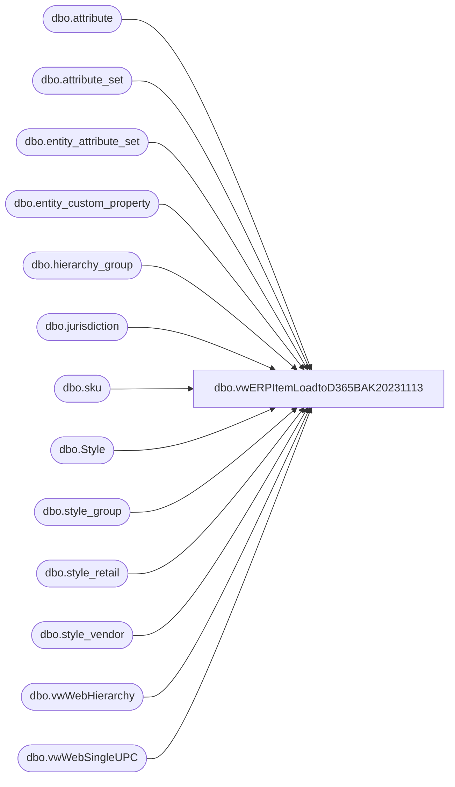

# dbo.vwERPItemLoadtoD365BAK20231113

**Database:** me_01  
**Server:** bedrockdb02  

## Architecture Diagram



## Table Dependencies

| Referenced Table |
|---|
| dbo.attribute |
| dbo.attribute_set |
| dbo.entity_attribute_set |
| dbo.entity_custom_property |
| dbo.hierarchy_group |
| dbo.jurisdiction |
| dbo.sku |
| dbo.Style |
| dbo.style_group |
| dbo.style_retail |
| dbo.style_vendor |
| dbo.vwWebHierarchy |
| dbo.vwWebSingleUPC |

## View Code

```sql
CREATE view [dbo].[vwERPItemLoadtoD365BAK20231113]

as 

---------------------------------------------------------------------------------------------------------------
-- Dan Tweedie - 2017-08-14 -- Created view from SQL provided by Keith Lee, used to capture SKU data for D365
--	DT --2018-06-14 - Updated view to get rid of handling for supplies since this is to be used only for Merchandise items
-- Tim Callahan - 2021-05-19 - Updated view to use UKTRF for UK HTS codes and USTRF for all others 
--	DT - 2022-06-02 - Added new data for retail inventory project
-- LT	2023-11-13	Backup created before implementing ItemCreate changes
---------------------------------------------------------------------------------------------------------------


WITH 
MSOUND as 
	(
		select
			s.style_code
		from bedrockdb02.me_01.dbo.sku sk (nolock) 
		inner join bedrockdb02.me_01.dbo.style s (nolock) on sk.style_id = s.style_id
		inner join bedrockdb02.me_01.dbo.entity_attribute_set eas_m (nolock) on s.style_id = eas_m.parent_id
		inner join bedrockdb02.me_01.dbo.attribute_set ats_m (nolock) on eas_m.attribute_set_id = ats_m.attribute_set_id
		inner join bedrockdb02.me_01.dbo.attribute a_m (nolock) on eas_m.attribute_id = a_m.attribute_id
		where   a_m.attribute_code = 'MSOUND'
		and s.style_code not in ('027500','127500','427500') -- These are the blank universal sound chips themselves
		group by 
			s.style_code
	),
Servic as
	(
		SELECT  
			s.style_code
		FROM Style s 
		join entity_attribute_set eas with (nolock) on eas.parent_id = s.style_id
		join attribute_set ats with (nolock) on eas.attribute_set_id = ats.attribute_set_id
		join attribute a with (nolock) on ats.attribute_id = a.attribute_id and a.parent_type = 1
		where a.attribute_code = 'SERVIC'
		and s.active_flag=1
		group by 
			s.style_code
	),
UPCs as
	(
		select
			u.style_code,
			u.UPC
		from vwWebSingleUPC u
		group by 
			u.style_code,
			u.UPC
	),
HierarchyGroup as
	(
		select
			s.style_code,
			concat(h.SubClass, ' (', h.SubClassCode, ')') as HierarchyGroup,
			case when h.Department in ('CAN Gift Cards','Gift Cards','UK-Gift Cards') then 1 else 0 end as GiftCard
		from style s with (nolock)
		join style_group sg with (nolock) on s.style_id = sg.style_id
		join vwWebHierarchy h on sg.hierarchy_group_id = h.SubClassHierarchyGroupID
		where s.active_flag = 1 
		group by 
			s.style_code,
			concat(h.SubClass, ' (', h.SubClassCode, ')'),
			case when h.Department in ('CAN Gift Cards','Gift Cards','UK-Gift Cards') then 1 else 0 end
	),
JurisdictionCodes as
	(
		select
			jurisdiction_id,
			cast(
					case jurisdiction_code
						when 'HOME' then '1100'
						when 'CA' then '1700'
						when 'UK' then '2110'
						when 'DK' then '2300'
						when 'CN' then '3001'
					end 
					as nvarchar (10)
				) as Entity
		from jurisdiction with (nolock)
		where jurisdiction_code in ('HOME', 'CA', 'UK', 'DK', 'CN')
		UNION 
		select
			jurisdiction_id,
			cast('1200'	as nvarchar (10)) as Entity
		from jurisdiction with (nolock)
		where jurisdiction_code in ('HOME')

	),
COO as
	(
		SELECT  
			s.style_code,
			a.attribute_code,
			a.attribute_label,
			ats.attribute_set_code,
			ats.attribute_set_label as COO
		FROM style s with (nolock)
		join entity_attribute_set eas with (nolock) on eas.parent_id = s.style_id
		join attribute_set ats with (nolock) on eas.attribute_set_id = ats.attribute_set_id
		join attribute a with (nolock) on ats.attribute_id = a.attribute_id and a.parent_type = 1
		where a.attribute_code in ('COO')
		and s.active_flag=1
	)
select	
		'ea' as INVENTORYUNITSYMBOL,
		'No' as ISCATCHWEIGHTPRODUCT,
		'No' as ISPRODUCTKIT,
		--'MOV-AVG' as ITEMMODELGROUPID,
		case 
			when 
				--ms.style_code is not null or 
			svc.style_code is not null 
			then 'SERV' 
			else 'MOV-AVG' 
		end as ITEMMODELGROUPID,
		cast(s.style_code as nvarchar(6)) as ITEMNUMBER,
		s.long_desc as PRODUCTDESCRIPTION,
		'MERCH' as PRODUCTGROUPID,
		s.long_desc  as PRODUCTNAME,
		cast(s.style_code as nvarchar(6)) as PRODUCTNUMBER,
		'Product' as PRODUCTSUBTYPE,
		'Item' as PRODUCTTYPE,
		'ea' as SALESUNITSYMBOL,
		NULL as RETAILPRODUCTCATEGORYNAME,
		s.long_desc as SEARCHNAME,
		s.long_desc as PRODUCTSEARCHNAME,
		--'SWL' as STORAGEDIMENSIONGROUPNAME,
		'BABWMS' as STORAGEDIMENSIONGROUPNAME,
		'None' as TRACKINGDIMENSIONGROUPNAME,
		case 
			when j.Entity = '1200' 
				then (sr.current_selling_retail / 6.5) 
			else sr.current_selling_retail
		end as SALESPRICE,
		--'eaipcs' as UNITCONVERSIONSEQUENCEGROUPID,
		case 
			when isnull(s.order_multiple,0)=isnull(s.distribution_multiple,0)
				then 'EACS'
			else 'EAIPCS'
		end as UNITCONVERSIONSEQUENCEGROUPID,
		'0.00' as UNITCOST,
		'1.00' as UNITCOSTQUANTITY,
		sv.current_cost as PURCHASEPRICE,
		'ea' as PURCHASEUNITSYMBOL,
		'Yes' as ISPURCHASEPRICEAUTOMATICALLYUPDATED,
		case 
			when att.attribute_set_label is not null 
				then cast(left(substring(isnull(att.attribute_set_label,''),1,12), 7) as varchar(7)) 
			else NULL
		end as HarmonizedSystemCode,
		cast('FAK70' as nvarchar(5)) as NMFCCode,
		cast('BABW' as nvarchar(4)) as ReservationHierarchyName,
		cast('Merch' as nvarchar(5)) as PropertyID,
		cast(COO.COO as nvarchar(10)) as OriginCountryRegionID,--need to add this
		cast('Yes' as nvarchar(3)) as AreTransportationManagementProcessesEnabled,
		--cast(s.long_desc as nvarchar(120)) as WarehouseMobileDeviceDescriptionLine2,
		cast('New' as nvarchar(120)) as WarehouseMobileDeviceDescriptionLine2,
		case 
			when 
				--ms.style_code is not null 
				--or 
				svc.style_code is not null 
			then 1 
			else 0 
		end as ServiceItem, --if digital sound or servic attribute (non-inventoried item)
		u.UPC,
		case 
			when 
				--ms.style_code is not null 
				--or 
				svc.style_code is not null 
			then 'SERV'
			when h.GiftCard=1 then 'GIFTCARD'
			else 'MERCH' 
		end as ItemGroup,
		h.HierarchyGroup,
		j.Entity
from	style s with (nolock)
join	style_group sg with (nolock) on s.style_id = sg.style_id
join	hierarchy_group hg with (nolock) on sg.hierarchy_group_id = hg.hierarchy_group_id
join	sku sk with (nolock) on s.style_id = sk.style_id
--join	ib_inventory_total iit with (nolock) on sk.sku_id = iit.sku_id
join	style_vendor sv with (nolock) on s.style_id = sv.style_id and sv.primary_vendor_flag = 1
join	style_retail sr with (nolock) on s.style_id = sr.style_id -- and jurisdiction_id = 1
join	JurisdictionCodes j on sr.jurisdiction_id = j.jurisdiction_id
left outer join entity_custom_property ecp3 with (nolock) on s.style_id = ecp3.parent_id
		and		ecp3.custom_property_id = 4 -- HTSCD
		and		ecp3.parent_type = 1
left outer join entity_attribute_set eas with (nolock) 
       on s.style_id = eas.parent_id
       and    eas.attribute_id = case when left(style_code,1) in ('4','5','6') 
                                                then 156 -- UKTRK
                                                else 152 -- USTRF
                                         end
left join attribute_set att with (nolock) on eas.attribute_set_id = att.attribute_set_id and len(attribute_set_label) > 0
left join COO on s.style_code=coo.style_code
left join MSOUND ms on s.style_code=ms.style_code
left join SERVIC svc on s.style_code=svc.style_code
join UPCs u on s.style_code=u.style_code
join HierarchyGroup h on s.style_code=h.style_code
where 1=1
and s.active_flag = 1
and len(s.style_code)=6
and (
		substring(hg.hierarchy_group_code,7,2) <> 60 --EXCLUDES SUPPLIES
		OR
		h.GiftCard=1 --includes giftcards that may be supplies
	)
--AND (
--			(	-- North America
--				s.style_code not between '400000' and '499999' 
--				and 
--				s.style_code not between '800000' and '899999'
--				and 
--				left(s.style_code, 1) <> '9'
--			) 
--		OR
--			(
--				s.style_code between '400000' and '499999' -- UK
--			)
--		OR
--			(
--				s.style_code between '800000' and '899999' -- China
--			)

--	)
and left(s.style_code, 1) <> '9'
group by 
	sv.current_cost, 
	s.style_code,
	s.long_desc, 
	hg.hierarchy_group_label, 
	hg.hierarchy_group_code,
	sr.current_selling_retail,
	ecp3.custom_property_value,
	att.attribute_set_label,
	COO.COO,
	ms.style_code,
	svc.style_code,
	u.UPC,
	h.HierarchyGroup,
	h.GiftCard,
	j.Entity,
		case 
			when isnull(s.order_multiple,0)=isnull(s.distribution_multiple,0)
				then 'EACS'
			else 'EAIPCS'
		end
--having	sum(iit.total_on_hand_units) <> 0
UNION -- LOAD STYLE STARTING WITH 8, BUT REPLACE 8 WITH 9
select	
		'ea' as INVENTORYUNITSYMBOL,
		'No' as ISCATCHWEIGHTPRODUCT,
		'No' as ISPRODUCTKIT,
		--'MOV-AVG' as ITEMMODELGROUPID,
		case 
			when 
				--ms.style_code is not null or 
			svc.style_code is not null 
			then 'SERV' 
			else 'MOV-AVG' 
		end as ITEMMODELGROUPID,
		cast(cast('9' as varchar)  + cast(RIGHT(s.style_code,5) as varchar) as nvarchar(6)) as ITEMNUMBER,
		s.long_desc as PRODUCTDESCRIPTION,
		'MERCH' as PRODUCTGROUPID,
		s.long_desc  as PRODUCTNAME,
		cast(cast('9' as varchar)  + cast(RIGHT(s.style_code,5) as varchar) as nvarchar(6)) as PRODUCTNUMBER,
		'Product' as PRODUCTSUBTYPE,
		'Item' as PRODUCTTYPE,
		'ea' as SALESUNITSYMBOL,
		NULL as RETAILPRODUCTCATEGORYNAME,
		s.long_desc as SEARCHNAME,
		s.long_desc as PRODUCTSEARCHNAME,
		--'SWL' as STORAGEDIMENSIONGROUPNAME,
		'BABWMS' as STORAGEDIMENSIONGROUPNAME,
		'None' as TRACKINGDIMENSIONGROUPNAME,
		case 
			when j.Entity = '1200' 
				then (sr.current_selling_retail / 6.5) 
			else sr.current_selling_retail
		end as SALESPRICE,
		--'eaipcs' as UNITCONVERSIONSEQUENCEGROUPID,
		case 
			when isnull(s.order_multiple,0)=isnull(s.distribution_multiple,0)
				then 'EACS'
			else 'EAIPCS'
		end as UNITCONVERSIONSEQUENCEGROUPID,
		'0.00' as UNITCOST,
		'1.00' as UNITCOSTQUANTITY,
		sv.current_cost as PURCHASEPRICE,
		'ea' as PURCHASEUNITSYMBOL,
		'Yes' as ISPURCHASEPRICEAUTOMATICALLYUPDATED,
		case 
			when att.attribute_set_label is not null 
				then cast(left(substring(isnull(att.attribute_set_label,''),1,12), 7) as varchar(7)) 
			else NULL
		end as HarmonizedSystemCode,
		'FAK70' as NMFCCode,
		cast('BABW' as nvarchar(4)) as ReservationHierarchyName,
		'Merch' as PropertyID,
		COO.COO as OriginCountryRegionID,--need to add this
		'Yes' as AreTransportationManagementProcessesEnabled,
		--cast(s.long_desc as nvarchar(120)) as WarehouseMobileDeviceDescriptionLine2,
		cast('New' as nvarchar(120)) as WarehouseMobileDeviceDescriptionLine2,
		case 
			when 
				--ms.style_code is not null 
				--or 
				svc.style_code is not null 
			then 1 
			else 0 
		end as ServiceItem, --if digital sound or servic attribute (non-inventoried item)
		u.UPC,
		case 
			when 
				--ms.style_code is not null 
				--or 
				svc.style_code is not null 
			then 'SERV'
			when h.GiftCard=1 then 'GIFTCARD'
			else 'MERCH' 
		end as ItemGroup,
		h.HierarchyGroup,
		j.Entity
from	style s with (nolock)
join	style_group sg with (nolock) on s.style_id = sg.style_id
join	hierarchy_group hg with (nolock) on sg.hierarchy_group_id = hg.hierarchy_group_id
join	sku sk with (nolock) on s.style_id = sk.style_id
--join	ib_inventory_total iit with (nolock) on sk.sku_id = iit.sku_id
join	style_vendor sv with (nolock) on s.style_id = sv.style_id and sv.primary_vendor_flag = 1
join	style_retail sr with (nolock) on s.style_id = sr.style_id -- and jurisdiction_id = 1
join	JurisdictionCodes j on sr.jurisdiction_id = j.jurisdiction_id
left outer join entity_custom_property ecp3 with (nolock) on s.style_id = ecp3.parent_id
		and		ecp3.custom_property_id = 4 -- HTSCD
		and		ecp3.parent_type = 1
left outer join entity_attribute_set eas with (nolock) on s.style_id = eas.parent_id
		and		eas.attribute_id = 152
left join attribute_set att with (nolock) on eas.attribute_set_id = att.attribute_set_id and len(attribute_set_label) > 0
left join COO on s.style_code=coo.style_code
left join MSOUND ms on s.style_code=ms.style_code
left join SERVIC svc on s.style_code=svc.style_code
join UPCs u on cast(cast('9' as varchar)  + cast(RIGHT(s.style_code,5) as varchar) as nvarchar(6))=u.style_code
join HierarchyGroup h on s.style_code=h.style_code
where 1=1
and s.active_flag = 1
and len(s.style_code)=6
and (
		substring(hg.hierarchy_group_code,7,2) <> 60 --EXCLUDES SUPPLIES
		OR
		h.GiftCard=1 --includes giftcards that may be supplies
	)
AND (
			
			(
				s.style_code between '800000' and '899999' -- China
			)
	)
group by 
	sv.current_cost, 
	s.style_code,
	s.long_desc, 
	hg.hierarchy_group_label, 
	hg.hierarchy_group_code,
	sr.current_selling_retail,
	ecp3.custom_property_value,
	att.attribute_set_label,
	COO.COO,
	ms.style_code,
	svc.style_code,
	u.UPC,
	h.HierarchyGroup,
	h.GiftCard,
	j.Entity,
		case 
			when isnull(s.order_multiple,0)=isnull(s.distribution_multiple,0)
				then 'EACS'
			else 'EAIPCS'
		end


dbo,vwHierarchy,create view vwHierarchy as

WITH
Hier as
	(
		select 
			h.hierarchy_label,
			hl.hierarchy_level_label,
			hg.hierarchy_group_code, 
			hg.hierarchy_group_label,
			hg.hierarchy_group_short_label,
			hg.hierarchy_group_id,
			hg.parent_group_id
		from hierarchy h with (nolock)
		join hierarchy_level hl with (nolock) on h.hierarchy_id = hl.hierarchy_id
		join hierarchy_group hg with (nolock) on h.hierarchy_id = hg.hierarchy_id and hl.hierarchy_level_id = hg.hierarchy_level_id
		where h.hierarchy_id = 1 --product hierarchy
		and left(hg.hierarchy_group_code,1) in ('W', 'R') 
	),
HierarchyX as 
	(
		select 
			con.hierarchy_group_label as Concept,
			ch.hierarchy_group_label as ConsumerGroup,
			div.hierarchy_group_label as Division,
			d.hierarchy_group_label as Department,
			c.hierarchy_group_label as Class, 
			sc.hierarchy_group_label as SubClass,
			con.hierarchy_group_code as ConceptCode,
			ch.hierarchy_group_code as ConsumerGroupCode,
			div.hierarchy_group_code as DivisionCode,
			d.hierarchy_group_code as DepartmentCode,
			c.hierarchy_group_code as ClassCode,
			sc.hierarchy_group_code as SubClassCode,
			sc.hierarchy_group_id SubClassHierarchyGroupID
		from Hier sc
		join Hier c on sc.parent_group_id = c.hierarchy_group_id and c.hierarchy_level_label='Class'
		join Hier d on c.parent_group_id = d.hierarchy_group_id and d.hierarchy_level_label='Department'
		join Hier div on d.parent_group_id = div.hierarchy_group_id and div.hierarchy_level_label='Division'
		join Hier ch on div.parent_group_id = ch.hierarchy_group_id and ch.hierarchy_level_label='Chain'
		join Hier con on ch.parent_group_id = con.hierarchy_group_id and con.hierarchy_level_label='Concept'
		where sc.hierarchy_level_label = 'Sub-Class'
	)
select 
	Concept,	
	ConsumerGroup,	
	Division,	
	Department,	
	Class,	
	SubClass,	
	ConceptCode,	
	ConsumerGroupCode,	
	DivisionCode,	
	DepartmentCode,	
	ClassCode,	
	SubClassCode,	
	SubClassHierarchyGroupID
from HierarchyX
group by 
	Concept,	
	ConsumerGroup,	
	Division,	
	Department,	
	Class,	
	SubClass,	
	ConceptCode,	
	ConsumerGroupCode,	
	DivisionCode,	
	DepartmentCode,	
	ClassCode,	
	SubClassCode,	
	SubClassHierarchyGroupID


dbo,vwItem_ActiveDistros,CREATE VIEW dbo.vwItem_ActiveDistros
AS
SELECT        u.upc_number AS style, st.long_desc AS description, LEFT(hg.hierarchy_group_code, 8) AS deptcode, st.distribution_multiple AS casepack, 'A' AS category
FROM            dbo.upc AS u WITH (nolock) INNER JOIN
                         dbo.sku AS sku WITH (nolock) ON u.sku_id = sku.sku_id INNER JOIN
                         dbo.style AS st WITH (nolock) ON st.style_id = sku.style_id INNER JOIN
                         dbo.style_group AS sg WITH (nolock) ON sg.style_id = st.style_id INNER JOIN
                         dbo.hierarchy_group AS hg WITH (nolock) ON hg.hierarchy_group_id = sg.hierarchy_group_id INNER JOIN
                         dbo.entity_attribute_set AS eas WITH (nolock) ON st.style_id = eas.parent_id INNER JOIN
                         dbo.attribute_set AS att WITH (nolock) ON eas.attribute_set_id = att.attribute_set_id
WHERE        (eas.attribute_id = 72) AND (eas.attribute_set_id IN (7200001)) AND (CAST(u.upc_number AS BIGINT) < 400000) AND (st.style_id IN
                             (SELECT        s.style_id
                               FROM            dbo.style AS s WITH (nolock) INNER JOIN
                                                         dbo.entity_attribute_set AS eas WITH (nolock) ON s.style_id = eas.parent_id INNER JOIN
                                                         dbo.attribute_set AS att WITH (nolock) ON eas.attribute_set_id = att.attribute_set_id
                               WHERE        (eas.attribute_id = 572) AND (eas.attribute_set_id IN (57200002, 57200003, 57200005))
                               UNION ALL
                               SELECT        s.style_code
                               FROM            dbo.style AS s INNER JOIN
                                                        dbo.entity_attribute_set AS eas ON s.style_id = eas.parent_id INNER JOIN
                                                        dbo.attribute_set AS att ON eas.attribute_set_id = att.attribute_set_id
                               WHERE        (att.attribute_id IN (114, 254)) AND (att.attribute_set_label = 'YES')))
```

