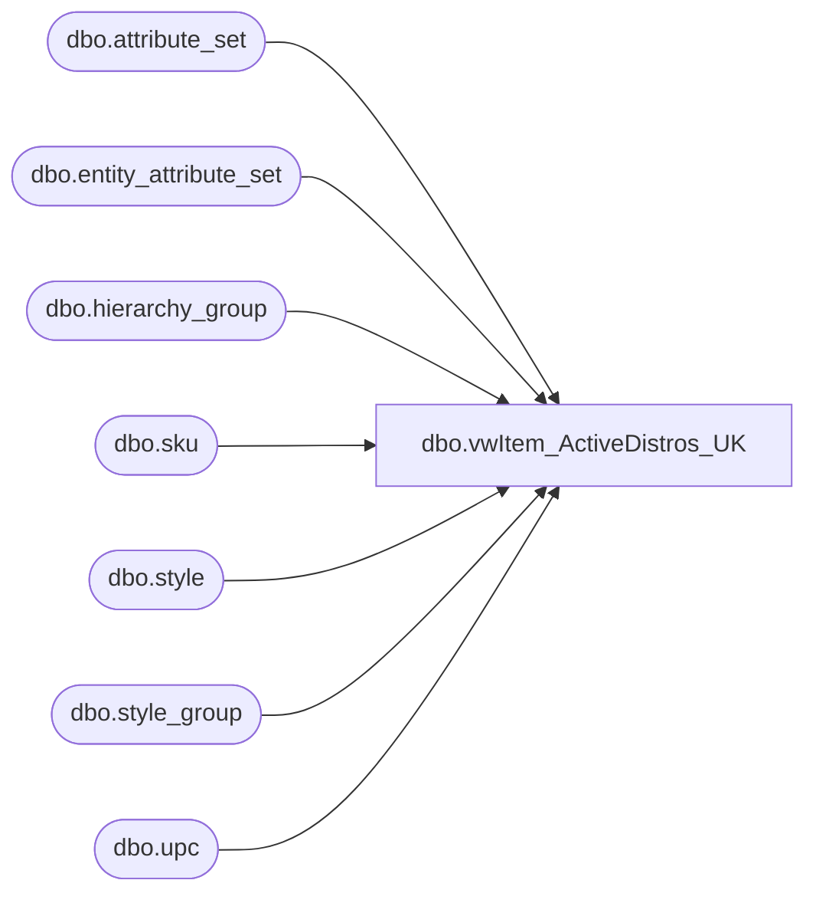

# dbo.vwItem_ActiveDistros_UK

**Database:** me_01  
**Server:** bedrockdb02  

## Architecture Diagram



## Table Dependencies

| Referenced Table |
|---|
| dbo.attribute_set |
| dbo.entity_attribute_set |
| dbo.hierarchy_group |
| dbo.sku |
| dbo.style |
| dbo.style_group |
| dbo.upc |

## View Code

```sql
CREATE VIEW [dbo].[vwItem_ActiveDistros_UK]
AS

select u.upc_number style
	,st.long_desc	description
	,left(hg.hierarchy_group_code,8) deptcode
	,st.distribution_multiple	casepack
	,'A' category
from me_01.dbo.upc u with (nolock)
	inner join me_01.dbo.sku sku with (nolock) 		ON u.sku_id = sku.sku_id 
	inner join me_01.dbo.style st with (nolock) 		ON st.style_id = sku.style_id 
	inner join me_01.dbo.style_group sg with (nolock) 	ON sg.style_id = st.style_id	
	inner join me_01.dbo.hierarchy_group hg with (nolock) 	ON hg.hierarchy_group_id = sg.hierarchy_group_id
	INNER JOIN me_01.dbo.entity_attribute_set eas (nolock) on st.style_id = eas.parent_id
	INNER JOIN me_01.dbo.attribute_set att (nolock) on eas.attribute_set_id = att.attribute_set_id
	WHERE eas.attribute_id = 72 
	AND CAST(u.upc_number AS BIGINT) < 600000 
	AND eas.attribute_set_id IN( 7200001)  --MEG'S INVENTOR STATUS BY STYLE | ACTIVE)
	AND st.style_id IN (SELECT s.style_id 
		FROM me_01.dbo.style s (nolock)
		INNER JOIN me_01.dbo.entity_attribute_set eas (nolock) on s.style_id = eas.parent_id
		INNER JOIN me_01.dbo.attribute_set att (nolock) on eas.attribute_set_id = att.attribute_set_id
		WHERE eas.attribute_id = 572 AND eas.attribute_set_id IN( 57200004,57200006)  --UK, UKWEB)	
	)
```

