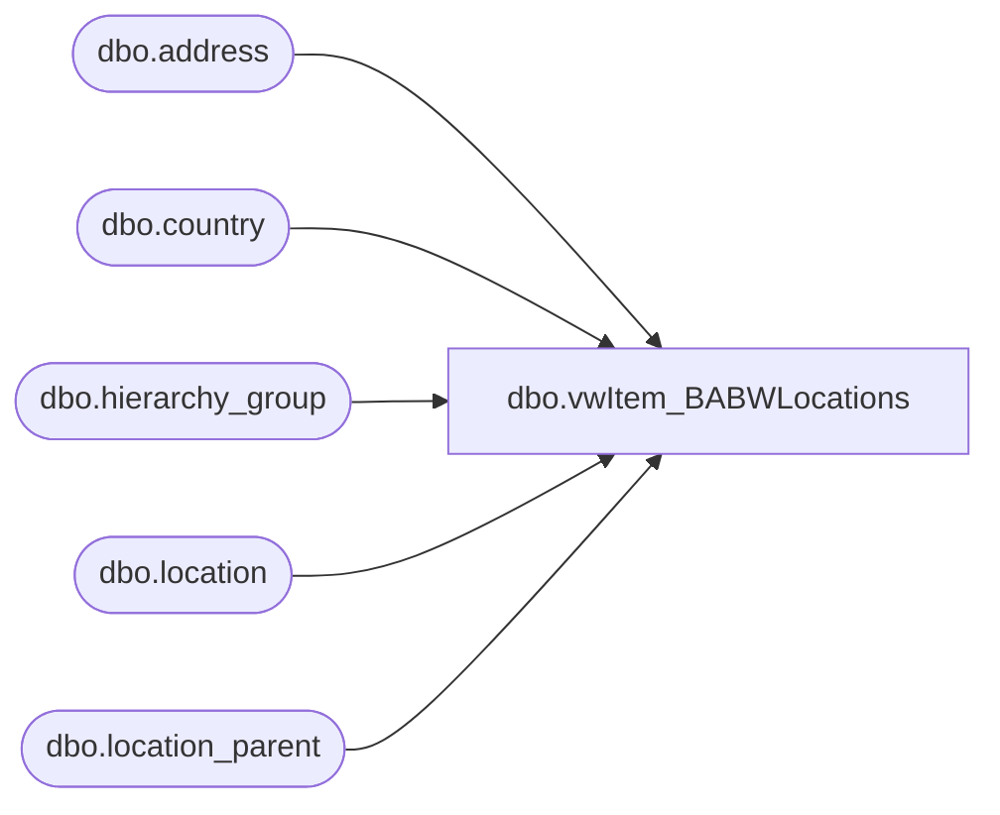

# dbo.vwItem_BABWLocations

**Database:** me_01  
**Server:** bedrockdb02  

## Architecture Diagram



## Table Dependencies

| Referenced Table |
|---|
| dbo.address |
| dbo.country |
| dbo.hierarchy_group |
| dbo.location |
| dbo.location_parent |

## View Code

```sql
CREATE VIEW [dbo].[vwItem_BABWLocations]
AS
SELECT        loc.location_code, loc.location_name, addr.address_line1, addr.address_line2, addr.address_city, addr.address_state, addr.address_zip_code, c.country_code, 
                         ba.hierarchy_group_short_label AS BeareaLeader, ba.hierarchy_group_code AS BeareaNum, bl.hierarchy_group_short_label AS Bearitory, 
                         bl.hierarchy_group_code AS BearitoryNum
FROM            dbo.location AS loc WITH (nolock) INNER JOIN
                         dbo.address AS addr WITH (nolock) ON loc.location_id = addr.parent_id INNER JOIN
                         dbo.country AS c WITH (nolock) ON addr.country_id = c.country_id INNER JOIN
                         dbo.location_parent AS lp WITH (nolock) ON lp.location_id = loc.location_id INNER JOIN
                         dbo.hierarchy_group AS ba WITH (nolock) ON lp.parent_hierarchy_group_id = ba.hierarchy_group_id AND ba.hierarchy_level_id = 20000008 INNER JOIN
                         dbo.hierarchy_group AS bl WITH (nolock) ON ba.parent_group_id = bl.hierarchy_group_id AND bl.hierarchy_level_id = 20000007
WHERE        (addr.address_type_id = 1) AND (addr.parent_type = 2) AND (loc.location_code < 990 OR
                         loc.location_code IN (9990, 9902, 9903, 9907, 9471, 9910) OR
                         loc.location_code BETWEEN 1500 AND 1599 OR
                         loc.location_code BETWEEN 2000 AND 2999 OR
                         loc.location_code BETWEEN 3000 AND 3999 OR
                         loc.location_code BETWEEN 9000 AND 9999)
```

