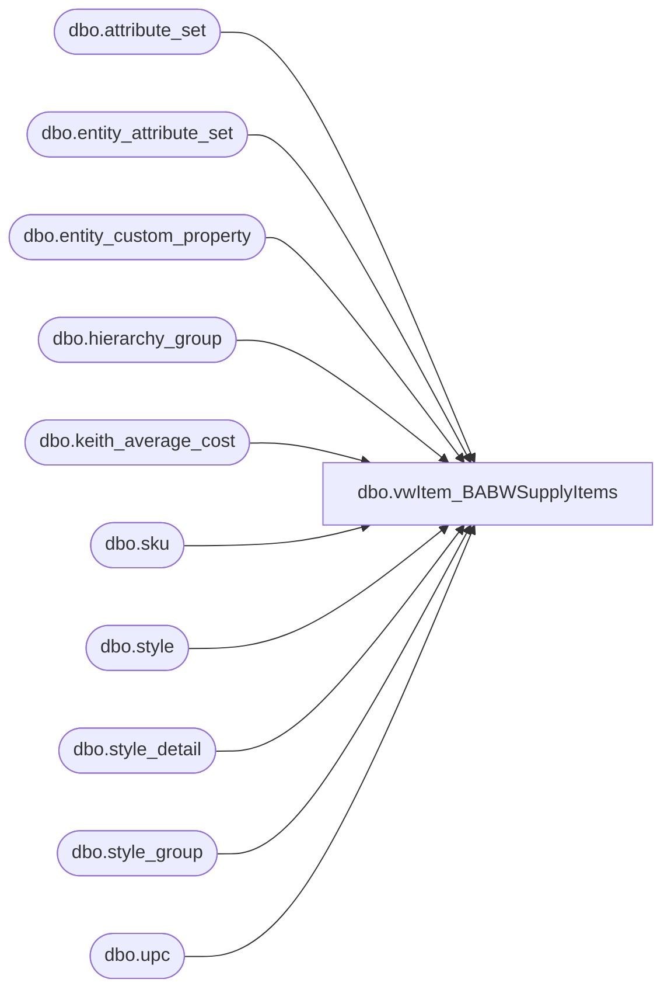

# dbo.vwItem_BABWSupplyItems

**Database:** me_01  
**Server:** bedrockdb02  

## Architecture Diagram



## Table Dependencies

| Referenced Table |
|---|
| dbo.attribute_set |
| dbo.entity_attribute_set |
| dbo.entity_custom_property |
| dbo.hierarchy_group |
| dbo.keith_average_cost |
| dbo.sku |
| dbo.style |
| dbo.style_detail |
| dbo.style_group |
| dbo.upc |

## View Code

```sql
CREATE VIEW [dbo].[vwItem_BABWSupplyItems] AS
SELECT u.upc_number
	,st.short_desc
	,st.long_desc
	,hierarchy_group_code
	,st.distribution_multiple
	,st.style_code
	,isnull(average_cost, 0.00) as cost
 	,max(case when ecp.custom_property_value is null then st.distribution_multiple else cast(cast(ecp.custom_property_value as float) as int) end) std_pack_qty
from 	me_01.dbo.upc u 
INNER JOIN me_01.dbo.sku sku on u.sku_id = sku.sku_id 
INNER JOIN me_01.dbo.style st on st.style_id = sku.style_id 
INNER JOIN me_01.dbo.style_detail sd on sd.style_id = st.style_id
INNER JOIN me_01.dbo.style_group sg on sg.style_id = st.style_id	
INNER JOIN me_01.dbo.hierarchy_group hg on hg.hierarchy_group_id = sg.hierarchy_group_id
LEFT JOIN me_01.dbo.entity_custom_property ecp on ecp.parent_id = st.style_id and custom_property_id = 2 --number of units in a pack
	and	parent_type = 1 and hg.hierarchy_group_code like 'R-%-%-60%'
LEFT JOIN me_01.dbo.keith_average_cost ac on (CAST(u.upc_number AS bigINT) = ac.style_code)--average_cost by style_code
WHERE CAST(u.upc_number as bigint) = 5428 -- this item accidently got put in the wrong hierarchy - dave 3/29/2004
OR 
st.style_id IN (
	SELECT s.style_id 
	FROM me_01.dbo.style s (nolock)
	INNER JOIN me_01.dbo.entity_attribute_set eas (nolock) on s.style_id = eas.parent_id
	INNER JOIN me_01.dbo.attribute_set att (nolock) on eas.attribute_set_id = att.attribute_set_id
	WHERE eas.attribute_id = 572 AND eas.attribute_set_id IN( 57200002,57200003,57200005)  --US, CA, USWEB)
	AND CAST(u.upc_number AS BIGINT) < 600000 
	UNION ALL
	SELECT sku.style_id
	from 	me_01.dbo.upc u 
	INNER JOIN me_01.dbo.sku sku on u.sku_id = sku.sku_id 
	INNER JOIN me_01.dbo.style_detail sd on sd.style_id = sku.style_id
	INNER JOIN me_01.dbo.style_group sg on sg.style_id = sku.style_id	
	INNER JOIN me_01.dbo.hierarchy_group hg on hg.hierarchy_group_id = sg.hierarchy_group_id
	INNER JOIN me_01.dbo.entity_attribute_set eas ON sku.style_id = eas.parent_id
	INNER JOIN me_01.dbo.attribute_set att ON eas.attribute_set_id = att.attribute_set_id
	WHERE att.attribute_id IN (114, 254) and att.attribute_set_label = 'YES'
	AND CAST(u.upc_number AS BIGINT) < 600000 
	UNION ALL
	SELECT sku.style_id
	FROM 	me_01.dbo.upc u 
	INNER JOIN me_01.dbo.sku sku on u.sku_id = sku.sku_id 
	INNER JOIN me_01.dbo.style_detail sd on sd.style_id = sku.style_id
	INNER JOIN me_01.dbo.style_group sg on sg.style_id = sku.style_id	
	INNER JOIN me_01.dbo.hierarchy_group hg on hg.hierarchy_group_id = sg.hierarchy_group_id
	WHERE (left(hg.hierarchy_group_code,11) in ('R-B-D-70-03') OR hg.hierarchy_group_code LIKE 'F%')	--Test Test Chain Test Division	--temporarily added to do testing for the 960 warehouse - dave 6/9/2004
		and cast(u.upc_number as bigint) BETWEEN  234 AND 999999	
) 
GROUP BY u.upc_number,st.short_desc,st.long_desc,hierarchy_group_code,st.distribution_multiple,st.style_code,
	average_cost


dbo,vwItem_BABWSupplyItems_CN,CREATE VIEW dbo.vwItem_BABWSupplyItems_CN
AS
SELECT        u.upc_number, st.short_desc, st.long_desc, hg.hierarchy_group_code, st.distribution_multiple, st.style_code, ISNULL(ac.average_cost, 0.00) AS cost, 
                         MAX(CASE WHEN ecp.custom_property_value IS NULL THEN st.distribution_multiple ELSE CAST(CAST(ecp.custom_property_value AS float) AS int) END) 
                         AS std_pack_qty
FROM            dbo.upc AS u INNER JOIN
                         dbo.sku AS sku ON u.sku_id = sku.sku_id INNER JOIN
                         dbo.style AS st ON st.style_id = sku.style_id INNER JOIN
                         dbo.style_detail AS sd ON sd.style_id = st.style_id INNER JOIN
                         dbo.style_group AS sg ON sg.style_id = st.style_id INNER JOIN
                         dbo.hierarchy_group AS hg ON hg.hierarchy_group_id = sg.hierarchy_group_id LEFT OUTER JOIN
                         dbo.entity_custom_property AS ecp ON ecp.parent_id = st.style_id AND ecp.custom_property_id = 2 AND ecp.parent_type = 1 AND 
                         hg.hierarchy_group_code LIKE 'R-%-%-60%' LEFT OUTER JOIN
                         dbo.keith_average_cost AS ac ON CAST(u.upc_number AS bigINT) = ac.style_code
WHERE        (st.style_id IN
                             (SELECT        s.style_id
                               FROM            dbo.style AS s WITH (nolock) INNER JOIN
                                                         dbo.entity_attribute_set AS eas WITH (nolock) ON s.style_id = eas.parent_id INNER JOIN
                                                         dbo.attribute_set AS att WITH (nolock) ON eas.attribute_set_id = att.attribute_set_id
                               WHERE        (eas.attribute_id = 572) AND (eas.attribute_set_id IN (57200009)) AND (CAST(u.upc_number AS BIGINT) < 900000)
                               UNION ALL
                               SELECT        sku.style_id
                               FROM            dbo.upc AS u WITH (nolock) INNER JOIN
                                                        dbo.sku AS sku WITH (nolock) ON u.sku_id = sku.sku_id INNER JOIN
                                                        dbo.style_detail AS sd WITH (nolock) ON sd.style_id = sku.style_id INNER JOIN
                                                        dbo.style_group AS sg WITH (nolock) ON sg.style_id = sku.style_id INNER JOIN
                                                        dbo.hierarchy_group AS hg WITH (nolock) ON hg.hierarchy_group_id = sg.hierarchy_group_id
                               WHERE        (hg.hierarchy_group_code LIKE 'R-%-%-60%') AND (CAST(u.upc_number AS bigint) BETWEEN 799999 AND 900000)))
GROUP BY u.upc_number, st.short_desc, st.long_desc, hg.hierarchy_group_code, st.distribution_multiple, st.style_code, ac.average_cost
```

