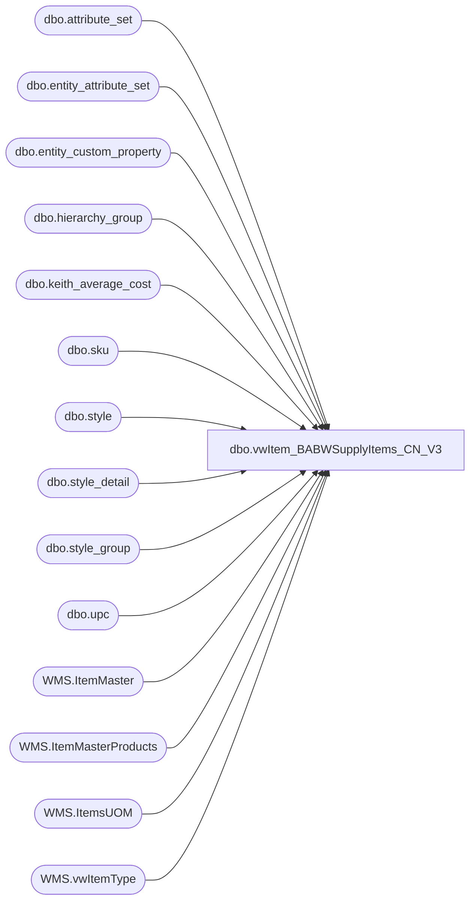

# dbo.vwItem_BABWSupplyItems_CN_V3

**Database:** me_01  
**Server:** bedrockdb02  

## Architecture Diagram



## Table Dependencies

| Referenced Table |
|---|
| dbo.attribute_set |
| dbo.entity_attribute_set |
| dbo.entity_custom_property |
| dbo.hierarchy_group |
| dbo.keith_average_cost |
| dbo.sku |
| dbo.style |
| dbo.style_detail |
| dbo.style_group |
| dbo.upc |
| WMS.ItemMaster |
| WMS.ItemMasterProducts |
| WMS.ItemsUOM |
| WMS.vwItemType |

## View Code

```sql
CREATE VIEW [dbo].[vwItem_BABWSupplyItems_CN_V3]
AS


WITH d365Supplies
AS
(
	SELECT RIGHT('000000000000' + im.ProductNumber, 12) AS 'upc_number'
				   ,d.PRODUCTNAME AS 'short_desc'
				   ,d.PRODUCTNAME AS 'long_desc'
				   ,'R-B-D-60-00-00' AS 'hierarchy_group_code'
				   --,c1.FACTOR as 'distribution_multiple'
				   ,1 as 'distribution_multiple'
				   ,im.ProductNumber AS 'style_code'
				   ,im.UnitCost AS 'cost'
				   ,c2.FACTOR as 'std_pack_qty'
	--INTO #SVWORKV11_1  
	FROM [STL-SSIS-P-01].[IntegrationStaging].[WMS].[ItemMaster] im
    INNER JOIN [STL-SSIS-P-01].[IntegrationStaging].WMS.vwItemType it WITH (NOLOCK) ON im.ProductNumber=it.ItemNumber and im.Entity=it.entity
	--LEFT JOIN [STL-SSIS-P-01].[IntegrationStaging].WMS.ItemsUOM c1 WITH (NOLOCK) ON im.ProductNumber = c1.PRODUCTNUMBER AND c1.Entity = 1100 AND im.InventoryUnitSymbol = c1.FROMUNITSYMBOL
	LEFT JOIN [STL-SSIS-P-01].[IntegrationStaging].WMS.ItemsUOM c2 WITH (NOLOCK) ON im.ProductNumber = c2.PRODUCTNUMBER AND c2.Entity = 1100 AND im.PurchaseUnitSymbol = c2.FROMUNITSYMBOL AND c2.ToUnitSymbol = 'WMEA'
	LEFT JOIN [STL-SSIS-P-01].[IntegrationStaging].WMS.ItemMasterProducts d WITH (NOLOCK) ON im.ProductNumber = d.PRODUCTNUMBER
	WHERE im.Entity = 1100 AND it.ItemType = 'Supplies' 
 
),
merchItems_availb
AS
(
	SELECT u.upc_number
	,st.short_desc
	,st.long_desc
	,hierarchy_group_code
	,st.distribution_multiple
	,st.style_code
	,isnull(average_cost, 0.00) as cost
 	,max(case when ecp.custom_property_value is null then st.distribution_multiple else cast(cast(ecp.custom_property_value as float) as int) end) std_pack_qty
	FROM 	me_01.dbo.upc u WITH (NOLOCK)
	INNER JOIN me_01.dbo.sku sku WITH (NOLOCK) on u.sku_id = sku.sku_id 
	INNER JOIN me_01.dbo.style st WITH (NOLOCK) on st.style_id = sku.style_id 
	INNER JOIN me_01.dbo.style_detail sd WITH (NOLOCK) on sd.style_id = st.style_id
	INNER JOIN me_01.dbo.style_group sg WITH (NOLOCK) on sg.style_id = st.style_id	
	INNER JOIN me_01.dbo.hierarchy_group hg WITH (NOLOCK) on hg.hierarchy_group_id = sg.hierarchy_group_id
	INNER JOIN me_01.dbo.entity_attribute_set eas WITH (NOLOCK) on st.style_id = eas.parent_id
	--INNER JOIN me_01.dbo.attribute_set att WITH (NOLOCK) on eas.attribute_set_id = att.attribute_set_id
	LEFT JOIN me_01.dbo.entity_custom_property ecp WITH (NOLOCK) on ecp.parent_id = st.style_id and custom_property_id = 2 --number of units in a pack
	LEFT JOIN me_01.dbo.keith_average_cost ac WITH (NOLOCK) on (CAST(u.upc_number AS bigINT) = ac.style_code)--average_cost by style_code
	WHERE (eas.attribute_id = 572 AND eas.attribute_set_id IN(57200009)
		AND CAST(u.upc_number AS BIGINT) <= 999999)
    GROUP BY u.upc_number,st.short_desc,st.long_desc,hierarchy_group_code,st.distribution_multiple,st.style_code,
		average_cost
),
merchitems_cnsupplies
AS
(
	SELECT u.upc_number
	,st.short_desc
	,st.long_desc
	,hierarchy_group_code
	,st.distribution_multiple
	,st.style_code
	,isnull(average_cost, 0.00) as cost
 	,max(case when ecp.custom_property_value is null then st.distribution_multiple else cast(cast(ecp.custom_property_value as float) as int) end) std_pack_qty
	FROM 	me_01.dbo.upc u WITH (NOLOCK)
	INNER JOIN me_01.dbo.sku sku WITH (NOLOCK) on u.sku_id = sku.sku_id 
	INNER JOIN me_01.dbo.style st WITH (NOLOCK) on st.style_id = sku.style_id 
	INNER JOIN me_01.dbo.style_detail sd WITH (NOLOCK) on sd.style_id = st.style_id
	INNER JOIN me_01.dbo.style_group sg WITH (NOLOCK) on sg.style_id = st.style_id	
	INNER JOIN me_01.dbo.hierarchy_group hg WITH (NOLOCK) on hg.hierarchy_group_id = sg.hierarchy_group_id
	INNER JOIN me_01.dbo.entity_attribute_set eas WITH (NOLOCK) on st.style_id = eas.parent_id
	INNER JOIN me_01.dbo.attribute_set att WITH (NOLOCK) on eas.attribute_set_id = att.attribute_set_id
	LEFT JOIN me_01.dbo.entity_custom_property ecp WITH (NOLOCK) on ecp.parent_id = st.style_id and custom_property_id = 2 --number of units in a pack
	LEFT JOIN me_01.dbo.keith_average_cost ac WITH (NOLOCK) on (CAST(u.upc_number AS bigINT) = ac.style_code)--average_cost by style_code
	WHERE (hg.hierarchy_group_code LIKE 'R-%-%-60%') AND (CAST(u.upc_number AS bigint) BETWEEN 799999 AND 900000)
    GROUP BY u.upc_number,st.short_desc,st.long_desc,hierarchy_group_code,st.distribution_multiple,st.style_code,
		average_cost
),
merchItems
AS
(
	SELECT TOP 100 PERCENT *
	FROM
	(
		SELECT * 
		FROM merchitems_availb
		UNION
		SELECT * 
		FROM merchitems_cnsupplies
	) AS innerQry
	GROUP BY upc_number, short_desc, long_desc,hierarchy_group_code, distribution_multiple, style_code,
		cost, std_pack_qty
	ORDER BY upc_number
),
merchItemsSansD365
AS
(
	SELECT [upc_number]
	FROM merchItems
	EXCEPT
	SELECT [upc_number]
	FROM d365Supplies
)

SELECT *
FROM d365Supplies
UNION
SELECT *
FROM merchItems
WHERE upc_number IN (SELECT upc_number FROM merchItemsSansD365)
```

