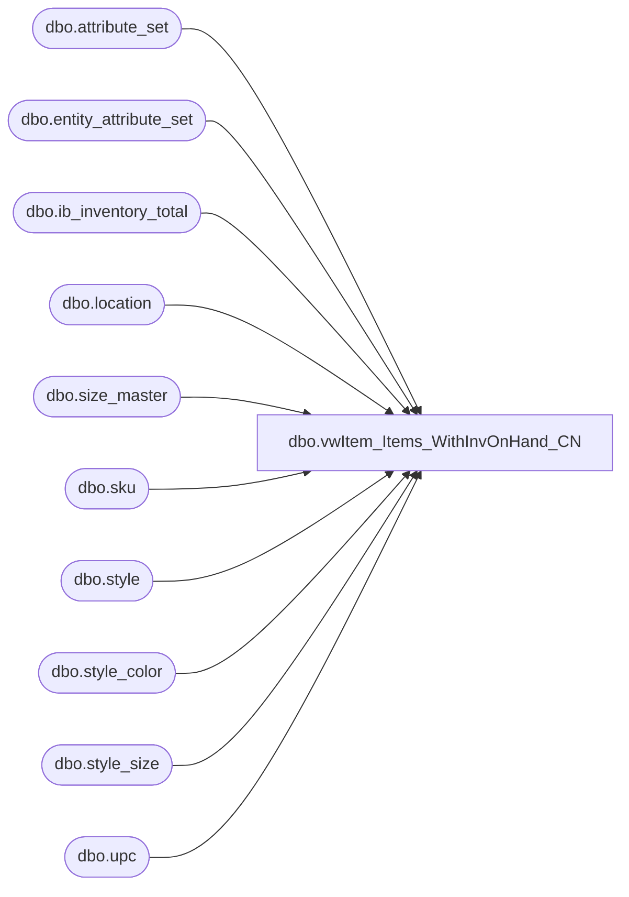

# dbo.vwItem_Items_WithInvOnHand_CN

**Database:** me_01  
**Server:** bedrockdb02  

## Architecture Diagram



## Table Dependencies

| Referenced Table |
|---|
| dbo.attribute_set |
| dbo.entity_attribute_set |
| dbo.ib_inventory_total |
| dbo.location |
| dbo.size_master |
| dbo.sku |
| dbo.style |
| dbo.style_color |
| dbo.style_size |
| dbo.upc |

## View Code

```sql
CREATE VIEW [dbo].[vwItem_Items_WithInvOnHand_CN]
AS 
SELECT u.upc_number, l.location_code, case when iit.inventory_status_id = 1 then iit.total_on_hand_units end as total_on_hand_units,
		case when iit.inventory_status_id = 2 then iit.total_on_hand_units end as total_in_transit_units

from me_01.dbo.upc u (nolock)
INNER JOIN me_01.dbo.sku sku (nolock)		ON u.sku_id = sku.sku_id 
INNER JOIN me_01.dbo.style st (nolock)		ON st.style_id = sku.style_id 
INNER JOIN me_01.dbo.style_color sc (nolock)	ON sc.style_color_id = sku.style_color_id 
INNER JOIN me_01.dbo.style_size sz (nolock)	ON sz.style_size_id = sku.style_size_id 
INNER JOIN me_01.dbo.size_master sm (nolock)	ON sm.size_master_id = sz.size_master_id
INNER JOIN me_01.dbo.ib_inventory_total iit ON iit.sku_id = sku.sku_id
INNER JOIN me_01.dbo.location l ON iit.location_id = l.location_id
WHERE iit.inventory_status_id IN  (1, 2) 
AND CAST(u.upc_number as bigint) < 900000
AND st.style_id IN (
	SELECT s.style_id 
	FROM me_01.dbo.style s (nolock)
	INNER JOIN me_01.dbo.entity_attribute_set eas (nolock) on s.style_id = eas.parent_id
	INNER JOIN me_01.dbo.attribute_set att (nolock) on eas.attribute_set_id = att.attribute_set_id
	WHERE eas.attribute_id = 572 AND eas.attribute_set_id IN( 57200009)  --CN)
	
)
```

