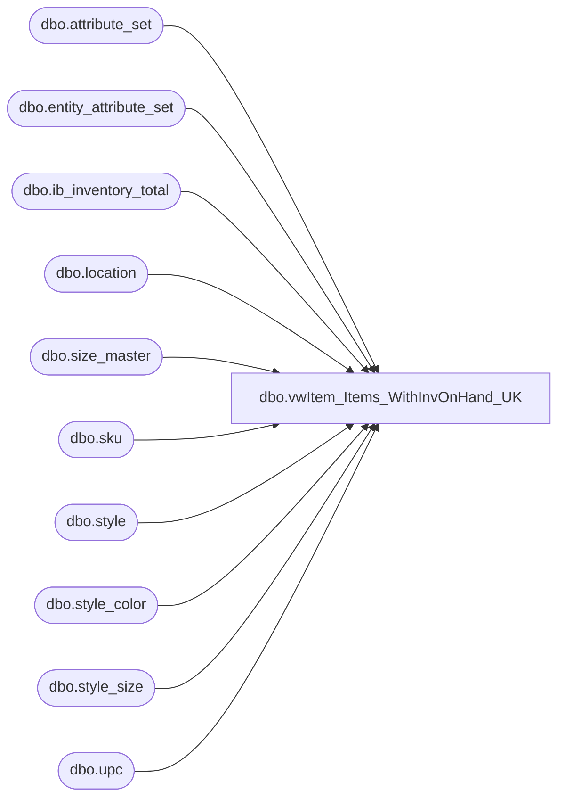

# dbo.vwItem_Items_WithInvOnHand_UK

**Database:** me_01  
**Server:** bedrockdb02  

## Architecture Diagram



## Table Dependencies

| Referenced Table |
|---|
| dbo.attribute_set |
| dbo.entity_attribute_set |
| dbo.ib_inventory_total |
| dbo.location |
| dbo.size_master |
| dbo.sku |
| dbo.style |
| dbo.style_color |
| dbo.style_size |
| dbo.upc |

## View Code

```sql
CREATE VIEW [dbo].[vwItem_Items_WithInvOnHand_UK]
AS 
SELECT u.upc_number, l.location_code, case when iit.inventory_status_id = 1 then iit.total_on_hand_units end as total_on_hand_units,
		case when iit.inventory_status_id = 2 then iit.total_on_hand_units end as total_in_transit_units

from me_01.dbo.upc u (nolock)
INNER JOIN me_01.dbo.sku sku (nolock)		ON u.sku_id = sku.sku_id 
INNER JOIN me_01.dbo.style st (nolock)		ON st.style_id = sku.style_id 
INNER JOIN me_01.dbo.style_color sc (nolock)	ON sc.style_color_id = sku.style_color_id 
INNER JOIN me_01.dbo.style_size sz (nolock)	ON sz.style_size_id = sku.style_size_id 
INNER JOIN me_01.dbo.size_master sm (nolock)	ON sm.size_master_id = sz.size_master_id
INNER JOIN me_01.dbo.ib_inventory_total iit ON iit.sku_id = sku.sku_id
INNER JOIN me_01.dbo.location l ON iit.location_id = l.location_id
WHERE iit.inventory_status_id IN  (1, 2) 
AND CAST(u.upc_number as bigint) < 600000
AND st.style_id IN (
	SELECT s.style_id 
	FROM me_01.dbo.style s (nolock)
	INNER JOIN me_01.dbo.entity_attribute_set eas (nolock) on s.style_id = eas.parent_id
	INNER JOIN me_01.dbo.attribute_set att (nolock) on eas.attribute_set_id = att.attribute_set_id
	WHERE eas.attribute_id = 572 AND eas.attribute_set_id IN( 57200004,57200006)  --UK, UKWEB)
	
) 


dbo,vwItem_WareHouseItems_Allocated,create view vwItem_WareHouseItems_Allocated

as 

select l.location_code,
	s.style_code,
	isnull(sum(ia.allocated_units),0) as allocated
from sku sk with (nolock)
join ib_allocation ia with (nolock) on ia.sku_id = sk.sku_id
join style s with (nolock) on sk.style_id = s.style_id 
--join style_group sg with (nolock) on s.style_id = sg.style_id
--join hierarchy_group hg with (nolock) on sg.hierarchy_group_id = hg.hierarchy_group_id
join distribution d with (nolock) on ia.allocation_number = d.distribution_number
join location l with (nolock) on l.location_id = d.location_id
where l.location_code in ('0980','0960','2970')
and isnull(d.po_id,0)=0 and isnull(d.advance_shipping_notice_id,0)=0
group by l.location_code, s.style_code


dbo,vwItem_WareHouseItems_WithInvOnHand,/*-------------------------------
ORIGINAL CODE FROM MIKE P
-------------------------------

select u.upc_number, l.location_code, iit.total_on_hand_units/st.distribution_multiple IOH
from me_01.dbo.upc u (nolock)
INNER JOIN me_01.dbo.sku sku (nolock)		ON u.sku_id = sku.sku_id 
INNER JOIN me_01.dbo.style st (nolock)		ON st.style_id = sku.style_id 
INNER JOIN me_01.dbo.style_color sc (nolock)	ON sc.style_color_id = sku.style_color_id 
INNER JOIN me_01.dbo.style_size sz (nolock)	ON sz.style_size_id = sku.style_size_id 
INNER JOIN me_01.dbo.size_master sm (nolock)	ON sm.size_master_id = sz.size_master_id
INNER JOIN me_01.dbo.ib_inventory_total iit ON iit.sku_id = sku.sku_id
INNER JOIN me_01.dbo.location l ON iit.location_id = l.location_id
where	iit.inventory_status_id = 1
and		l.location_code in ('0980','0960','2970')

--------------------------
UPDATED CODE FROM DAN T
--------------------------*/
CREATE VIEW dbo.vwItem_WareHouseItems_WithInvOnHand
AS
SELECT        u.upc_number, l.location_code, (iit.total_on_hand_units - ISNULL(a.allocated, 0)) / st.distribution_multiple AS IOH, ISNULL(av.AVAILB_US, 0) AS availb_us, 
                         ISNULL(av.AVAILB_CA, 0) AS availb_ca, ISNULL(av.AVAILB_UK, 0) AS availb_uk, ISNULL(av.AVAILB_INTL, 0) AS availb_intl, ISNULL(av.AVAILB_USWEB, 0) 
                         AS availb_usweb, ISNULL(av.AVAILB_UKWEB, 0) AS availb_ukweb, ISNULL(av.AVAILB_DINO, 0) AS availb_dino
FROM            dbo.upc AS u WITH (nolock) INNER JOIN
                         dbo.sku AS sku WITH (nolock) ON u.sku_id = sku.sku_id INNER JOIN
                         dbo.style AS st WITH (nolock) ON st.style_id = sku.style_id INNER JOIN
                         dbo.style_color AS sc WITH (nolock) ON sc.style_color_id = sku.style_color_id INNER JOIN
                         dbo.style_size AS sz WITH (nolock) ON sz.style_size_id = sku.style_size_id INNER JOIN
                         dbo.size_master AS sm WITH (nolock) ON sm.size_master_id = sz.size_master_id INNER JOIN
                         dbo.ib_inventory_total AS iit ON iit.sku_id = sku.sku_id INNER JOIN
                         dbo.location AS l ON iit.location_id = l.location_id LEFT OUTER JOIN
                         dbo.vwItem_WareHouseItems_Allocated AS a ON st.style_code = a.style_code AND l.location_code = a.location_code LEFT OUTER JOIN
                         dbo.vw_StyleAVAILBAttribute AS av ON st.style_code = av.style_code
WHERE        (iit.inventory_status_id = 1) AND (l.location_code IN ('0980', '0960', '2970', '3970', '3980'))
```

