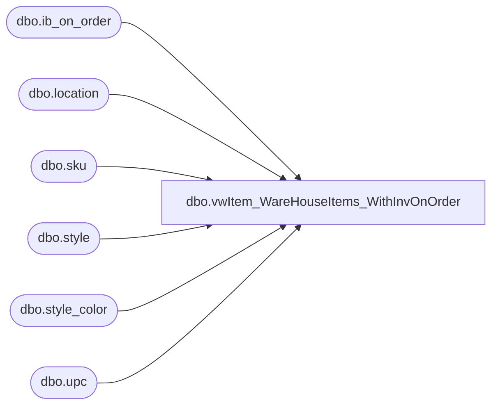

# dbo.vwItem_WareHouseItems_WithInvOnOrder

**Database:** me_01  
**Server:** bedrockdb02  

## Architecture Diagram



## Table Dependencies

| Referenced Table |
|---|
| dbo.ib_on_order |
| dbo.location |
| dbo.sku |
| dbo.style |
| dbo.style_color |
| dbo.upc |

## View Code

```sql
CREATE VIEW [dbo].[vwItem_WareHouseItems_WithInvOnOrder]
AS 

SELECT u.upc_number, l.location_code, min(ioo.receipt_date +10) as receipt_date
from	bedrockdb02.me_01.dbo.ib_on_order ioo
INNER JOIN me_01.dbo.sku sku (nolock) ON 	ioo.sku_id = sku.sku_id 
INNER JOIN me_01.dbo.upc u (nolock) ON u.sku_id = sku.sku_id 
INNER JOIN me_01.dbo.style st (nolock) ON st.style_id = sku.style_id 
INNER JOIN me_01.dbo.style_color sc (nolock) ON sc.style_color_id = sku.style_color_id 
INNER JOIN me_01.dbo.location l ON ioo.location_id = l.location_id
where cast(ioo.receipt_date as date) >= cast(getdate() as date)
group by u.upc_number, l.location_code
having sum(on_order_units) > 0
```

