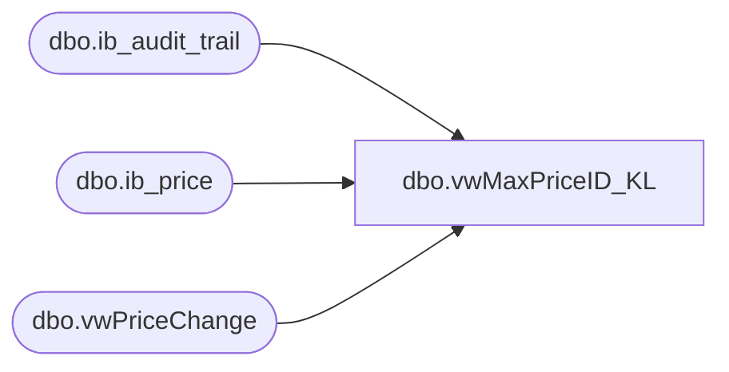

# dbo.vwMaxPriceID_KL

**Database:** me_01  
**Server:** bedrockdb02  

## Architecture Diagram



## Table Dependencies

| Referenced Table |
|---|
| dbo.ib_audit_trail |
| dbo.ib_price |
| dbo.vwPriceChange |

## View Code

```sql
CREATE view [dbo].[vwMaxPriceID_KL]

as

select ip.style_id, ip.jurisdiction_id, ip.location_id, max(ip.ib_price_id) ib_price_id
from ib_price ip with (nolock)
--left join price_change pc with (nolock) on ip.document_number = pc.price_change_no 
	--and pc.approval_status = 2
	--and pc.price_change_status = 4
where ip.start_date <= getdate()
--OLD and (ip.end_date > getdate() or ip.end_date is NULL)
and (ip.end_date >= cast(left(getdate(), 11) as smalldatetime)  or ip.end_date is NULL)
and not exists (select application_identifier from ib_audit_trail with (nolock) where application_identifier = ip.document_number and application_type = 'PC' and action = 'delete')
--and not exists (select price_change_no from price_change with (nolock) where price_change_no = ip.document_number and ( approval_status <> '2' or price_change_status <> '4' ) )
--and (ip.document_number in (select price_change_no from price_change with (nolock) where ( approval_status = '2' and price_change_status = '4' ) ) or ip.document_number is NULL)
and 	(ip.document_number in 
						(
							select document_number
							from vwPriceChange
							where (document_type = 'Permanent'
									and document_status in ('Effective', 'Completed')
									and approval_status = 'Approved')
							or (document_type in ('Promotional', 'Deal')
--OLD									and document_status = 'Effective'
									and document_status in ('Effective')
									and approval_status = 'Approved')
							or (document_type in ('Promotional', 'Deal')
									and document_status in ('Completed')
									and approval_status = 'Approved'
									and	effective_to_date = cast(left(getdate(), 11) as smalldatetime))
						) 
	OR
		ip.document_number is NULL)

group by ip.style_id, ip.jurisdiction_id, ip.location_id
```

