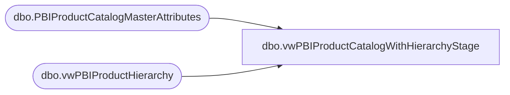

# dbo.vwPBIProductCatalogWithHierarchyStage

**Database:** me_01  
**Server:** bedrockdb02  

## Architecture Diagram



## Table Dependencies

| Referenced Table |
|---|
| dbo.PBIProductCatalogMasterAttributes |
| dbo.vwPBIProductHierarchy |

## View Code

```sql
CREATE view [dbo].[vwPBIProductCatalogWithHierarchyStage]

as

select 
	ph.StyleCode as ProductNumber,
	case 
		when left(ph.StyleCode,1) in ('0','2','3') then 'US'
		when left(ph.StyleCode,1) in ('4','5','6') and p.ProductSellingGeography='UK' then 'UK'
		when Left(ph.StyleCode,1) = '1' then 'CA'
		when p.ProductSellingGeography='IE' then 'IE'
	end as ProductCountry,
	p.UPC,	
	--ph.short_desc as ProductDescription,
	p.AccessoryType,	
	p.AnimalSoldSeparately,	
	p.AsthmaFriendly,	
	p.ColorCode,	
	p.LicensedCollection,	
	p.BirthCertificateRequired,	
	p.BodyType,	
	p.Bottoms,	
	p.Boy,	
	p.CommodityCode,	
	--p.DepartmentSortOrder,	
	p.DisplayOnAmazon,	
	p.EyeColor,	
	p.WebExclusive,	
	p.Girl,	
	p.Neutral,	
	p.Outfits,	
	p.GiftBoxType,	
	p.KeyStory,	
	p.ManufacturerCountry,	
	p.MerchInDate,	
	p.Mini,	
	p.Music,	
	p.NoInternationalShipping,	
	p.SAC,	
	p.SNC,	
	p.ProductSellingGeography,	
	p.QuantityRestriction,	
	p.RefundEligible,	
	p.Seasonal,	
	p.ThirdPartySiteEligible,	
	p.ShippingClass,	
	p.Stuffable,	
	p.Tops,	
	p.WarningLabel,	
	p.AccessoryEligible,	
	p.SkinType,	
	p.FriendHeight,	
	p.FriendWeight,	
	p.SoundEligible,	
	p.MSTAT,	
	p.EmbroideryProductList,	
	p.ProductCanBeEmbroidered,	
	p.ProductMustBeEmbroidered,	
	p.Purses,		
	p.CategoryTree,	
	--p.SendData,	
	p.LICEN,	
	p.sportsTeam,	
	p.occasion,	
	p.OccasionCode,	
	p.StoreFrontEligible,	
	p.OnOrderFlag,	
	p.InventoryBuffer,	
	--p.Inventory,	
	--p.OnlineFlag,	
	--p.SearchableFlag,	
	--p.SearchableIfUnavailableFlag,	
	--p.IsFirstTransmit,	
	p.giftCardType,	
	p.PackageOption,	
	--p.isCPS,	
	p.Web,	
	--p.WebBuf,	
	p.BRF,	
	p.Inline,	
	p.AvailB,	
	--p.WebInStock,	
	--p.StoreInStock,	
	--p.OnOrder,

	ph.Department,
	ph.Class,
	ph.SubClass,

	ph.DepartmentCode,
	ph.ClassCode,
	ph.SubClassCode,
	cast(ph.StyleCode as varchar(6)) as StyleCode,

	ph.DepartmentHierarchyGroupID,
	ph.ClassHierarchyGroupID,
	ph.SubClassHierarchyGroupID,

	ph.ClassParentGroupID,
	ph.SubClassParentGroupID,
	ph.StyleParentGroupID,

	--Added for PIM,  including in case needed
	p.BaseID,	
	p.Shoes,	
	p.Sound,	
	p.fourLeggedAnimal,	
	p.merchOutDate,	
	p.MLBTeams,	
	p.NBATeams,
	p.NFLTeams,	
	p.NHLTeams,	
	p.UKFootball,
	p.isEndlessAisleEligible,
	p.isTaxExempt, --= check the tax data set to verify the relationship to style.... join on tax item group to department... styles that are not included are assumed tax exempt.. will this be gift cards?
	case when p.ItemType = 'Donation'
		then 0
			else p.isCouponEligible
		end as isCouponEligible, -- Added Case Logic on 11/7/2023 as some of the donation items belong to the transaction flag department which was allowing them to be discounted 
	case when p.ItemType = 'Donation'
		then 0
			else p.isEmployeeDiscountEligible
		end as isEmployeeDiscountEligible, -- Added Case Logic on 11/7/2023 as some of the donation items belong to the transaction flag department which was allowing them to be discounted 
	case when p.ItemType = 'Donation'
		then 0
			else P.isLoyaltyRewardsDiscountEligible
		end as isLoyaltyRewardsDiscountEligible	,  -- Added Case Logic on 11/7/2023 as some of the donation items belong to the transaction flag department which was allowing them to be discounted 
	p.isReturnEligible, --= yes for all - - SellingStatus what equals sale or return
	p.ItemDescription, --Added to Basket
	p.ProductDescription, --Item Inquiry
	p.ItemName, --View Details 
	p.isCashierEnterQty,
	p.isCashierEntersPrice,
	case when p.ItemType = 'Donation'
			then 1
		else p.isQtyRestricted
	end as isQtyRestricted,
	p.SellingStatus,
	p.ItemType,
	p.isWebEligible,	
	p.Chain,	
	p.Division,	
	p.ChainCode,	
	p.DivisionCode,	
	p.ConsumerGroup,	
	p.distribution_multiple as DistributionMultiple,
	p.order_multiple as OrderMultiple,
	p.InnerCasePack,	
	p.CompSetName,
	p.OMSTAT,
	p.WMSTAT,
	p.ONOTE,
	p.ODATE,
	p.Outlet 
from vwPBIProductHierarchy ph
join PBIProductCatalogMasterAttributes p on ph.StyleCode=p.BABWProductID
--join vwPOSItemsExportEligible e on e.Style_Code=ph.StyleCode -- Deployed on 6/12/2023 as related to JIRA BIB 543 and 544 ---rolled back on 2023-06-14 due to not including items ('089001', '089002', '089003', '089004') and maybe others
--								and e.ProductSellingGeography=p.ProductSellingGeography 
		
where left(ph.StyleCode,1) in ('0','1','2','3','4','5','6')
```

