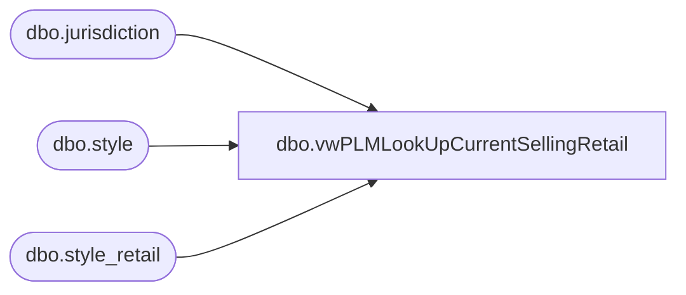

# dbo.vwPLMLookUpCurrentSellingRetail

**Database:** me_01  
**Server:** bedrockdb02  

## Architecture Diagram



## Table Dependencies

| Referenced Table |
|---|
| dbo.jurisdiction |
| dbo.style |
| dbo.style_retail |

## View Code

```sql
CREATE view [dbo].[vwPLMLookUpCurrentSellingRetail]
as

SELECT DISTINCT  
	RTRIM(s_sub.[style_code]) AS StyleCode, 
	j_sub.jurisdiction_code, 
	sum(sr_sub.current_selling_retail) as CurrentSellingRetail,
	sum(sr_sub.original_selling_retail) as OriginalSellingRetail
from me_01.dbo.style s_sub 
INNER JOIN me_01.dbo.style_retail sr_sub ON s_sub.style_id = sr_sub.style_id 
INNER JOIN me_01.dbo.jurisdiction j_sub on sr_sub.jurisdiction_id = j_sub.jurisdiction_id
where  j_sub.jurisdiction_code in ('CA','CN','DK','HOME','IE','UK')
group by j_sub.jurisdiction_code, RTRIM(s_sub.[style_code])
```

