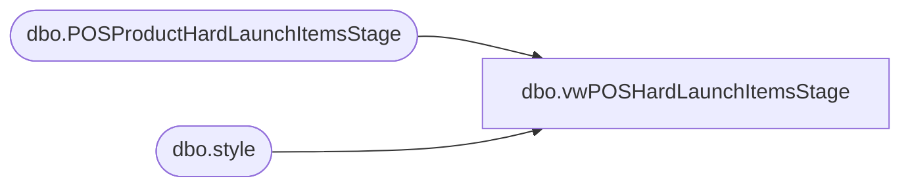

# dbo.vwPOSHardLaunchItemsStage

**Database:** me_01  
**Server:** bedrockdb02  

## Architecture Diagram



## Table Dependencies

| Referenced Table |
|---|
| dbo.POSProductHardLaunchItemsStage |
| dbo.style |

## View Code

```sql
CREATE view [dbo].[vwPOSHardLaunchItemsStage]

as

--------------------------------------------------------------------------------------------------
--Tim Callahan		05-01-2023		Created View as related to JIRA BIB544
--Tim Callahan	 2023-06-15	-- Added Handling for Ireland  per JIRA Task BIB588
--------------------------------------------------------------------------------------------------


select 
p.StyleCode as StyleCodeFromStagedFile,
s.style_code as AptosStyleCode,
s.long_desc as AptosLongDescription,
case when left(s.style_code,1) = '0'
		then 'US'
	when left(s.style_code,1) = '1'
		then 'CA'
	when left(s.style_code,1) = '4'
		then 'UK'
	end as CountryCode 
from POSProductHardLaunchItemsStage p
join style s on right('00000000000'+s.style_code,5)=right('00000000000'+p.stylecode,5)
where 1=1
and isnumeric (p.stylecode) = 1
and left(s.style_code,1) in ('0','1','4')
-- Added union below on 6/15/2023
union 
select
p.StyleCode as StyleCodeFromStagedFile,
s.style_code as AptosStyleCode,
s.long_desc as AptosLongDescription,
case when left(s.style_code,1) = '4'
		then 'IE'
	end as CountryCode 
from POSProductHardLaunchItemsStage p
join style s on right('00000000000'+s.style_code,5)=right('00000000000'+p.stylecode,5)
where 1=1
and isnumeric (p.stylecode) = 1
and left(s.style_code,1) in ('4')
```

