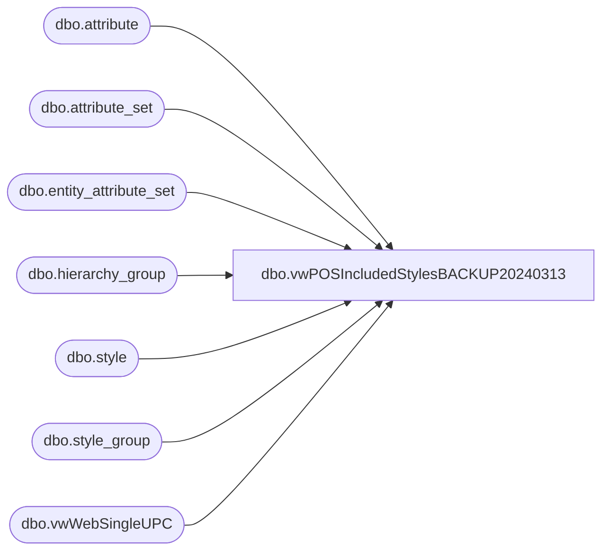

# dbo.vwPOSIncludedStylesBACKUP20240313

**Database:** me_01  
**Server:** bedrockdb02  

## Architecture Diagram



## Table Dependencies

| Referenced Table |
|---|
| dbo.attribute |
| dbo.attribute_set |
| dbo.entity_attribute_set |
| dbo.hierarchy_group |
| dbo.style |
| dbo.style_group |
| dbo.vwWebSingleUPC |

## View Code

```sql
CREATE view [dbo].[vwPOSIncludedStylesBACKUP20240313]

as

--------------------------------------------------------------------------------------------------
-- vwPOSIncludedStyles - Captures style, description and UPC for products which will be included in eCommerce integration.
--						Included style criteria:
--						Does not have WEBNO style attribute
--						Does have AVAILB style attribute set to one of these values:  ('US', 'USWEB', 'DINO', 'UK', 'UKWEB')
--						Logically captures UPC based on being either one of our purchased UPCs (GS1), having max(date) or max(upc)
--- 2022-11-29 - Dan Tweedie - Created View modeled after vwWebIncludedStyles, custom for POS
--------------------------------------------------------------------------------------------------


WITH
Styles as
	(
		select
			s.style_id,
			s.style_code,
			s.long_desc,
			s.short_desc,
			sg.hierarchy_group_id,
			isnull(s.allow_customer_order_flag,0) as isEndlessAisleEligible
		from style s with (nolock)
		join style_group sg with (nolock) on s.style_id = sg.style_id
		where 1=1
		and len(s.style_code)=6
		and s.active_flag = 1
		and not exists (select hg.hierarchy_group_id from hierarchy_group hg where sg.hierarchy_group_id=hg.hierarchy_group_id and substring(hg.hierarchy_group_code,7,2) ='60') --supplies no longer maintained in Aptos
	),
WebExcludedStyles as
	(
		SELECT distinct 
			s.style_id
		FROM style s with (nolock) 
		join entity_attribute_set eas with (nolock) on eas.parent_id = s.style_id
		join attribute_set ats with (nolock) on eas.attribute_set_id = ats.attribute_set_id
		join attribute a with (nolock) on ats.attribute_id = a.attribute_id and a.parent_type = 1
		where 
			(
				a.attribute_label = 'WEB STATUS' 
				and ats.attribute_set_code = 'WEBNO'
			)
	),
IncludedStyles as
	(  
		SELECT distinct 
			s.style_id,
			case 
				when left(s.style_code,1) in ('0','2','3') then 'US'
				when left(s.style_code,1) in ('4','5','6') then 'UK'
				when left(s.style_code,1) in ('1') then 'CA'
				else left(s.style_code,1) 
			end as SellingGeography
			,
			case 
				when exists (select e.style_id from WebExcludedStyles e where e.style_id = s.style_id) then '0' 
				else '1'
			end as isWebEligible
		FROM styles s with (nolock) 
		where 1=1
		and left(s.style_code,1) in ('0','2','3','4','5','6','1')
	), 
UPCs as
	(
		select
			u.sku_id,
			u.style_code,
			u.Color,
			u.UPC
		from vwWebSingleUPC u
		where exists (select s.style_id from IncludedStyles s where s.style_id = u.style_id)
	),
--OWNRSP as 
--	(
--		SELECT distinct
--			s.style_id
--		FROM Styles s 
--		join entity_attribute_set eas with (nolock) on eas.parent_id = s.style_id
--		join attribute_set ats with (nolock) on eas.attribute_set_id = ats.attribute_set_id
--		join attribute a with (nolock) on ats.attribute_id = a.attribute_id and a.parent_type = 1
--		where a.attribute_code = 'OWNRSP'
--		and ats.attribute_set_code not in ('CN', 'CAN')
--		and not exists (select i.style_id from IncludedStyles i where i.style_id = s.style_id)
--	),
StoreFrontEligible as
	(
		select 
			s.style_id,
			s.hierarchy_group_id,
			cast(u.sku_id as nvarchar(24)) as SKU,
			cast(s.style_code as varchar(6)) as style_code,
			cast(s.short_desc as varchar(120)) as SKUDescription,
			u.Color,
			cast(u.UPC as varchar(20)) as UPC,
			i.SellingGeography,
			1 as StoreFrontEligible,
			s.isEndlessAisleEligible,
			i.isWebEligible
		from styles s
		join UPCs u on s.style_code = u.style_code
		join IncludedStyles i on s.style_id = i.style_id
	)--,
--NotStoreFrontEligible as
--	(
--		select 
--			s.style_id,
--			s.hierarchy_group_id,
--			NULL as SKU,
--			cast(s.style_code as varchar(6)) as style_code,
--			cast(s.short_desc as varchar(120)) as SKUDescription,
--			NULL as Color,
--			NULL as UPC,
--			NULL as SellingGeography,
--			0 as StoreFrontEligible,
--			s.isEndlessAisleEligible
--		from styles s
--		join OWNRSP O on s.style_id = O.style_id
--		where not exists (select i.style_id from StoreFrontEligible i where i.style_id = s.style_id)
--	)

select 
	style_id,
	hierarchy_group_id,
	SKU,
	style_code,
	SKUDescription,
	Color,
	UPC,
	SellingGeography,
	StoreFrontEligible,
	isEndlessAisleEligible,
	isWebEligible,
	NULL as isTaxExempt, --= check the tax data set to verify the relationship to style.... join on tax item group to department... styles that are not included are assumed tax exempt.. will this be gift cards?
	'1' as isCouponEligible, --= no known way to exclude items from using coupon
	'1' as isEmployeeDiscountEligible, -- = currently manually communicated - should be based on not being a donation or gift card?
	'1' as isLoyaltyRewardsDiscountEligible, -- Added 2/23/2023 Per JIRA BIB-514
	'1' as isReturnEligible, --= yes for all - - SellingStatus what equals sale or return
	SKUDescription as ItemDescription, --Added to Basket
	SKUDescription as ProductDescription, --Item Inquiry
	SKUDescription as ItemName, --View Details 
	'0' as isCashierEnterQty,
	'0' as isCashierEntersPrice,
	'0' as isQtyRestricted
from StoreFrontEligible
		--UNION
		--select 
		--	style_id,
		--	hierarchy_group_id,
		--	SKU,
		--	style_code,
		--	SKUDescription,
		--	Color,
		--	UPC,
		--	SellingGeography,
		--	StoreFrontEligible,
		--	isEndlessAisleEligible,
		--	NULL as isTaxExempt, --= check the tax data set to verify the relationship to style.... join on tax item group to department... styles that are not included are assumed tax exempt.. will this be gift cards?
		--	'1' as isCouponEligible, --= no known way to exclude items from using coupon
		--	NULL as isEmployeeDiscountEligible, -- = currently manually communicated - should be based on not being a donation or gift card?
		--	'1' as isReturnEligible, --= yes for all - - SellingStatus what equals sale or return
		--	SKUDescription as ItemDescription, --Added to Basket
		--	SKUDescription as ProductDescription, --Item Inquiry
		--	SKUDescription as ItemName, --View Details 
		--	'0' as isCashierEnterQty,
		--	'0' as isCashierEntersPrice,
		--	'0' as isQtyRestricted
		--from NotStoreFrontEligible
```

