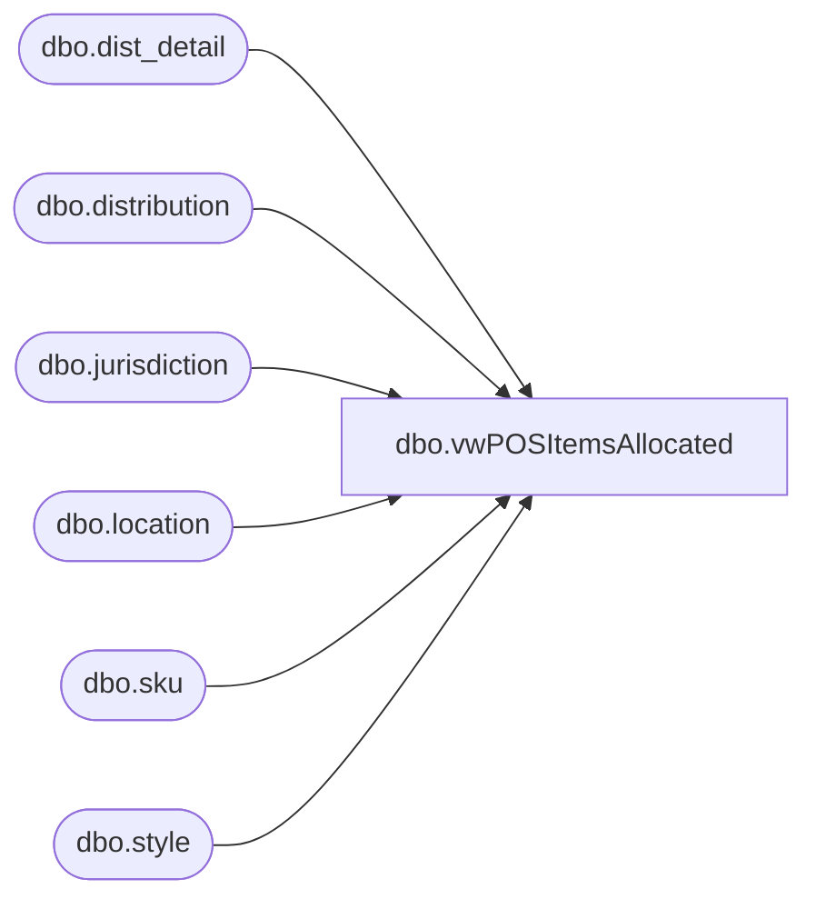

# dbo.vwPOSItemsAllocated

**Database:** me_01  
**Server:** bedrockdb02  

## Architecture Diagram



## Table Dependencies

| Referenced Table |
|---|
| dbo.dist_detail |
| dbo.distribution |
| dbo.jurisdiction |
| dbo.location |
| dbo.sku |
| dbo.style |

## View Code

```sql
CREATE view [dbo].[vwPOSItemsAllocated]

--------------------------------------------------------------------------------------------------------------------------------------
--Tim Callahan	 2023-4-27 -- Created view for Jumpmind POS Product Dataset for Hard Launch Item Reference 
--Tim Callahan	 2023-06-15	-- Added Handling for Ireland  per JIRA Task BIB588
--------------------------------------------------------------------------------------------------------------------------------------

as

select 
case when j.jurisdiction_code = 'UK'
		then 'UK'
	when j.jurisdiction_code = 'IE'-- Added 6/15/2023
		then 'IE' -- Added 6/15/2023
	when j.jurisdiction_code = 'Home'
		then 'US'
	when j.jurisdiction_code = 'CA'
		then 'CA'
	end as ProductSellingGeography, 
--j.jurisdiction_code, 
s.style_code, 
s.long_desc, 
sum (dd.quantity) as QuantityAllocated
from distribution d (nolock) 
join dist_detail dd (nolock)  on d.distribution_id=dd.distribution_id
join sku  (nolock) on sku.sku_id=dd.sku_id
join style s  (nolock)  on s.style_id=sku.style_id
join location l  (nolock)  on l.location_id=dd.location_id
join jurisdiction j (nolock) on j.jurisdiction_id=l.jurisdiction_id
where 1=1
and d.distribution_status in (5,6,7) -- Open, Released, Frozen 
and j.jurisdiction_code in ('Home','CA','UK','IE')  -- US, Canada, UK, IE 
group by 
--j.jurisdiction_code, 
case when j.jurisdiction_code = 'UK'
		then 'UK'
	when j.jurisdiction_code = 'IE'-- Added 6/15/2023
		then 'IE'-- Added 6/15/2023
	when j.jurisdiction_code = 'Home'
		then 'US'
	when j.jurisdiction_code = 'CA'
		then 'CA'
end,
s.style_code, 
s.long_desc
having sum (dd.quantity) > 0 
--order by 1, 2
```

