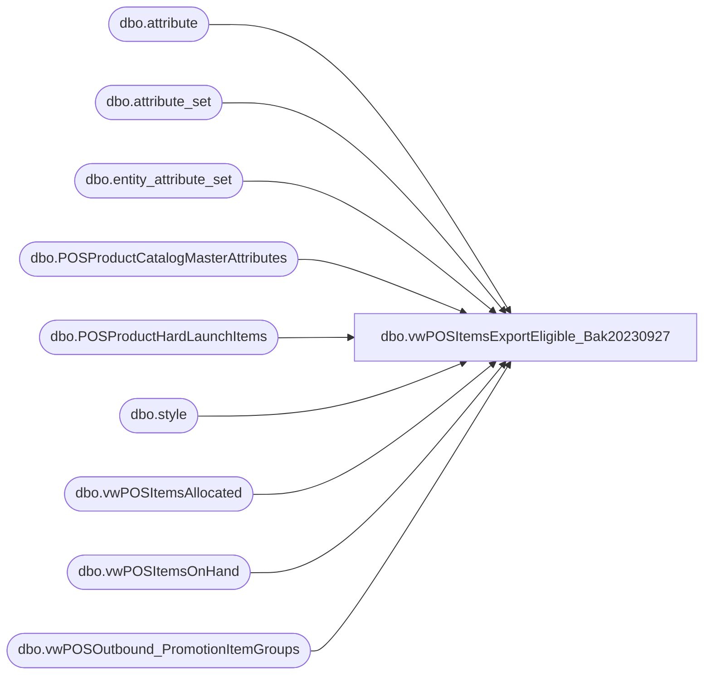

# dbo.vwPOSItemsExportEligible_Bak20230927

**Database:** me_01  
**Server:** bedrockdb02  

## Architecture Diagram



## Table Dependencies

| Referenced Table |
|---|
| dbo.attribute |
| dbo.attribute_set |
| dbo.entity_attribute_set |
| dbo.POSProductCatalogMasterAttributes |
| dbo.POSProductHardLaunchItems |
| dbo.style |
| dbo.vwPOSItemsAllocated |
| dbo.vwPOSItemsOnHand |
| dbo.vwPOSOutbound_PromotionItemGroups |

## View Code

```sql
CREATE view [dbo].[vwPOSItemsExportEligible_Bak20230927]

--------------------------------------------------------------------------------------------------------------------------------------
--Tim Callahan	 2023-05-01 -- Created view for Jumpmind POS Product Dataset for Eligibility to Export Reference as related to JIRA BIB544
--Tim Callahan	 2023-05-15 -- Modified view added some additional conditions to allow some Donation, Gift Card and Service Items to Be included which likely will not have inventory
--Tim Callahan	 2023-06-15 -- Modified Handling for Some Items that must be stock item type but dont have inventory 
--Dan Tweedie	 2023-06-23	-- Changed MerchInDate buffer from 7 days to 10 (rolled back until Amy S finally confirms)
--Tim Callahan	 2023-07-07 -- Modified Handling for additional items that must be stock item type but dont have inventory see JIRA BIB-599 for details 
--Dan Tweedie    2023-07-26	-- Added allowance for items that are in an item group for an Aptos deal -- there might be very low inventory items that we might not have on hand but supposedly is available in stores in very small qty
--------------------------------------------------------------------------------------------------------------------------------------

as


with InfInv as
(
select 
s.style_code as StyleCode,
ats.attribute_set_label as InventoryLabel
from bedrockdb02.me_01.dbo.attribute a (nolock)
join bedrockdb02.me_01.dbo.entity_attribute_set eas  (nolock) on a.attribute_id = eas.attribute_id 
join bedrockdb02.me_01.dbo.attribute_set ats  (nolock)
    on a.attribute_id = ats.attribute_id 
    and eas.attribute_set_id = ats.attribute_set_id 
    and ats.active_flag = 1
join bedrockdb02.me_01.dbo.style s on eas.parent_id = s.style_id 
where 1=1
and s.active_flag = 1 -- Active Styles Only
and a.attribute_code = 'WEBINV' 
and ats.attribute_set_label = 'INFINITE INVENTORY'
) 


select 
datediff(dd,p.MerchInDate,getdate()) as DateDifference,
p.Style_Code, 
p.SKUDescription, 
p.UPC, 
p.ProductSellingGeography, 
p.MerchInDate, 
--p.merchOutDate, 
hl.StyleCode as HardLaunchStyleCode, 
ia.QuantityAllocated, 
ioh.TotalUnitsAvailable, 
P.ItemType
--,p.* 
from POSProductCatalogMasterAttributes p 
left join POSProductHardLaunchItems hl on p.Style_Code=hl.StyleCode and hl.CountryCode=p.ProductSellingGeography -- Created this table as related to JIRA BIB544
left join vwPOSItemsAllocated ia on ia.style_code=p.Style_Code and ia.ProductSellingGeography=p.ProductSellingGeography -- Created this view as related to JIRA BIB544
left join vwPOSItemsOnHand ioh on ioh.style_code = p.Style_Code and ioh.ProductSellingGeography=p.ProductSellingGeography -- Created this view as related to JIRA BIB544
left join InfInv i on i.StyleCode=p.Style_Code
where 1=1
and  
(
		(
			DATEDIFF(dd,p.MerchInDate, getdate()) >= 0 
			and 
			p.ItemType = 'STOCK'
			and 
			(
			ia.style_code is not null -- Allocated Inventory in Chain
				or 
			ioh.style_code is not null  -- On Hand Inventory in Chain								  
				or 
			p.Department in ('Canadian Fees','Misc.Fees','Party Fees','Transaction Flags','UK Fees','UK UK Mandated Fees','UK-Misc. Fees','UK-Transaction Flags','US State Mandated Fees') -- Added 6/15/2023 
				or
			left(p.HierarchyGroupCode,8) in ('R-B-D-46','R-B-U-46', 'R-B-D-65') -- Donations\Embroidery -- Added 7/7/2023
				or
			p.HierarchyGroupCode in ('W-C-K-12-01-07','W-D-K-12-01-07','W-E-K-12-01-07','W-F-K-12-01-07','R-B-D-80-02-00','R-B-U-80-02-00') --Digital Blanks\Virtual GiftCards -- Added 7/7/2023
				or
			i.StyleCode is not null -- Infinite Inventory Item -- Added 7/7/2023
			)			
			-- This is excluding older styles that do not have any inventory existing or allocated in the Item Country 

		) -- IDATE Is Today or In the Past 
	or
	(
			DATEDIFF(dd,p.MerchInDate, getdate()) >= 0 
			and 
			p.ItemType <> 'STOCK'
	)	--  IDATE Is Today or In the Past , not a stock a item type and doesn't check for inventory nor allocations -- Added 5/15/2023
	or 
		(
		 hl.StyleCode is not null 
			and 
		 DATEDIFF(dd,p.MerchInDate, getdate()) >= -1 
		) -- Hard Launch Item and 1 Prior to IDATE being active 
	or 
		(
			hl.StyleCode is null 
				and 
			DATEDIFF(dd,p.MerchInDate, getdate()) >= -7
				and 
					(
					isnull(ia.QuantityAllocated,0) > 0 
						or 
					isnull(ioh.TotalUnitsAvailable,0) > 0 
					)
		) -- Not a Hard Launch Item but the IDATE is 7 Days  or less in the future and there is inventory or allocation in the country\ProductSellingGeography


	OR
		p.Style_Code in (select style_code from vwPOSOutbound_PromotionItemGroups)

) 

--and p.Style_Code in (select distinct stylecode from POSProductHardLaunchItems) -- Testing Purposes 
--and p.Style_Code in ('016883','017696','017700','019119','022017','022018','023085','023116','023117','023119','023315','024276','024352','024931','024932','025504','025661','026052','027141','027142','027176','027409','027612','027705','029389','029390','031381')
--order by p.MerchInDate, p.Style_Code
--order by 2
```

