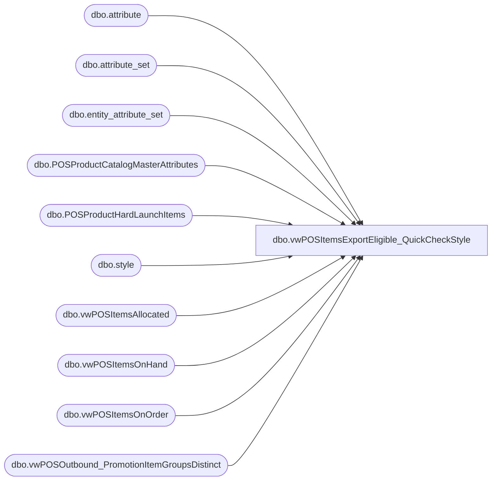

# dbo.vwPOSItemsExportEligible_QuickCheckStyle

**Database:** me_01  
**Server:** bedrockdb02  

## Architecture Diagram



## Table Dependencies

| Referenced Table |
|---|
| dbo.attribute |
| dbo.attribute_set |
| dbo.entity_attribute_set |
| dbo.POSProductCatalogMasterAttributes |
| dbo.POSProductHardLaunchItems |
| dbo.style |
| dbo.vwPOSItemsAllocated |
| dbo.vwPOSItemsOnHand |
| dbo.vwPOSItemsOnOrder |
| dbo.vwPOSOutbound_PromotionItemGroupsDistinct |

## View Code

```sql
CREATE view [dbo].[vwPOSItemsExportEligible_QuickCheckStyle]

--------------------------------------------------------------------------------------------------------------------------------------
--Tim Callahan	 2023-05-01 -- Created view for Jumpmind POS Product Dataset for Eligibility to Export Reference as related to JIRA BIB544
--Tim Callahan	 2023-05-15 -- Modified view added some additional conditions to allow some Donation, Gift Card and Service Items to Be included which likely will not have inventory
--Tim Callahan	 2023-06-15 -- Modified Handling for Some Items that must be stock item type but dont have inventory 
--Dan Tweedie	 2023-06-23	-- Changed MerchInDate buffer from 7 days to 10 (rolled back until Amy S finally confirms)
--Tim Callahan	 2023-07-07 -- Modified Handling for additional items that must be stock item type but dont have inventory see JIRA BIB-599 for details 
--Tim Callahan	 2023-07-07	 -- Created this view based on vwPOSItemsExportEligible so we can quickly determine why a style may be excluded from the product data set
--------------------------------------------------------------------------------------------------------------------------------------

as

with InfInv as
(
select 
s.style_code as StyleCode,
ats.attribute_set_label as InventoryLabel
from bedrockdb02.me_01.dbo.attribute a (nolock)
join bedrockdb02.me_01.dbo.entity_attribute_set eas  (nolock) on a.attribute_id = eas.attribute_id 
join bedrockdb02.me_01.dbo.attribute_set ats  (nolock)
    on a.attribute_id = ats.attribute_id 
    and eas.attribute_set_id = ats.attribute_set_id 
    and ats.active_flag = 1
join bedrockdb02.me_01.dbo.style s on eas.parent_id = s.style_id 
where 1=1
and s.active_flag = 1 -- Active Styles Only
and a.attribute_code = 'WEBINV' 
and ats.attribute_set_label = 'INFINITE INVENTORY'
) 


select 
datediff(dd,p.MerchInDate,getdate()) as DateDifference,
p.Style_Code, 
p.SKUDescription, 
p.UPC, 
p.ProductSellingGeography, 
p.MerchInDate, 
p.MerchOutDate, 
hl.StyleCode as HardLaunchStyleCode, 
ia.QuantityAllocated, 
ioh.TotalUnitsAvailable, 
ioo.TotalUnitsOnOrder,
P.ItemType,
p.Department, 
P.HierarchyGroupCode, 
p.CategoryTree, 
p.SubClassLabel,
--p.*
i.InventoryLabel as InfiniteInventoryLabel, 
ig.style_code as PromoItemGroupStyle, 
p.MSTAT
from POSProductCatalogMasterAttributes p 
left join POSProductHardLaunchItems hl on p.Style_Code=hl.StyleCode and hl.CountryCode=p.ProductSellingGeography -- Created this table as related to JIRA BIB544
left join vwPOSItemsAllocated ia on ia.style_code=p.Style_Code and ia.ProductSellingGeography=p.ProductSellingGeography -- Created this view as related to JIRA BIB544
left join vwPOSItemsOnHand ioh on ioh.style_code = p.Style_Code and ioh.ProductSellingGeography=p.ProductSellingGeography -- Created this view as related to JIRA BIB544
left join InfInv i on i.StyleCode=p.Style_Code
left join vwPOSOutbound_PromotionItemGroupsDistinct ig on ig.style_code=p.Style_Code 
left join vwPOSItemsOnOrder ioo on ioo.style_code = p.Style_Code and ioo.ProductSellingGeography=p.ProductSellingGeography --Added 5/28/2024
where 1=1
```

