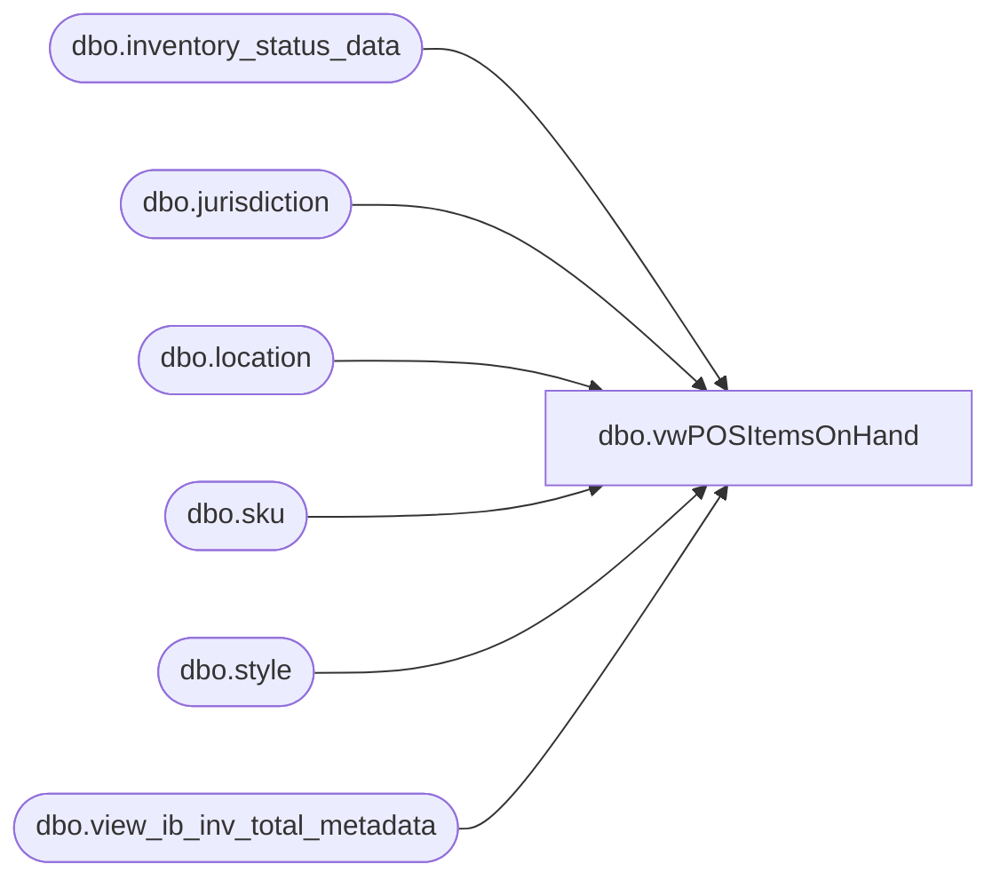

# dbo.vwPOSItemsOnHand

**Database:** me_01  
**Server:** bedrockdb02  

## Architecture Diagram



## Table Dependencies

| Referenced Table |
|---|
| dbo.inventory_status_data |
| dbo.jurisdiction |
| dbo.location |
| dbo.sku |
| dbo.style |
| dbo.view_ib_inv_total_metadata |

## View Code

```sql
CREATE view [dbo].[vwPOSItemsOnHand]

--------------------------------------------------------------------------------------------------------------------------------------
--Tim Callahan	 2023-05-01 -- Created view for Jumpmind POS Product Dataset for Hard Launch Item Reference 
--Tim Callahan	 2023-06-15	-- Added Handling for Ireland  per JIRA Task BIB588
--------------------------------------------------------------------------------------------------------------------------------------

as

select 
case when j.jurisdiction_code = 'UK'
		then 'UK'
	when j.jurisdiction_code = 'IE'-- Added 6/15/2023
		then 'IE'-- Added 6/15/2023
	when j.jurisdiction_code = 'Home'
		then 'US'
	when j.jurisdiction_code = 'CA'
		then 'CA'
end as ProductSellingGeography, 
s.style_code, 
s.active_flag, 
--isd.inventory_status_id, 
isd.inventory_status_code, 
isd.inventory_status_desc,
sum (m.total_on_hand_units) as TotalUnitsAvailable
from view_ib_inv_total_metadata m (nolock)
join inventory_status_data isd (nolock) on isd.inventory_status_id=m.inventory_status_id
join sku sk (nolock) on sk.sku_id=m.sku_id
join style s (nolock) on s.style_id=sk.style_id
join location l (nolock) on l.location_id=m.location_id
join jurisdiction j (nolock) on j.jurisdiction_id=l.jurisdiction_id
where 1=1 
and m.total_on_hand_units > 0 -- Even though we are summing -- This filter increases performance 
and isd.inventory_status_id  = 1 -- Available Status Flag 
and j.jurisdiction_code in ('Home','CA','UK','IE')  -- US, Canada, UK, IE 
and s.active_flag = 1
--and s.style_code in (select distinct StyleCode from [dbo].[POSProductHardLaunchItems]) -- Testing Purposes 
group by 
case when j.jurisdiction_code = 'UK'
		then 'UK'
	when j.jurisdiction_code = 'IE'-- Added 6/15/2023
		then 'IE'-- Added 6/15/2023
	when j.jurisdiction_code = 'Home'
		then 'US'
	when j.jurisdiction_code = 'CA'
		then 'CA'
end , 

--isd.inventory_status_id, 
isd.inventory_status_code, 
isd.inventory_status_desc, 
s.style_code, 
s.active_flag
having sum (m.total_on_hand_units)  > 0 

--order by 2
```

