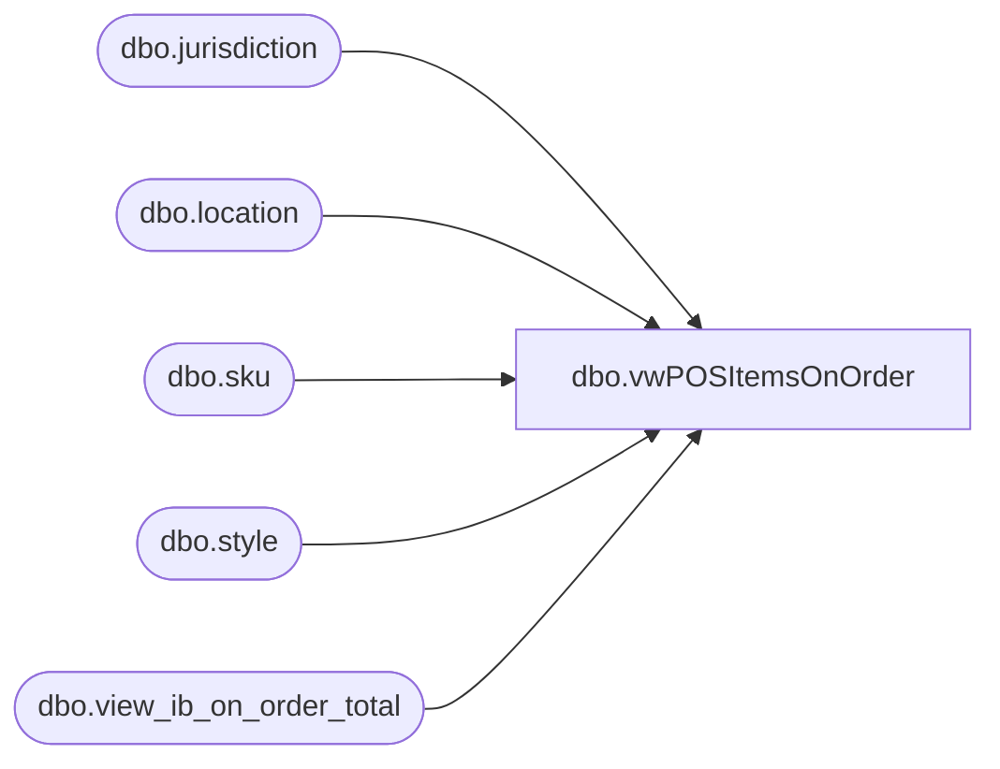

# dbo.vwPOSItemsOnOrder

**Database:** me_01  
**Server:** bedrockdb02  

## Architecture Diagram



## Table Dependencies

| Referenced Table |
|---|
| dbo.jurisdiction |
| dbo.location |
| dbo.sku |
| dbo.style |
| dbo.view_ib_on_order_total |

## View Code

```sql
CREATE view [dbo].[vwPOSItemsOnOrder]

--------------------------------------------------------------------------------------------------------------------------------------
--Tim Callahan	 2024-05-28 -- Created view for Jumpmind POS Product Dataset 
--------------------------------------------------------------------------------------------------------------------------------------

as

select 
case when j.jurisdiction_code = 'UK'
		then 'UK'
	when j.jurisdiction_code = 'IE'-- Added 6/15/2023
		then 'IE'-- Added 6/15/2023
	when j.jurisdiction_code = 'Home'
		then 'US'
	when j.jurisdiction_code = 'CA'
		then 'CA'
end as ProductSellingGeography, 
s.style_code, 
s.active_flag, 
sum (m.total_on_order_units) as TotalUnitsOnOrder 
from view_ib_on_order_total m (nolock)
join sku sk (nolock) on sk.sku_id=m.sku_id
join style s (nolock) on s.style_id=sk.style_id
join location l (nolock) on l.location_id=m.location_id
join jurisdiction j (nolock) on j.jurisdiction_id=l.jurisdiction_id
where 1=1 
and j.jurisdiction_code in ('Home','CA','UK','IE')  -- US, Canada, UK, IE 
and s.active_flag = 1
and s.style_code in ('032383') -- Testing Purposes 
group by 
case when j.jurisdiction_code = 'UK'
		then 'UK'
	when j.jurisdiction_code = 'IE'-- Added 6/15/2023
		then 'IE'-- Added 6/15/2023
	when j.jurisdiction_code = 'Home'
		then 'US'
	when j.jurisdiction_code = 'CA'
		then 'CA'
end , 
s.style_code, 
s.active_flag
having sum (m.total_on_order_units)  > 0 

--order by 2
```

