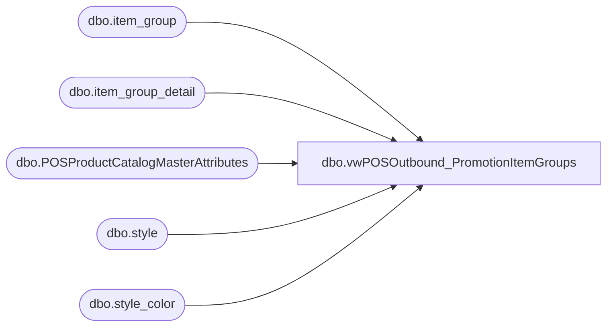

# dbo.vwPOSOutbound_PromotionItemGroups

**Database:** me_01  
**Server:** bedrockdb02  

## Architecture Diagram



## Table Dependencies

| Referenced Table |
|---|
| dbo.item_group |
| dbo.item_group_detail |
| dbo.POSProductCatalogMasterAttributes |
| dbo.style |
| dbo.style_color |

## View Code

```sql
CREATE view [dbo].[vwPOSOutbound_PromotionItemGroups]

--------------------------------------------------------------------------------------------------------------------------------------
--Ian Wallace 2022-12-11 -- Created view for Jumpmind POS postgres Promotions table  
--------------------------------------------------------------------------------------------------------------------------------------
as


--with 
--ActiveDealsWithItemGroups as
--	(
--		select ig.item_group_id
--		from deal_item_req dir 
--		join deal d on dir.deal_id=d.deal_id 
--		join jurisdiction j 
--			on d.jurisdiction_id=j.jurisdiction_id
--			and j.jurisdiction_code in ('CA','UK','HOME','IE')
--		join item_group ig on dir.item_group_num=ig.item_group_id and ig.active_flag=1
--		where 
--			(
--				( --current promotions only
--					cast(d.effective_from_date as date)<=getdate()
--					and
--					cast(isnull(d.effective_to_date,'3030-12-31') as date) > cast(getdate() as date)
--				)
--				OR
--				d.deal_no in (011899,011911,011914)
--			)
--		group by ig.item_group_id
--	)
select 
	cast(ig.item_group_id as varchar) as item_group_id,
	ig.item_group_code,
	ig.item_group_description,
	s.style_code,
	0 as isExcluded
from item_group ig
join item_group_detail igd on ig.item_group_id=igd.item_group_id
join style_color sc on igd.style_color_id=sc.style_color_id and sc.reorder_flag=1
join style s on sc.style_id=s.style_id
--join ActiveDealsWithItemGroups a on ig.item_group_id=a.item_group_id
where ig.active_flag=1
and s.active_flag=1
and exists (select pos.style_code from POSProductCatalogMasterAttributes pos where pos.style_code=s.style_code)
--and ig.item_group_id in (1192,1182, 1187)


--Promotion Item Groups w/Items
--select 
--	ig.item_group_id,
--	ig.item_group_code,
--	ig.item_group_description,
--	s.style_code
----into #x
--from item_group ig
--join item_group_detail igd on ig.item_group_id=igd.item_group_id
--join style_color sc on igd.style_color_id=sc.style_color_id and sc.reorder_flag=1
--join style s on sc.style_id=s.style_id
--where ig.active_flag=1
--and s.active_flag=1
----order by ig.item_group_code, s.style_code

--GO
```

