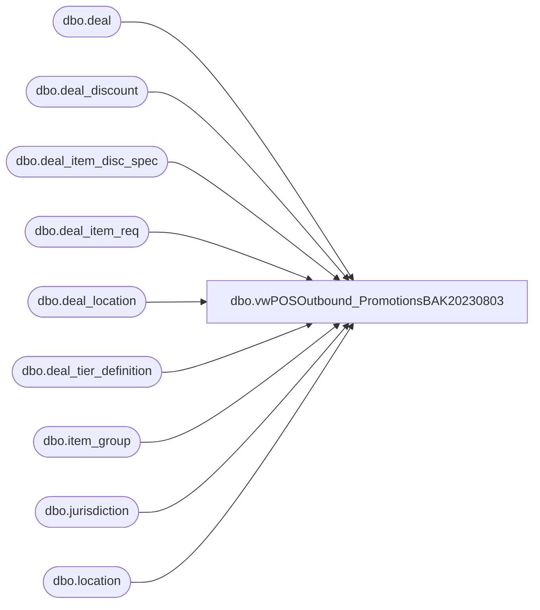

# dbo.vwPOSOutbound_PromotionsBAK20230803

**Database:** me_01  
**Server:** bedrockdb02  

## Architecture Diagram



## Table Dependencies

| Referenced Table |
|---|
| dbo.deal |
| dbo.deal_discount |
| dbo.deal_item_disc_spec |
| dbo.deal_item_req |
| dbo.deal_location |
| dbo.deal_tier_definition |
| dbo.item_group |
| dbo.jurisdiction |
| dbo.location |

## View Code

```sql
CREATE view [dbo].[vwPOSOutbound_PromotionsBAK20230803]

--------------------------------------------------------------------------------------------------------------------------------------
--Ian Wallace 2022-12-11 -- Created view for Jumpmind POS postgres Promotions table  
--------------------------------------------------------------------------------------------------------------------------------------
as

-- all active promotions (with products)
select distinct
	isnull(dd.deal_discount_id, d.deal_id) deal_discount_id,
	d.deal_id, 
	d.deal_no, 
	d.name deal_name, 
	d.description deal_description, 
	cast(d.effective_from_date as date) as DealStartDate,  
	cast(d.effective_to_date as date) as DealEndDate,
	dd.type deal_discount_type, 
	dd.name deal_discount_name,  
	dtd.disc_type as DealTierDef_DiscType,
	dtd.disc_pct as DealTierDef_DiscPct,
	dtd.disc_amt as DealTierDef_DiscAmt,
	dtd.disc_applies_to as DealTierDef_DiscAppliesTo,
	dtd.disc_qty as DealTierDef_DiscQty,
	dtd.add_info as DealTierDef_AddlInfo,
	dtd.threshold_type as DealTierDef_ThresholdType,
	dtd.threshold_qty as DealTierDef_ThresholdQty,
	dtd.threshold_amt as DealTierDef_ThresholdAmt,
	isnull(ig.item_group_id,0) as DealItemRequired_ItemGroup,
	dir.quantity DealItemReqQty,
	j.jurisdiction_code DealLocationJurisdictionCode,
	l.gl_location_number as DealLocation,
	dids.identity_type as DealItemDiscSpec_IdentityType,
	dids.quantity as DealItemDiscSpec_Qty,
	dids.disc_type as DealItemDiscSpec_DiscType,
	dids.disc_pct as DealItemDiscSpec_DiscPct,
	dids.disc_amt as DealItemDiscSpec_DiscAmt,
	dids.disc_applies_to as DealItemDiscSpec_DiscAppliesTo
from [dbo].[deal] d
join jurisdiction j 
	on d.jurisdiction_id=j.jurisdiction_id
	and j.jurisdiction_code in ('CA','UK','HOME','IE')
join [dbo].[deal_discount] dd on d.deal_id = dd.deal_id
join [dbo].[deal_tier_definition] dtd 
	on d.deal_id=dtd.deal_id
	and dtd.deal_discount_id = dd.deal_discount_id
left join [dbo].[deal_item_req] dir 
	on d.deal_id=dir.deal_id
	and dir.deal_discount_id = dd.deal_discount_id
left join item_group ig on dir.item_group_num=ig.item_group_id
left join deal_item_disc_spec dids 
	on d.deal_id=dids.deal_id
	and dd.deal_discount_id=dids.deal_discount_id
	and dir.item_group_num=dids.item_group_num      
left join deal_location dl on d.deal_id=dl.deal_id
left join location l on dl.location_id=l.location_id 

where 1=1
--and (dd.deal_discount_id is not null or d.name like '%party%')
and d.name not like '%party%'
and 
	(
		( --current promotions only
			getdate() between cast(dateadd(dd,-7,d.effective_from_date) as date)
			and
			cast(isnull(d.effective_to_date,'3030-12-31') as date)
		)
		--OR
		--d.deal_no in (011899,011911,011914)
	)
--where d.deal_no=011899 --- 2 for xx
	---deal_discount type='MIPK'
	---DealTierDef_DiscType='PRCH'
	---DealTierDef_DiscAmt=45.00
	---DealTierDef_DiscAppliesTo=ALL_
	---DealItemRequired_ItemGroup=1428
	---DealItemReqQty=2
	---DealLocationJurisdictionCode=HOME
	---DealLocation=xxxx
	---

--where d.deal_no=011911 --bogo % off 
--	---deal_discount_type='MXMH'
--	---DealTierDef_DiscAppliesTo=ITEM
--	---DealItemRequired_ItemGroup=2034
--	---DealItemReqQty=2
--	---DealLocationJurisdictionCode=UK
--	---DealLocation=xxxx
--	---DealItemDiscSpec_IdentityType=IGRP
--	---DealItemDiscSpec_Qty=1
--	---DealItemDiscSpec_DiscType=PCT_
--	---DealItemDiscSpec_DiscPct=50.00
--	---DealItemDiscSpec_DiscAppliesTo=ELST

--where d.deal_no=011914 --purchase with purchase
	---deal_discount_type=MXMH
	---DealTierDef_DiscType=AMT_
	---DealTierDef_DiscAmt=11.00
	---DealTierDef_DiscAppliesTo=ITEM
	---DealItemRequired_ItemGroup=1986 and 1983 (multiple rows)
	---DealItemReqQty=1
	---DealLocationJurisdictionCode=HOME
	---DealLocation=xxxx
	---DealItemDiscSpec_IdentityType=NULL and IGRP (ItemGroup 1986 = NULL, 1983=IGRP)
	---DealItemDiscSpec_Qty=NULL and 1
	---DealItemDiscSpec_DiscType=NULL and AMT_
	---DealItemDiscSpec_DiscAmt=NULL and 9.00
	---DealItemDiscSpec_DiscAppliesTo=NULL and ELST


--- d.deal_no=011903 --bogo setup by juan --- not in aptos, but in the pos??
---d.deal_no=011874 --party package setup by juan --- not in aptos, but in the pos??
--order by d.deal_no


--select *
--from deal 
--where deal_no=011437

--select *
--from deal_discount
--where deal_id=3889

--select d.deal_no, dd.name, dd.description
--from deal d
--join deal_discount dd on d.deal_id=dd.deal_id
--order by d.deal_no

--with Multis as (
--select deal_discount_id, dealLocation
--from #xx
--group by deal_discount_id,dealLocation
--having count(*) >1
--)
--select d.deal_no, dd.name, dd.description
--from deal d
--join deal_discount dd on d.deal_id=dd.deal_id
--where deal_no in (select deal_no from Multis)
--and ( --current promotions only
--			cast(effective_from_date as date)<=getdate()
--			and
--			cast(isnull(effective_to_date,'3030-12-31') as date) > cast(getdate() as date)
--		)
--order by deal_no


--select count(*) 
--from deal d
--join deal_discount dd on d.deal_id=dd.deal_id


--select *
--from #xx
--where deal_discount_id=42980001
```

