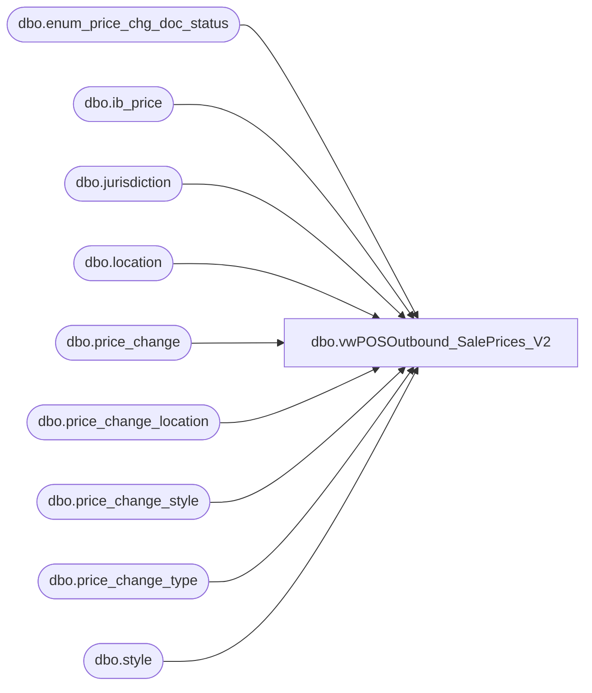

# dbo.vwPOSOutbound_SalePrices_V2

**Database:** me_01  
**Server:** bedrockdb02  

## Architecture Diagram



## Table Dependencies

| Referenced Table |
|---|
| dbo.enum_price_chg_doc_status |
| dbo.ib_price |
| dbo.jurisdiction |
| dbo.location |
| dbo.price_change |
| dbo.price_change_location |
| dbo.price_change_style |
| dbo.price_change_type |
| dbo.style |

## View Code

```sql
CREATE view [dbo].[vwPOSOutbound_SalePrices_V2]

--------------------------------------------------------------------------------------------------------------------------------------
--Tim Callahan	2023-09-21 -- Created view for Jumpmind POS postgres Sale Price Staging table  
--------------------------------------------------------------------------------------------------------------------------------------

as

with 
PriceChangeByJuris as 
(

select 
s.style_code, 
pcs.original_selling_retail, 
pcs.old_price, 
pcs.new_price,
pcs.list_retail, -- Always Seem to Be Zero for Locational 
ib.selling_retail_price,
pc.jurisdiction_id, 
e.price_chg_doc_status_desc, 
pc.category_id,
l.gl_location_number,
-- Testing selects above
ib.ib_price_id as deal_discount_id, 
pc.price_change_id as deal_id, 
pc.price_change_no as deal_no, 
pc.price_change_description as deal_name,
pc.price_change_description as deal_description,
ib.start_date as DealStartDate, 
ib.end_date as DealEndDate,
pct.abbreviation as deal_discount_type, 
pc.price_change_description as deal_discount_name, 
'AMT_'  as DealTierDef_DiscType,
null as DealTierDef_DiscPct, 
--pcs.original_selling_retail-isnull(pcs.new_price,isnull(ib.selling_retail_price,pcs.list_retail)) as DealTierDef_DiscAmt, -- Replaced on 9/21/2023 -- This calculates and loads the discount amount rather the sale price 
isnull(ib.selling_retail_price,pcs.list_retail) as DealTierDef_DiscAmt, -- Replaced Above on 9/21/2023 -- This loads the sales prace 
'ITEM' as DealTierDef_DiscAppliesTo,
null  as DealTierDef_DiscQty, 
null as DealTierDef_AddlInfo, 
null as DealTierDef_ThresholdType, 
null as DealTierDef_ThresholdQty, 
null as DealTierDef_ThresholdAmt, 
s.style_code as DealItemRequired_ItemGroup, -- Should this be the itemid aka style code rather than null? 
1  as DealItemReqQty, -- This Ultimately Maps to qualification field
j.jurisdiction_code as DealLocationJurisdictionCode , 
l.gl_location_number as DealLocation  ,  
'ITEM' as DealItemDiscSpec_IdentityType, -- Should this Be ITEM or NULL when it's not a Item group (IGRP)
1 as DealItemDiscSpec_Qty, -- This Ultimately Maps to reward_qty field 
'AMT_' as DealItemDiscSpec_DiscType,
NULL as DealItemDiscSpec_DiscPct,
--pcs.original_selling_retail-isnull(pcs.new_price,isnull(ib.selling_retail_price,pcs.list_retail)) as DealItemDiscSpec_DiscAmt,  -- Replaced on 9/21/2023 -- This calculates and loads the discount amount rather the sale price 
isnull(ib.selling_retail_price,pcs.list_retail) as DealItemDiscSpec_DiscAmt, -- Replaced Above on 9/21/2023 -- This loads the sales prace 
'ELST' as DealItemDiscSpec_DiscAppliesTo -- This Utimately maps to "lowest price" for field reward_application_type_code
from price_change pc  (nolock)
join ib_price ib (nolock) on pc.price_change_no=ib.document_number and ib.jurisdiction_id=pc.jurisdiction_id
join style s on s.style_id=ib.style_id
join price_change_type pct (nolock) on pct.price_change_type_code=pc.price_change_type
join price_change_style pcs (nolock) on pcs.price_change_id=pc.price_change_id and pcs.style_id=s.style_id
join enum_price_chg_doc_status e (nolock) on e.enum=pc.price_change_status
join price_change_location pcl (nolock) on  pcl.price_change_id=pc.price_change_id			
join location l (nolock) on l.location_id=pcl.location_id 
join jurisdiction j (nolock) on j.jurisdiction_id=pc.jurisdiction_id
where 1=1
and ib.location_id is null -- This is for Jurisiction Level discounts
and pc.promotional_event_flag = 1 -- 1 = Promotional, 2 = Perm
and ib.cancel_promo_flag = 0
--and cast (getdate() as date) between pc.effective_from_date and pc.effective_to_date
and
(
(
	pc.price_change_status in (3) --  0 = New; 1 = Preliminary; 2 = Submitted; 3 = Issued; 4 = Effective; 5 = Canceled; 6 = Completed
		and 
	(cast (getdate()+7 as date) between pc.effective_from_date and pc.effective_to_date) -- Allow Documents to flow 7 days before effective date 
)
or 
(
pc.price_change_status in (4) --  0 = New; 1 = Preliminary; 2 = Submitted; 3 = Issued; 4 = Effective; 5 = Canceled; 6 = Completed
)
or 
(
cast (getdate() as date) between pc.effective_from_date and pc.effective_to_date and pc.price_change_status = '6')
)
and j.jurisdiction_code in ('CA','UK','HOME','IE') -- Only Possibly POS Jurisdictions At This Time
and l.location_code not in ('0013','2013') -- Exclude Webstores 
and l.active_flag = 1
and l.selling_location = 1 -- Store Location Type
and l.register_type_id is not null 


), 

PriceChangeSummaryByJuris as 
(

select
style_code, 
original_selling_retail, 
old_price, 
new_price, 
list_retail, 
selling_retail_price, 
jurisdiction_id, 
price_chg_doc_status_desc, 
category_id, 
--gl_location_number, 
deal_discount_id, 
deal_id, 
deal_no, 
deal_name, 
deal_description, 
DealStartDate, 
DealEndDate, 
deal_discount_type, 
deal_discount_name, 
DealTierDef_DiscType, 
DealTierDef_DiscPct, 
DealTierDef_DiscAmt, 
DealTierDef_DiscAppliesTo, 
DealTierDef_DiscQty, 
DealTierDef_AddlInfo, 
DealTierDef_ThresholdType, 
DealTierDef_ThresholdQty, 
DealTierDef_ThresholdAmt, 
DealItemRequired_ItemGroup, 
DealItemReqQty, 
DealLocationJurisdictionCode, 
null as DealLocation, 
DealItemDiscSpec_IdentityType, 
DealItemDiscSpec_Qty, 
DealItemDiscSpec_DiscType, 
DealItemDiscSpec_DiscPct, 
DealItemDiscSpec_DiscAmt, 
DealItemDiscSpec_DiscAppliesTo

from PriceChangeByJuris
group by 
style_code, 
original_selling_retail, 
old_price, 
new_price, 
list_retail, 
selling_retail_price, 
jurisdiction_id, 
price_chg_doc_status_desc, 
category_id, 
--gl_location_number, 
deal_discount_id, 
deal_id, 
deal_no, 
deal_name, 
deal_description, 
DealStartDate, 
DealEndDate, 
deal_discount_type, 
deal_discount_name, 
DealTierDef_DiscType, 
DealTierDef_DiscPct, 
DealTierDef_DiscAmt, 
DealTierDef_DiscAppliesTo, 
DealTierDef_DiscQty, 
DealTierDef_AddlInfo, 
DealTierDef_ThresholdType, 
DealTierDef_ThresholdQty, 
DealTierDef_ThresholdAmt, 
DealItemRequired_ItemGroup, 
DealItemReqQty, 
DealLocationJurisdictionCode, 
--DealLocation, 
DealItemDiscSpec_IdentityType, 
DealItemDiscSpec_Qty, 
DealItemDiscSpec_DiscType, 
DealItemDiscSpec_DiscPct, 
DealItemDiscSpec_DiscAmt, 
DealItemDiscSpec_DiscAppliesTo
) 
,

PriceChangeByLocation as 
(

select 
s.style_code, 
pcs.original_selling_retail, 
pcs.old_price, 
pcs.new_price,
pcs.list_retail, -- Last Field To Reference 
ib.selling_retail_price,
pc.jurisdiction_id, 
e.price_chg_doc_status_desc, 
pc.category_id,
--l.gl_location_number,
-- Testing selects above
ib.ib_price_id as deal_discount_id, 
pc.price_change_id as deal_id, 
pc.price_change_no as deal_no, 
pc.price_change_description as deal_name,
pc.price_change_description as deal_description,
ib.start_date as DealStartDate, 
ib.end_date as DealEndDate,
pct.abbreviation as deal_discount_type, 
pc.price_change_description as deal_discount_name, 
'AMT_'  as DealTierDef_DiscType,
null as DealTierDef_DiscPct, 
--pcs.original_selling_retail-isnull(pcs.new_price,isnull(ib.selling_retail_price,pcs.list_retail))as DealTierDef_DiscAmt, -- Replaced on 9/21/2023 -- This calculates and loads the discount amount rather the sale price 
isnull(ib.selling_retail_price,pcs.list_retail) as DealTierDef_DiscAmt, -- Replaced Above on 9/21/2023 -- This loads the sales prace 
'ITEM' as DealTierDef_DiscAppliesTo,
null  as DealTierDef_DiscQty, 
null as DealTierDef_AddlInfo, 
null as DealTierDef_ThresholdType, 
null as DealTierDef_ThresholdQty, 
null as DealTierDef_ThresholdAmt, 
s.style_code as DealItemRequired_ItemGroup, -- Should this be the itemid aka style code rather than null? 
1  as DealItemReqQty, -- This Ultimately Maps to qualification field
j.jurisdiction_code as DealLocationJurisdictionCode , 
l.gl_location_number as DealLocation  ,  -- Need to work through location join first 
'ITEM' as DealItemDiscSpec_IdentityType, -- Should this Be ITEM or NULL when it's not a Item group (IGRP)
1 as DealItemDiscSpec_Qty, -- This Ultimately Maps to reward_qty field 
'AMT_' as DealItemDiscSpec_DiscType,
NULL as DealItemDiscSpec_DiscPct,
--pcs.original_selling_retail-isnull(pcs.new_price,isnull(ib.selling_retail_price,pcs.list_retail)) as DealItemDiscSpec_DiscAmt, -- Replaced on 9/21/2023 -- This calculates and loads the discount amount rather the sale price 
isnull(ib.selling_retail_price,pcs.list_retail) as DealItemDiscSpec_DiscAmt, -- Replaced Above on 9/21/2023 -- This loads the sales prace 
'ELST' as DealItemDiscSpec_DiscAppliesTo -- This Utimately maps to "lowest price" for field reward_application_type_code
from price_change pc  (nolock)
join ib_price ib (nolock) on pc.price_change_no=ib.document_number  and ib.jurisdiction_id=pc.jurisdiction_id 
join style s on s.style_id=ib.style_id
join price_change_type pct (nolock) on pct.price_change_type_code=pc.price_change_type
join price_change_style pcs (nolock) on pcs.price_change_id=pc.price_change_id and pcs.style_id=s.style_id
join enum_price_chg_doc_status e (nolock) on e.enum=pc.price_change_status
join price_change_location pcl (nolock) on  pcl.price_change_id=pc.price_change_id			
join location l (nolock) on l.location_id=pcl.location_id and ib.location_id =l.location_id
join jurisdiction j (nolock) on j.jurisdiction_id=pc.jurisdiction_id
where 1=1
and ib.location_id is not null -- This is for Location Level discounts
and pc.promotional_event_flag = 1 -- 1 = Promotional, 2 = Perm
and ib.cancel_promo_flag = 0
--and pc.price_change_status in (3,4) --  0 = New; 1 = Preliminary; 2 = Submitted; 3 = Issued; 4 = Effective; 5 = Canceled; 6 = Completed
and 
(
(
	pc.price_change_status in (3) --  0 = New; 1 = Preliminary; 2 = Submitted; 3 = Issued; 4 = Effective; 5 = Canceled; 6 = Completed
		and 
	(cast (getdate()+7 as date) between pc.effective_from_date and pc.effective_to_date)-- Allow to flow 7 days before effective date
)
or 
(
pc.price_change_status in (4) --  0 = New; 1 = Preliminary; 2 = Submitted; 3 = Issued; 4 = Effective; 5 = Canceled; 6 = Completed
)
or 
(cast (getdate() as date) between pc.effective_from_date and pc.effective_to_date and pc.price_change_status = '6')
)
and j.jurisdiction_code in ('CA','UK','HOME','IE') -- Only Possibly POS Jurisdictions At This Time
and l.location_code not in ('0013','2013') -- Exclude Webstores 
and l.active_flag = 1
and l.selling_location = 1 -- Store Location Type
and l.register_type_id is not null 

), 

FinalSummary as
(
select *
from PriceChangeSummaryByJuris
	union 
select *
from PriceChangeByLocation
) 

select 
--DealItemDiscSpec_DiscAmt as DealItemDiscSpec_DiscAmtReview, 
--style_code, 
--original_selling_retail, 
--old_price, 
--new_price, 
--list_retail, 
--selling_retail_price, 
--jurisdiction_id, 
--price_chg_doc_status_desc, 
--category_id, 
-- Optional\Testing selects above
deal_discount_id, 
deal_id, 
deal_no, 
deal_name, 
deal_description, 
DealStartDate, 
case when s.deal_no in ('0008246')
	then '2023-11-12 00:00:00'
	--else DealEndDate
	else cast(convert(char(8), DealEndDate, 112) + ' 23:59:59.99' as datetime)
end as DealEndDate, -- Added 6/10/2024 for 1 day sales
deal_discount_type, 
deal_discount_name, 
DealTierDef_DiscType, 
DealTierDef_DiscPct, 
DealTierDef_DiscAmt, 
DealTierDef_DiscAppliesTo, 
DealTierDef_DiscQty, 
DealTierDef_AddlInfo, 
DealTierDef_ThresholdType, 
DealTierDef_ThresholdQty, 
DealTierDef_ThresholdAmt, 
DealItemRequired_ItemGroup, 
DealItemReqQty, 
DealLocationJurisdictionCode, 
isnull(DealLocation,'*') as DealLocation, 
DealItemDiscSpec_IdentityType, 
DealItemDiscSpec_Qty, 
DealItemDiscSpec_DiscType, 
DealItemDiscSpec_DiscPct, 
DealItemDiscSpec_DiscAmt, 
DealItemDiscSpec_DiscAppliesTo
from FinalSummary s
where 1=1
and s.selling_retail_price <> 0.00 -- If Somehow they have managed to make the selling retail price $0 we will ignore that price change. 
--Testing only Filters below 
--and s.DealLocation is not null 
--and s.DealItemDiscSpec_DiscAmt <> s.selling_retail_price
--and s.selling_retail_price = 0.00 
--and s.deal_no = '0008184' and s.style_code = '022245'-- Example of a Document Where the price varies for 1 store 

--and s.DealLocation = '1001'
```

