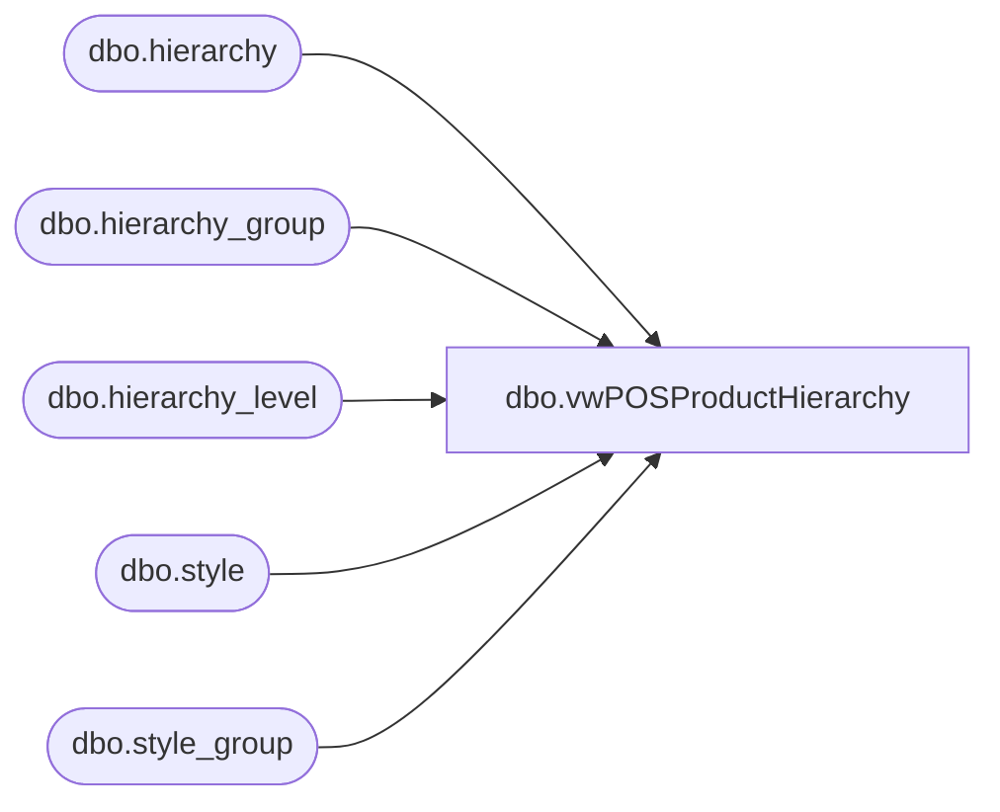

# dbo.vwPOSProductHierarchy

**Database:** me_01  
**Server:** bedrockdb02  

## Architecture Diagram



## Table Dependencies

| Referenced Table |
|---|
| dbo.hierarchy |
| dbo.hierarchy_group |
| dbo.hierarchy_level |
| dbo.style |
| dbo.style_group |

## View Code

```sql
CREATE view [dbo].[vwPOSProductHierarchy]

as

with Hier as
	(
		select 
			h.hierarchy_label,
			hl.hierarchy_level_label,
			hg.hierarchy_group_code, 
			hg.hierarchy_group_label,
			hg.parent_group_id,
			hg.hierarchy_group_id
		from hierarchy h with (nolock)
		join hierarchy_level hl with (nolock) on h.hierarchy_id = hl.hierarchy_id
		join hierarchy_group hg with (nolock) on h.hierarchy_id = hg.hierarchy_id and hl.hierarchy_level_id = hg.hierarchy_level_id
		where h.hierarchy_id = 1 --product hierarchy
		and left(hg.hierarchy_group_code,1) in ('W', 'R') 
		and substring(hg.hierarchy_group_code,7,2) <>'60' --supplies no longer maintained in Aptos
	),
Chain as 
	(
		select *
		from Hier 
		where hierarchy_level_label = 'Chain'
	),
Division as
	(
		select *
		from Hier
		where hierarchy_level_label= 'Division'
	),
Department as
	(
		select *
		from Hier 
		where hierarchy_level_label = 'Department'
	), 
Class as
	(
		select *
		from Hier 
		where hierarchy_level_label = 'Class'
	), 
SubClass as
	(
		select *
		from Hier 
		where hierarchy_level_label = 'Sub-Class'
	),
Hierarchy as 
	(
		select 
			ch.hierarchy_group_label as Chain,
			dv.hierarchy_group_label as Division,
			d.hierarchy_group_label as Department,
			c.hierarchy_group_label as Class, 
			sc.hierarchy_group_label as SubClass,

			ch.hierarchy_group_code as ChainCode,
			dv.hierarchy_group_code as DivisionCode,
			d.hierarchy_group_code as DepartmentCode,
			c.hierarchy_group_code as ClassCode,
			sc.hierarchy_group_code as SubClassCode,

			ch.hierarchy_group_id as ChainHierarchyGroupID,
			dv.hierarchy_group_id as DivisionHierarchyGroupID,
			d.hierarchy_group_id as DepartmentHierarchyGroupID,
			c.hierarchy_group_id as ClassHierarchyGroupID,
			sc.hierarchy_group_id SubClassHierarchyGroupID, --joins to style_group on sg.hierarchy_group_id=sc.hierarchy_group_id join style s on sg.style_id=s.style_id
			--d.parent_group_id as DepartmentParentGroupID,
			c.parent_group_id as ClassParentGroupID,
			sc.parent_group_id as SubClassParentGroupID
		from SubClass sc
		join Class c on sc.parent_group_id = c.hierarchy_group_id
		join Department d on c.parent_group_id = d.hierarchy_group_id
		join Division dv on d.parent_group_id=dv.hierarchy_group_id
		join Chain ch on dv.parent_group_id=ch.hierarchy_group_id
	)
select 
	h.Chain,
	h.Division,
	h.Department,
	h.Class,
	h.SubClass,
	s.short_desc,
	h.ChainCode,
	h.DivisionCode,
	h.DepartmentCode,
	h.ClassCode,
	h.SubClassCode,
	s.Style_Code as StyleCode,
	h.ChainHierarchyGroupID,
	h.DivisionHierarchyGroupID,
	h.DepartmentHierarchyGroupID,
	h.ClassHierarchyGroupID,
	h.SubClassHierarchyGroupID,
			
	h.ClassParentGroupID,
	h.SubClassParentGroupID,
	sg.hierarchy_group_id as StyleParentGroupID
from Hierarchy h
join style_group sg with (nolock) on sg.hierarchy_group_id=h.SubClassHierarchyGroupID
join style s with (nolock) on sg.style_id=s.style_id --and s.active_flag=1
```

