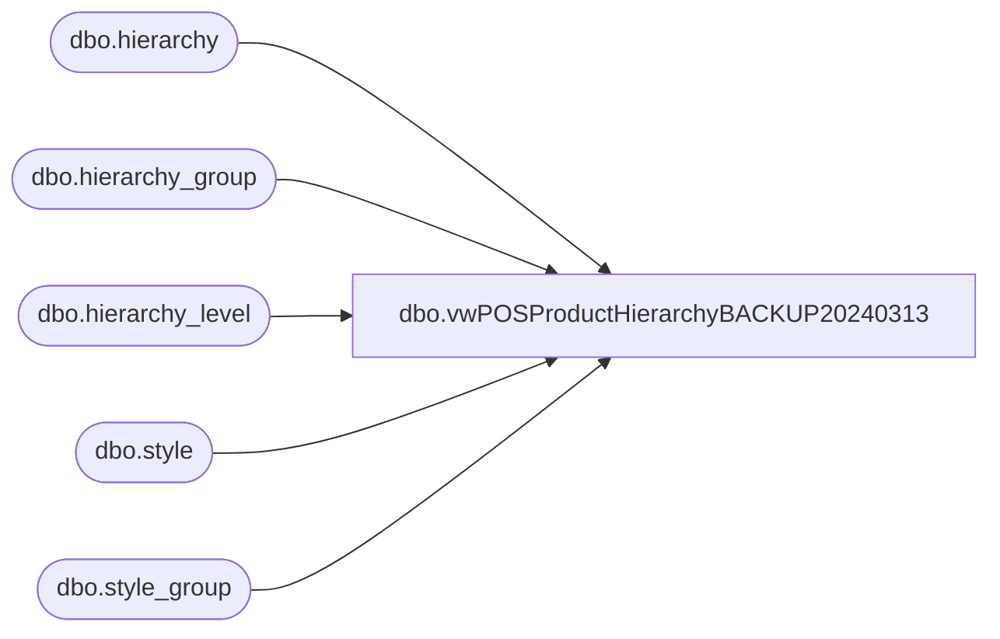

# dbo.vwPOSProductHierarchyBACKUP20240313

**Database:** me_01  
**Server:** bedrockdb02  

## Architecture Diagram



## Table Dependencies

| Referenced Table |
|---|
| dbo.hierarchy |
| dbo.hierarchy_group |
| dbo.hierarchy_level |
| dbo.style |
| dbo.style_group |

## View Code

```sql
CREATE view [dbo].[vwPOSProductHierarchyBACKUP20240313]

as

with Hier as
	(
		select 
			h.hierarchy_label,
			hl.hierarchy_level_label,
			hg.hierarchy_group_code, 
			hg.hierarchy_group_label,
			hg.parent_group_id,
			hg.hierarchy_group_id
		from hierarchy h with (nolock)
		join hierarchy_level hl with (nolock) on h.hierarchy_id = hl.hierarchy_id
		join hierarchy_group hg with (nolock) on h.hierarchy_id = hg.hierarchy_id and hl.hierarchy_level_id = hg.hierarchy_level_id
		where h.hierarchy_id = 1 --product hierarchy
		and left(hg.hierarchy_group_code,1) in ('W', 'R') 
		and substring(hg.hierarchy_group_code,7,2) <>'60' --supplies no longer maintained in Aptos
	),
Department as
	(
		select *
		from Hier 
		where hierarchy_level_label = 'Department'
	), 
Class as
	(
		select *
		from Hier 
		where hierarchy_level_label = 'Class'
	), 
SubClass as
	(
		select *
		from Hier 
		where hierarchy_level_label = 'Sub-Class'
	),
Hierarchy as 
	(
		select 
			d.hierarchy_group_label as Department,
			c.hierarchy_group_label as Class, 
			sc.hierarchy_group_label as SubClass,
			d.hierarchy_group_code as DepartmentCode,
			c.hierarchy_group_code as ClassCode,
			sc.hierarchy_group_code as SubClassCode,
			d.hierarchy_group_id as DepartmentHierarchyGroupID,
			c.hierarchy_group_id as ClassHierarchyGroupID,
			sc.hierarchy_group_id SubClassHierarchyGroupID, --joins to style_group on sg.hierarchy_group_id=sc.hierarchy_group_id join style s on sg.style_id=s.style_id
			--d.parent_group_id as DepartmentParentGroupID,
			c.parent_group_id as ClassParentGroupID,
			sc.parent_group_id as SubClassParentGroupID
		from SubClass sc
		join Class c on sc.parent_group_id = c.hierarchy_group_id
		join Department d on c.parent_group_id = d.hierarchy_group_id
	)
select 
	h.Department,
	h.Class,
	h.SubClass,
	s.short_desc,
			
	h.DepartmentCode,
	h.ClassCode,
	h.SubClassCode,
	s.Style_Code as StyleCode,
			
	h.DepartmentHierarchyGroupID,
	h.ClassHierarchyGroupID,
	h.SubClassHierarchyGroupID,
			
	h.ClassParentGroupID,
	h.SubClassParentGroupID,
	sg.hierarchy_group_id as StyleParentGroupID
from Hierarchy h
join style_group sg with (nolock) on sg.hierarchy_group_id=h.SubClassHierarchyGroupID
join style s with (nolock) on sg.style_id=s.style_id and s.active_flag=1

dbo,vwPriceChange,CREATE view vwPriceChange

as

select 
	case promotional_event_flag
		when 0 then 'Permanent'
		when 1 then 'Promotional'
	end as Document_Type,
	pct.description type,
	pc.price_change_no document_number,
	pc.price_change_description description,
	case pc.approval_status
		when 0 then 'None'
		when 1 then 'Pending_Approval'
		when 2 then 'Approved'
	end as Approval_Status,
	convert(varchar, pc.issue_date, 101) issue_date,
	convert(varchar, pc.effective_from_date, 101) effective_from_date,
	convert(varchar, pc.effective_to_date, 101) effective_to_date,
	j.jurisdiction_code,
	j.jurisdiction_id, 
	case price_change_status
		when 0 then 'New'
		when 1 then 'Preliminary'
		when 2 then 'Submitted'
		when 3 then 'Issued'
		when 4 then 'Effective'
		when 5 then 'Canceled'
		when 6 then 'Completed'
	end as document_status
from price_change pc with (nolock)
join price_change_type pct with (nolock) on pc.price_change_type = pct.price_change_type_code
join jurisdiction j with (nolock) on pc.jurisdiction_id = j.jurisdiction_id
union all
select 
	case promotional_event_flag
		when 1 then 'Deal'
	end as Document_Type,
	'' as type,
	d.deal_no as document_number,
	d.description as description,
	case d.approval_status
		when 0 then 'None'
		when 1 then 'Pending_Approval'
		when 2 then 'Approved'
	end as Approval_Status,
	convert(varchar, d.issue_date, 101) issue_date,
	convert(varchar, d.effective_from_date, 101) effective_from_date,
	convert(varchar, d.effective_to_date, 101) effective_to_date,
	j.jurisdiction_code,
	j.jurisdiction_id,
	case document_status
		when 0 then 'New'
		when 1 then 'Preliminary'
		when 2 then 'Submitted'
		when 3 then 'Issued'
		when 4 then 'Effective'
		when 5 then 'Canceled'
		when 6 then 'Completed'
	end as document_status
from deal d (nolock)
join jurisdiction j (nolock) on d.jurisdiction_id = j.jurisdiction_id


----------------------------------------------------
```

