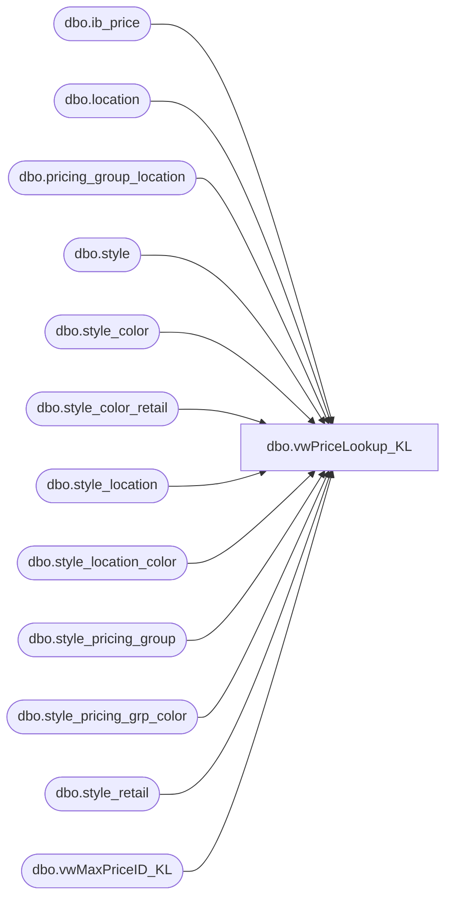

# dbo.vwPriceLookup_KL

**Database:** me_01  
**Server:** bedrockdb02  

## Architecture Diagram



## Table Dependencies

| Referenced Table |
|---|
| dbo.ib_price |
| dbo.location |
| dbo.pricing_group_location |
| dbo.style |
| dbo.style_color |
| dbo.style_color_retail |
| dbo.style_location |
| dbo.style_location_color |
| dbo.style_pricing_group |
| dbo.style_pricing_grp_color |
| dbo.style_retail |
| dbo.vwMaxPriceID_KL |

## View Code

```sql
--================================================================================
---Dan Tweedie - 2017-06-21 - Updated view to include original_selling_retail
--================================================================================


CREATE view [dbo].[vwPriceLookup_KL] 

as

select distinct s.style_id, s.style_code, s.short_desc, l.location_code,
isnull(slc.original_selling_retail, 
       isnull(spgc.original_selling_retail, 
           isnull(scr.original_selling_retail, 
              isnull(sl.original_selling_retail, 
                 isnull(spg.original_selling_retail, r.original_selling_retail))))) as original_local_price,

isnull(slc.current_selling_retail, 
       isnull(spgc.current_selling_retail, 
           isnull(scr.current_selling_retail, 
              isnull(sl.current_selling_retail, 
                 isnull(spg.current_selling_retail, r.current_selling_retail))))) as current_local_price,

isnull(ip1.selling_retail_price,
         isnull(ip2.selling_retail_price,
            isnull(ip3.selling_retail_price,
               isnull(ip4.selling_retail_price,
                 isnull(ip5.selling_retail_price,ip6.selling_retail_price))))) as promo_local_price 

from style_retail r with (nolock)
join style s with (nolock) on r.style_id = s.style_id and s.active_flag = 1
join location l with (nolock) on l.jurisdiction_id = r.jurisdiction_id
join style_color sc with (nolock) on r.style_id = sc.style_id and sc.reorder_flag = 1
left outer join pricing_group_location pgl with (nolock) on pgl.location_id = l.location_id
left outer join style_location_color slc with (nolock) on slc.style_id = r.style_id
	and slc.jurisdiction_id = r.jurisdiction_id
	and slc.location_id = l.location_id
	and slc.style_color_id = sc.style_color_id
left outer join style_pricing_grp_color spgc with (nolock) on spgc.style_id = r.style_id
	and spgc.style_color_id = sc.style_color_id
	and spgc.jurisdiction_id = r.jurisdiction_id
	and spgc.pricing_group_id = pgl.pricing_group_id
left outer join style_color_retail scr with (nolock) on scr.style_id = r.style_id
	and scr.style_color_id = sc.style_color_id
	and scr.jurisdiction_id = r.jurisdiction_id
left outer join style_location sl with (nolock) on sl.style_id = r.style_id
	and sl.location_id = l.location_id
	and sl.jurisdiction_id = r.jurisdiction_id
left outer join style_pricing_group spg with (nolock) on spg.style_id = r.style_id
	and spg.jurisdiction_id = r.jurisdiction_id
	and spg. pricing_group_id = pgl.pricing_group_id 
left outer join ib_price ip1 with (nolock) on ip1.style_id = r.style_id
	and ip1.jurisdiction_id = r.jurisdiction_id
	and ip1.color_id = sc.color_id
	and ip1.location_id = l.location_id
	and ip1.temp_price_flag = 1
	and ip1.start_date <= getdate()
	and (ip1.end_date >= cast(left(getdate(), 11) as smalldatetime) OR ip1.end_date is NULL)
	and exists (select mp.ib_price_id from vwMaxPriceID_KL mp where mp.ib_price_id = ip1.ib_price_id and mp.style_id = ip1.style_id and mp.jurisdiction_id = ip1.jurisdiction_id and isnull(mp.location_id, 0) = isnull(ip1.location_id, 0))
left outer join ib_price ip2 with (nolock) on ip2.style_id = r.style_id
	and ip2.jurisdiction_id = r.jurisdiction_id
	and ip2.color_id = sc.color_id
	and ip2.pricing_group_id = pgl.pricing_group_id 
	and ip2.location_id is null
	and ip2.temp_price_flag = 1
	and ip2.start_date <= getdate()
	and (ip2.end_date >= cast(left(getdate(), 11) as smalldatetime) OR ip2.end_date is NULL)
	and exists (select mp.ib_price_id from vwMaxPriceID_KL mp where mp.ib_price_id = ip2.ib_price_id and mp.style_id = ip2.style_id and mp.jurisdiction_id = ip2.jurisdiction_id and isnull(mp.location_id, 0) = isnull(ip2.location_id, 0))
left outer join ib_price ip3 with (nolock) on ip3.style_id = r.style_id
	and ip3.jurisdiction_id = r.jurisdiction_id
	and ip3.color_id = sc.color_id
	and ip3.pricing_group_id is null
	and ip3.location_id is null
	and ip3.temp_price_flag = 1
	and ip3.start_date <= getdate()
	and (ip3.end_date >= cast(left(getdate(), 11) as smalldatetime) OR ip3.end_date is NULL)
	and exists (select mp.ib_price_id from vwMaxPriceID_KL mp where mp.ib_price_id = ip3.ib_price_id and mp.style_id = ip1.style_id and mp.jurisdiction_id = ip3.jurisdiction_id and isnull(mp.location_id, 0) = isnull(ip3.location_id, 0))
left outer join ib_price ip4 with (nolock) on ip4.style_id = r.style_id
	and ip4.jurisdiction_id = r.jurisdiction_id
	and ip4.color_id is null
	and ip4.pricing_group_id is null
	and ip4.location_id = l.location_id
	and ip4.temp_price_flag = 1
	and ip4.start_date <= getdate()
	and (ip4.end_date >= cast(left(getdate(), 11) as smalldatetime) OR ip4.end_date is NULL)
	and exists (select mp.ib_price_id from vwMaxPriceID_KL mp where mp.ib_price_id = ip4.ib_price_id and mp.style_id = ip4.style_id and mp.jurisdiction_id = ip4.jurisdiction_id and isnull(mp.location_id, 0) = isnull(ip4.location_id, 0))
left outer join ib_price ip5 with (nolock) on ip5.style_id = r.style_id
	and ip5.jurisdiction_id = r.jurisdiction_id
	and ip5.color_id is null
	and ip5.pricing_group_id = pgl.pricing_group_id
	and ip5.location_id is null
	and ip5.temp_price_flag = 1
	and ip5.start_date <= getdate()
	and (ip5.end_date >= cast(left(getdate(), 11) as smalldatetime) OR ip5.end_date is NULL)
	and exists (select mp.ib_price_id from vwMaxPriceID_KL mp where mp.ib_price_id = ip5.ib_price_id and mp.style_id = ip5.style_id and mp.jurisdiction_id = ip5.jurisdiction_id and isnull(mp.location_id, 0) = isnull(ip5.location_id, 0))
left outer join ib_price ip6 with (nolock) on ip6.style_id = r.style_id
	and ip6.jurisdiction_id = r.jurisdiction_id
	and ip6.color_id is null
	and ip6.pricing_group_id is null
	and ip6.location_id is null
	and ip6.temp_price_flag = 1
	and ip6.start_date <= getdate()
	and (ip6.end_date >= cast(left(getdate(), 11) as smalldatetime) OR ip6.end_date is NULL)
	and exists (select mp.ib_price_id from vwMaxPriceID_KL mp where mp.ib_price_id = ip6.ib_price_id and mp.style_id = ip6.style_id and mp.jurisdiction_id = ip6.jurisdiction_id and isnull(mp.location_id, 0) = isnull(ip6.location_id, 0))
```

