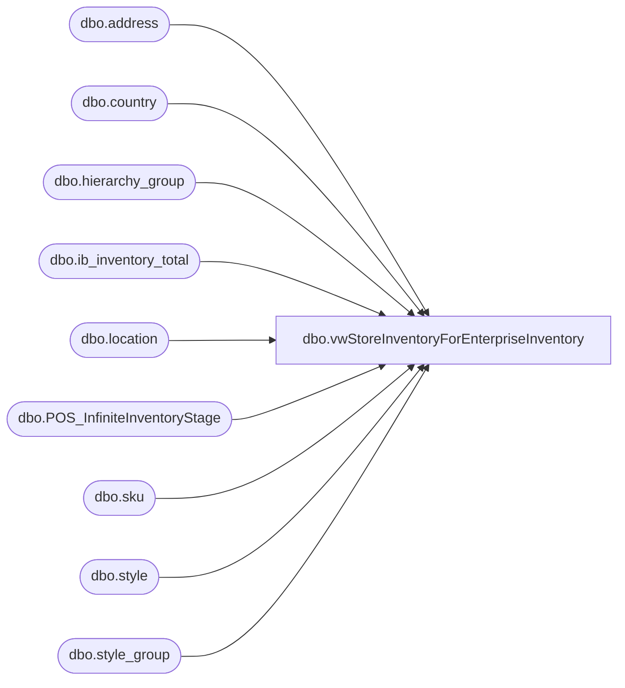

# dbo.vwStoreInventoryForEnterpriseInventory

**Database:** me_01  
**Server:** bedrockdb02  

## Architecture Diagram



## Table Dependencies

| Referenced Table |
|---|
| dbo.address |
| dbo.country |
| dbo.hierarchy_group |
| dbo.ib_inventory_total |
| dbo.location |
| dbo.POS_InfiniteInventoryStage |
| dbo.sku |
| dbo.style |
| dbo.style_group |

## View Code

```sql
CREATE view [dbo].[vwStoreInventoryForEnterpriseInventory]

as

with 
Locations as
	(
		select 
			l.location_id,
			cast(l.location_code as varchar(4)) as location_code, ---NEED TO USE LOCATION CODE
			cast(l.gl_location_number as varchar(4)) as gl_location_number,
			case 
				when c.country_code in ('US', 'USA') 
					then 'US'
				when c.country_code in ('GB','UK')
					then 'UK'
			end as Country
		from location l
		join address a on l.location_id=a.parent_id and a.address_type_id=1 and a.parent_type=2
		join country c on a.country_id=c.country_id
		where l.active_flag=1
		and l.location_type=2
		and l.location_code not in ('0013', '2013')
		and c.country_code in ('US','USA','GB','UK')
	)
select  
		cast(l.location_code as varchar(4)) as location_code, 
		cast(l.gl_location_number as varchar(4)) as gl_location_number,
		cast(s.style_code as varchar(6)) as style_code,
		case 
			when cast(sum(iit.total_on_hand_units) as int) < 0 
			then 0
			else cast(sum(iit.total_on_hand_units) as int)
		end as StoreInventory,
		l.Country 
from locations l
join ib_inventory_total iit with (nolock) on l.location_id=iit.location_id
inner join	sku sk with (nolock)
	on		iit.sku_id = sk.sku_id
	and		iit.inventory_status_id = 1
inner join	style s with (nolock) on sk.style_id = s.style_id
join style_group sg with (nolock) on s.style_id = sg.style_id
join hierarchy_group hg with (nolock) on hg.hierarchy_group_id = sg.hierarchy_group_id
where s.active_flag = 1
and substring(hg.hierarchy_group_code,7,2)<>'60'
and not exists (select ii.StyleCode from POS_InfiniteInventoryStage ii where ii.LocationCode=l.location_code and ii.StyleCode=s.style_code)
group by 
	l.location_code, 
	l.gl_location_number, 
	s.style_code,
	l.country
UNION
select --infinite inventory --  as staged via ssis POS_EnterpriseInventory, spPOS_StageInfiniteInventoryItems 
	cast(l.location_code as varchar(4)) as location_code, 
	cast(l.gl_location_number as varchar(4)) as gl_location_number,
	cast(i.StyleCode as varchar(6)) as style_code,
	cast('99999' as int) as StoreInventory,
	l.Country 
from POS_InfiniteInventoryStage i
join locationS l on i.LocationCode=l.location_code
```

